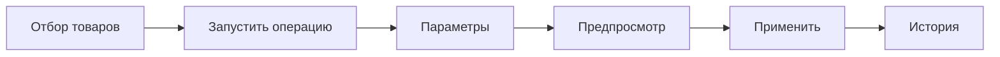

# Интерфейс

Панель открывается в менеджере MODX (**Пакеты → msBulkEditor**). Сверху четыре вкладки.

| Вкладка | Кому видна | Зачем |
| --- | --- | --- |
| **Товары** | Право `msbulkeditor_view` | Отбор, операции, предпросмотр, правка ячеек |
| **История** | То же | Журнал и откат |
| **Пресеты** | Право `msbulkeditor_presets` | Сохранённые операции |
| **Импорт и экспорт** | Право `msbulkeditor_import_export` | CSV и XLSX |

Без права вкладка скрыта. Прямой переход на скрытую вкладку вернёт вас на **Товары**.

Все сценарии со скриншотами: [пошаговые сценарии](flows).

---

## Вкладка «Товары»: из чего состоит экран

Сверху вниз:

1. **Счётчики** — сколько товаров по фильтру и сколько отмечено.
2. **Панель инструментов** — поиск, фильтры, быстрые действия, пресеты, колонки, **Запустить операцию**.
3. **Таблица** — галочки, колонки, клик по ячейке для одной правки.
4. **Предпросмотр** (после кнопки **Предпросмотр**) — сводка и «было / станет».
5. **Прогресс** (после **Применить**) — сколько уже обработано.

Слева от таблицы — дерево категорий.

→ [Сетка товаров](products-grid)

---

## Базовый цикл массовой операции

1. Отметьте товары галочками **или** включите экспертный режим и настройте фильтр.
2. Нажмите **Запустить операцию** (или пункт быстрых действий / пресет).
3. Заполните форму и нажмите **Предпросмотр**.
4. Снимите галочки со строк, которые не нужно менять.
5. Нажмите **Применить** и дождитесь прогресса.
6. Проверьте результат. Ошибка? Вкладка **История** → **Откат**.

Разбор с картинками: [сценарий A](flows#flow-a--массовая-операция-полный-цикл).

---

## Разделы документации

| Раздел | Страница |
| --- | --- |
| Все сценарии A–J | [Пошаговые сценарии](flows) |
| Фильтры и выбор | [Сетка товаров](products-grid) |
| Быстрые действия | [Быстрые действия](quick-actions) |
| Цена, остаток, категории | [Товар и цены](product-and-prices) |
| Опции MiniShop3 | [Опции](options) |
| TV | [TV-параметры](tv-parameters) |
| Колонки таблицы | [Настройка колонок](column-settings) |
| Правка ячейки | [Редактирование в списке](inline-editing) |
| Предпросмотр и запись | [Предпросмотр и применение](preview-and-apply) |
| Откат | [История](history) |
| Повтор операций | [Пресеты](presets) |
| Excel / CSV | [Импорт и экспорт](import-export) |
| Нет TV/опции у части товаров | [Мастер привязки](binding-wizard) |
| SEO, флаги, связи, даты | [Поля ресурса](resource-fields) |

---

## Навигация

- [← Возможности](../features)
- [Пошаговые сценарии →](flows)
- [Сетка товаров →](products-grid)
