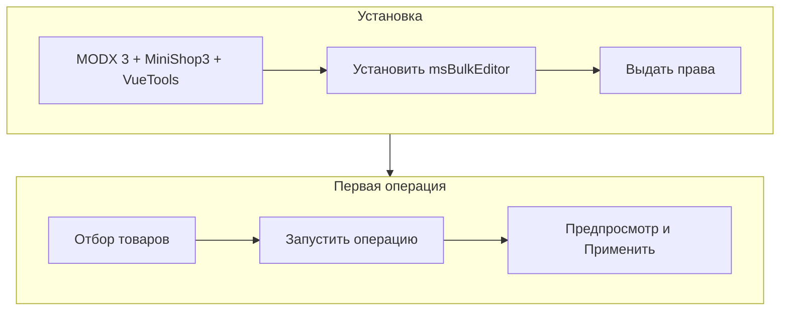

# Быстрый старт

За 15 минут вы установите панель и примените скидку 10 % с предпросмотром. Если пакет уже стоит, начните с [шага 3](#шаг-3-открыть-панель).

## Что понадобится

| Требование | Версия |
| --- | --- |
| MODX Revolution | 3.0+ |
| PHP | 8.2+ |
| MiniShop3 | установлен |
| VueTools | установлен |

Права делает администратор. Менеджеру каталога нужны минимум `msbulkeditor_view` и `msbulkeditor_edit`.

## Шаг 1. Установить пакет

1. [Подключите ModStore](https://modstore.pro/info/connection), если ставите из каталога.
2. Откройте **Extras → Installer → Download Extras**.
3. Найдите **msBulkEditor** → **Download** → **Install**.
4. Убедитесь, что установлены **MiniShop3** и **VueTools**.
5. Откройте **Настройки → Очистить кэш**.

### Что появится после установки

| Элемент | Ожидание |
| --- | --- |
| Меню | **Пакеты → msBulkEditor** |
| Namespace | `msbulkeditor` |
| Права | `msbulkeditor_view`, `edit`, `rollback`, `presets`, `import_export` |
| Настройки | область `msbulkeditor` в системных настройках |

## Шаг 2. Выдать права менеджерам

Откройте **Управление → Пользователи → Политики доступа** и добавьте права в политику менеджеров магазина.

| Право | Зачем |
| --- | --- |
| `msbulkeditor_view` | Открыть панель, смотреть товары, предпросмотр, историю |
| `msbulkeditor_edit` | Нажимать **Применить** и править ячейки в таблице |

Для отката, пресетов и Excel добавьте `msbulkeditor_rollback`, `msbulkeditor_presets`, `msbulkeditor_import_export`. Полная таблица: [Системные настройки](settings#права-доступа).

## Шаг 3. Открыть панель

1. Войдите под учёткой с правом `msbulkeditor_view`.
2. Откройте **Пакеты → msBulkEditor**.
3. Прямая ссылка: `manager/?a=index&namespace=msbulkeditor`.

Если видите предупреждение про VueTools, установите пакет и очистите кэш. Разбор: [FAQ](faq#не-открывается-панель--предупреждение-про-vuetools).

На экране четыре вкладки: **Товары**, **История**, **Пресеты**, **Импорт и экспорт**. Без отдельного права вкладка **Пресеты** или **Импорт** может быть скрыта.

## Шаг 4. Сделать скидку 10 %

Цель: снизить цену у выбранных товаров на 10 % и при желании сохранить старую цену в поле «старая цена».

1. Оставайтесь на вкладке **Товары**.
2. Слева выберите категорию в дереве **или** задайте фильтр сверху.
3. Отметьте товары галочками.
   - Нужна вся выборка по фильтру? Включите **экспертный режим** (если администратор его разрешил).
4. Нажмите **Запустить операцию**.
5. Тип операции: **Цена**.
6. Режим: **−%**, значение `10`.
7. При необходимости включите перенос текущей цены в `old_price`.
8. Нажмите **Предпросмотр**.
9. В таблице «было / станет» снимите галочки со строк, которые трогать не нужно.
10. Нажмите **Применить** и дождитесь полосы прогресса.

Подробнее про режимы цены: [Товар и цены](interface/product-and-prices). Полный цикл со скриншотами: [сценарий A](interface/flows#flow-a--массовая-операция-полный-цикл).

### Если кнопка «Применить» неактивна

- в предпросмотре 0 изменений (значения уже совпадают с целевыми)
- не выбраны товары и выключен экспертный режим
- нет права `msbulkeditor_edit`

## Шаг 5. Проверить результат и откатить при ошибке

1. Откройте вкладку **История**.
2. Найдите операцию со статусом **Завершена**.
3. Откройте товар на витрине или в MiniShop3 и сверьте цену.
4. Если ошиблись: нажмите **Откат** у операции или **Изменения** и откатите отдельные товары.

Для отката нужно право `msbulkeditor_rollback`. Подробнее: [История](interface/history).

## Три типичных следующих шага

| Задача | Куда идти |
| --- | --- |
| Обновить остатки из Excel | [Импорт и экспорт](interface/import-export) |
| Сохранить скидку как пресет | [Пресеты](interface/presets) |
| Пройти все сценарии A–J | [Пошаговые сценарии](interface/flows) |

## Что дальше

| Тема | Страница |
| --- | --- |
| Фильтры, дерево категорий, экспертный режим | [Сетка товаров](interface/products-grid) |
| Быстрые действия без выбора типа | [Быстрые действия](interface/quick-actions) |
| Лимиты и Scheduler | [Системные настройки](settings) |
| Ошибки и ограничения | [FAQ](faq) |
