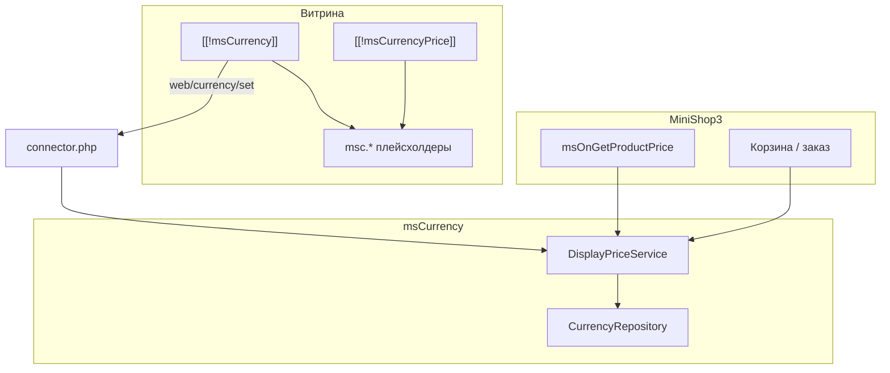

# msCurrency

**msCurrency** — дополнение для [MODX Revolution 3](https://modx.com/) и [MiniShop3](/components/minishop3/): несколько валют на витрине, автоматические курсы, цена товара в своей валюте, корзина и заказ с учётом выбора покупателя.

С чего начать: [Быстрый старт](quick-start).

## Минимальный путь на витрине

1. Установить **MiniShop3** и **msCurrency** через ModStore.
2. Открыть **MiniShop3 → Валюты (msCurrency)**, проверить справочник и нажать **Синхронизировать курсы**.
3. В шаблоне сайта вывести переключатель (см. [Быстрый старт](quick-start#шаг-4-переключатель-в-шаблоне)).
4. На карточке товара заменить вывод цены на `msCurrencyPrice` (см. [Быстрый старт](quick-start#шаг-5-цена-на-карточке-товара)).
5. **Очистить кэш** и проверить смену валюты на карточке. В оформленном заказе должен быть снимок `properties.msc`.

## Быстрые ссылки

| Нужно | Документ |
| --- | --- |
| Установить и вывести переключатель | [Быстрый старт](quick-start) |
| Все ключи `mscurrency_*` | [Системные настройки](settings) |
| Сниппеты и параметры | [Сниппеты](snippets/index) |
| Карточка, корзина, заказ, платёжки | [Интеграция](integration) |
| CRUD валют, cron, connector | [Управление валютами](manager) |
| `mscOnGetPrice`, `mscOnToggleCurrency` | [События MODX](events) |
| Фильтр по цене в валюте пользователя | [mFilter](mfilter) |
| Диагностика | [FAQ](faq) |

## Возможности

- **Справочник валют** — базовая валюта, коэффициент, поле `val` (курс × коэффициент)
- **Поставщики курсов** — ЦБ РФ, НБУ, НБРБ, НБК и свои классы. Cron: `sync_rates.php`
- **Переключатель на витрине** — плейсхолдеры `msc.*` / `msmc.*`, AJAX через connector
- **Цена товара в отдельной валюте** — поля `currency_id`, `msc_price`, `msc_old_price` в карточке MS3
- **Режим заказа** — суммы в базовой валюте или в валюте покупателя (`mscurrency_order_price_mode`)
- **Снимок валюты в заказе** — `properties.msc` (и дубль `msmc`) при оформлении
- **Админка Vue 3** — CRUD валют, провайдеры, привязки, синхронизация курсов
- **mFilter** — тип фильтра `currency_price` (опционально)

## Системные требования

| Требование | Версия |
|------------|--------|
| MODX Revolution | 3.0+ |
| PHP | 8.2+ |
| MiniShop3 | 1.0+ |
| pdoTools | 3.0+ (рекомендуется для Fenom) |
| VueTools | для Vue-админки msCurrency |

### Зависимости

- **[MiniShop3](/components/minishop3/)** — товары, корзина, заказы, формат цены

### Опционально

- **[mFilter](/components/mfilter/)** — фильтр каталога `currency_price`
- **[VueTools](https://modstore.pro/)** — без него админка msCurrency покажет предупреждение и не загрузит UI

## Установка

1. [Подключите репозиторий ModStore](https://modstore.pro/info/connection).
2. **Extras → Installer** → **Download Extras** — найдите **msCurrency**, **Download**, **Install**.
3. Убедитесь, что установлен **MiniShop3** (и **VueTools** для админки).
4. Настройте область **`mscurrency`** в системных настройках.
5. **Настройки → Очистить кэш**.

Каталог: [modstore.pro/packages/ecommerce/mscurrency](https://modstore.pro/packages/ecommerce/mscurrency).

После установки появляются:

- namespace `mscurrency`
- сниппеты `msCurrency`, `msCurrencyPrice`, `msCurrencyPrices`, `msCurrencyCart`, `msCurrencyGetOrder`, `mscLexiconScript`
- чанки `tpl.msCurrency`, `tpl.msCurrencyPrices`
- плагины категории msCurrency
- таблицы `msc_currency`, `msc_providers`, `msc_provider_links`
- файл `core/config/ms3.services.d/50-mscurrency.php`

## Термины

| Термин | Описание |
|--------|----------|
| **Базовая валюта** | Валюта каталога MS3. Поле `price` товара хранится в ней (обычно RUB) |
| **val** | Эффективный курс: `rate × coefficient`. Цена на витрине: база ÷ val |
| **Снимок валюты** | Массив в `order.properties.msc`: код, символы, val на момент заказа |
| **Режим `user`** | Корзина и заказ показывают суммы в выбранной валюте покупателя |
| **Режим `base`** | Суммы в базовой валюте. Переключатель влияет только на отображение на витрине |

## Архитектура (кратко)

Подробнее: [Интеграция](integration), [События MODX](events), [Управление валютами](manager).
