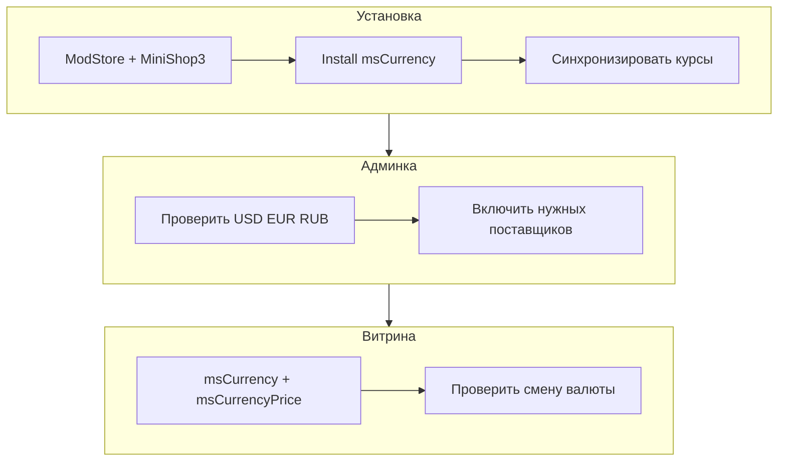

# Быстрый старт

За 15–20 минут можно подключить мультивалютность: справочник валют, курсы и пересчёт цены на карточке.



## Требования

| Требование | Версия |
|------------|--------|
| MODX Revolution | 3.0+ |
| PHP | 8.2+ |
| MiniShop3 | установлен |
| pdoTools | 3.x (для примеров Fenom) |
| VueTools | для пункта меню «Валюты (msCurrency)» |

## Шаг 1: Установка пакета

1. [Подключите ModStore](https://modstore.pro/info/connection).
2. **Extras → Installer → Download Extras** — **msCurrency** → **Download** → **Install**.
3. Убедитесь, что установлен **MiniShop3**.
4. **Настройки → Очистить кэш**.

Пакет: [msCurrency на modstore.pro](https://modstore.pro/packages/ecommerce/mscurrency).

### После установки

| Элемент | Ожидание |
|---------|----------|
| Сервис `mscurrency` | В `$modx->services` / через `msc_get_service()` |
| Сниппеты | `msCurrency`, `msCurrencyPrice`, `msCurrencyPrices`, `msCurrencyCart`, `msCurrencyGetOrder`, `mscLexiconScript` |
| Плагины | `mscurrency_frontend`, `mscurrency_product_price`, `mscurrency_cart_display`, `mscurrency_detect` (GeoIP, опц.) и др. — включены |
| Таблицы | `msc_currency`, `msc_providers`, `msc_provider_links` |
| Базовая валюта | RUB (если справочник пуст — создаётся резолвером) |
| Меню MS3 | **Валюты (msCurrency)** |

## Шаг 2: Курсы валют

1. **MiniShop3 → Валюты (msCurrency)**.
2. На вкладке **Дашборд курсов** или **Валюты** проверьте RUB (базовая), USD, EUR — при необходимости включите **Активна**.
3. На вкладке **Поставщики курсов** включите **ЦБ РФ** (по умолчанию уже активен).
4. Нажмите **Синхронизировать курсы**.

Отдельный API-ключ для ЦБ РФ не нужен — используются открытые XML-котировки ЦБ. Подробнее: [Управление валютами](manager#ключ-api-и-авторизация).

## Шаг 3: Системные настройки

**Настройки → Системные настройки**, фильтр **`mscurrency`**.

Для первого запуска достаточно значений по умолчанию:

| Ключ | Значение по умолчанию | Смысл |
|------|----------------------|-------|
| `mscurrency_selected_currency_default` | `0` | Валюта при первом заходе — базовая |
| `mscurrency_order_price_mode` | `base` | Корзина и заказ в базовой валюте. Переключатель только на витрине |
| `mscurrency_default_provider` | `cbr_ru` | Cron обновляет через ЦБ РФ |

Если нужно, чтобы корзина и заказ шли в валюте покупателя, поставьте `mscurrency_order_price_mode` = `user`. Полный список ключей: [Системные настройки](settings).

## Шаг 4: Переключатель в шаблоне

В шапке сайта или на карточке товара (некэшированно):

::: code-group

```fenom
{'!msCurrency' | snippet : ['tpl' => 'tpl.msCurrency']}
```

```modx
[[!msCurrency? &tpl=`tpl.msCurrency`]]
```

:::

Чанк `tpl.msCurrency` идёт в пакете. Для своего дизайна скопируйте чанк и укажите своё имя в `tpl`.

Для отладки вызовите сниппет с пустым `tpl`. Он выведет таблицу плейсхолдеров `msc.*`:

::: code-group

```fenom
{'!msCurrency' | snippet : ['tpl' => '']}
```

```modx
[[!msCurrency? &tpl=``]]
```

:::

## Шаг 5: Цена на карточке товара

На шаблоне **msProduct** замените вывод `[[+price]]` на конвертацию:

::: code-group

```fenom
<span class="product-price">
  {'!msCurrencyPrice' | snippet : ['price' => $price, 'pid' => $_modx->resource.id]}
</span>
```

```modx
<span class="product-price">
  [[!msCurrencyPrice?
    &price=`[[!+price]]`
    &pid=`[[*id]]`
  ]]
</span>
```

:::

Плагин `mscurrency_product_price` на событии `msOnGetProductPrice` подставляет цену в выбранной валюте. То же работает для плейсхолдеров MS3, если вы используете стандартные чанки товара без отдельного сниппета.

## Шаг 6: Проверка

| Действие | Ожидание |
|----------|----------|
| Открыть карточку товара | Виден переключатель валют |
| Выбрать USD / EUR | Цена пересчитывается |
| Плейсхолдер `msc.code` | Код выбранной валюты (`[[!+msc.code]]` / `{$_modx->getPlaceholder('msc.code')}`) |
| Добавить в корзину | При `base` — сумма в базовой валюте. При `user` — в выбранной |
| Оформить заказ | В `properties` заказа есть блок `msc` с кодом валюты |

## Дальше

- [Интеграция](integration) — корзина, заказ, цена товара в своей валюте, платёжные системы
- [Сниппет msCurrencyPrices](snippets/msCurrencyPrices) — таблица цен во всех валютах
- [mFilter](mfilter) — фильтр каталога по цене в валюте пользователя
- [FAQ](faq) — если курсы не обновляются или админка не открывается
