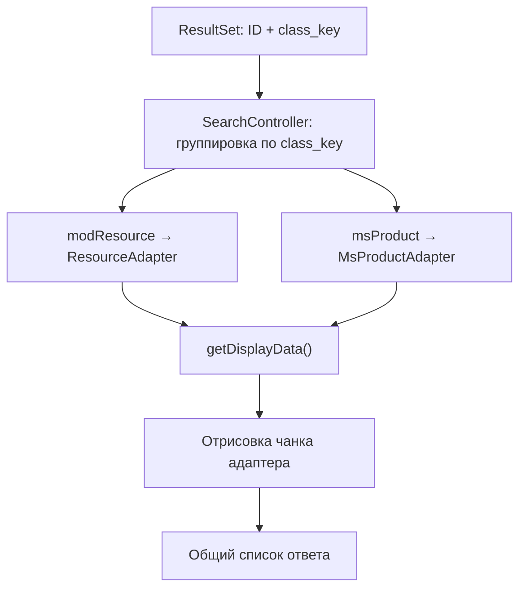

# Расширение компонента

mSearch индексирует не только ресурсы MODX, но и любые xPDO-объекты — комментарии, товары, пользователей, чужие модели. Каждый тип объекта обслуживается своим **адаптером**, реализующим `ContentAdapterInterface`.

## Архитектура

```
┌──────────────────────────────────────────────────────────────┐
│                          Indexer                             │
│   ┌──────────────┐  ┌──────────────┐  ┌──────────────────┐   │
│   │ Resource     │  │ MsProduct    │  │ Custom           │   │
│   │ Adapter      │  │ Adapter      │  │ Adapter          │   │
│   │ priority 0   │  │ priority 10  │  │ priority N       │   │
│   └──────────────┘  └──────────────┘  └──────────────────┘   │
└──────────────────────────────────────────────────────────────┘
                          ▼
┌──────────────────────────────────────────────────────────────┐
│                    Таблицы индекса                           │
│   mse_words (resource, field, word, count, class_key)        │
│   mse_intro (resource, intro, class_key)                     │
└──────────────────────────────────────────────────────────────┘
```

Обязанности адаптера описаны в интерфейсе `ContentAdapterInterface` — каждый метод снабжён комментарием.

## Интерфейс ContentAdapterInterface

```php
<?php

namespace MSearch\Adapters;

interface ContentAdapterInterface
{
    /**
     * Проверяет, поддерживает ли адаптер данный класс
     */
    public function supports(string $className): bool;

    /**
     * Короткий идентификатор типа (например, "resource", "product")
     * Используется в маршрутизации чанков подсказок
     */
    public function getType(): string;

    /**
     * Поля для индексации с весами: [field => weight]
     */
    public function getIndexableFields(): array;

    /**
     * Извлекает текст из поля объекта
     */
    public function extractContent(object $object, string $field): string;

    /**
     * Итератор объектов для пакетной индексации
     */
    public function getObjects(array $criteria, int $limit, int $offset): iterable;

    /**
     * Общее количество объектов
     */
    public function getTotal(array $criteria = []): int;

    /**
     * Приоритет адаптера (выше = выбирается раньше при совпадении supports)
     */
    public function getPriority(): int;

    /**
     * Батч-загрузка плейсхолдеров для рендера подсказок/результатов.
     *
     * Возвращает [id => array_of_placeholders]. Адаптер сам подсвечивает
     * нужные поля при непустом $query, дополняет данные computed-полями
     * (url, type, class_key, context_key).
     *
     * $options может содержать `element` (имя внешнего сниппета-загрузчика)
     * и `elementProperties` — адаптер сам решает, использовать их или нет.
     */
    public function getDisplayData(array $ids, string $query = '', array $options = []): array;

    /**
     * Имя дефолтного чанка для строки подсказки автокомплита
     */
    public function getDefaultSuggestTpl(): string;

    /**
     * Имя дефолтного чанка для строки полной выдачи поиска
     */
    public function getDefaultResultTpl(): string;
}
```

## Базовый класс AbstractAdapter

Наследуйтесь от `AbstractAdapter`: он реализует значения по умолчанию и даёт вспомогательные методы.

### Реализации по умолчанию

| Метод | Поведение по умолчанию |
|-------|------------------------|
| `getPriority()` | `0` |
| `getType()` | Имя класса в lowercase без суффикса `Adapter` |
| `getDisplayData()` | Пустой массив (адаптер не участвует в рендере) |
| `getDefaultSuggestTpl()` | `'mSearch.suggest.row'` |
| `getDefaultResultTpl()` | `'mSearch.row'` |

### Обязательные к реализации методы

`AbstractAdapter` не реализует эти методы — их обязан дать наследник:

- `supports(string $className): bool`
- `getIndexableFields(): array`
- `extractContent(object $object, string $field): string`
- `getObjects(array $criteria, int $limit, int $offset): iterable`
- `getTotal(array $criteria = []): int`

Остальные методы интерфейса имеют рабочие реализации по умолчанию (см. таблицу выше) и переопределяются по необходимости.

### Вспомогательные методы

| Метод | Назначение |
|-------|------------|
| `cleanText(string $text)` | Удаляет HTML-теги, декодирует HTML-entities, нормализует пробелы |
| `parseFieldWeights(string $fields)` | Парсит строку формата `field1:3,field2:1` в `[field => weight]` |
| `extractTvContent(object $object, string $tvName)` | Извлекает значение TV — поддерживает скаляры и JSON (MIGX) |
| `flattenArray(array $array)` | Превращает многомерный массив в строку из его строковых leaf-значений |
| `loadIntros(int[] $ids)` | Пакетная загрузка `mse_intro` по списку ID |
| `loadViaElement(string $element, int[] $ids, array $extraProps = [])` | Вызов внешнего сниппета (`runSnippet`) с проверкой существования и валидацией JSON-ответа. Ключи `resources` и `return` всегда переопределяются |
| `highlight(string $text, string $query, array $options = [])` | Обёртка над `MSearch::highlight()` — возвращает HTML-safe строку (escape + `<mark>`) |
| `parseTvFields(string $includeTVs, string $tvPrefix = '')` | Разбирает список TV через запятую в имена плейсхолдеров (с префиксом), схлопывает дубли |
| `highlightableTvFields(array $tvFields, array $extraReserved = [], string $processTVs = '', string $prepareTVs = '', string $tvPrefix = '')` | Отбирает TV, которые можно подсвечивать: исключает зарезервированные поля и те, что отрендерены через `processTVs`/`prepareTVs` |
| `highlightTvFields(array $data, array $row, array $tvFields, string $query)` | Подсвечивает значения перечисленных TV в `$data` по сырым значениям из `$row`, возвращает изменённую копию |

### Конструктор

```php
public function __construct(
    \MODX\Revolution\modX $modx,
    \MSearch\MSearch $msearch,
    array $config = []
)
```

## Регистрация адаптера через `mseOnRegisterAdapters`

Адаптер регистрируется в Indexer на старте — через подписку на событие:

| Параметр события | Тип | Описание |
|------------------|-----|----------|
| `indexer` | `Indexer` | Сервис индексатора. На нём вызывается `addAdapter()` |

```php
<?php
// Плагин на событие mseOnRegisterAdapters
/** @var MSearch\Services\Indexer\IndexerInterface $indexer */
$indexer = $scriptProperties['indexer'];

if (class_exists(\MyApp\Model\Article::class)) {
    $indexer->addAdapter(new \MyApp\Adapters\ArticleAdapter(
        $modx,
        $modx->services->get('msearch')
    ));
}
```

Подробное описание всех событий — см. [Плагин и события](/components/msearch/plugin-and-events).

## Пример: адаптер для комментариев Tickets

Допустим, у вас есть модель `Tickets\Model\TicketComment` и вы хотите индексировать тексты комментариев.

### Шаг 1. Класс адаптера

Файл: `core/components/tickets/src/Adapters/TicketCommentAdapter.php`

```php
<?php

namespace Tickets\Adapters;

use MSearch\Adapters\AbstractAdapter;
use Tickets\Model\TicketComment;

class TicketCommentAdapter extends AbstractAdapter
{
    public function getType(): string
    {
        return 'comment';
    }

    public function getPriority(): int
    {
        return 10;
    }

    public function supports(string $className): bool
    {
        if (!class_exists(TicketComment::class)) {
            return false;
        }
        return $className === TicketComment::class
            || is_subclass_of($className, TicketComment::class);
    }

    public function getIndexableFields(): array
    {
        return [
            'text' => 1,
            'name' => 2,
        ];
    }

    public function extractContent(object $object, string $field): string
    {
        $value = $object->get($field);
        return $value === null ? '' : $this->cleanText((string) $value);
    }

    public function getObjects(array $criteria, int $limit, int $offset): iterable
    {
        $c = $this->modx->newQuery(TicketComment::class);
        $c->where([
            'published' => true,
            'deleted' => false,
        ]);
        $c->sortby('id', 'ASC');
        $c->limit($limit, $offset);

        return $this->modx->getIterator(TicketComment::class, $c);
    }

    public function getTotal(array $criteria = []): int
    {
        return $this->modx->getCount(TicketComment::class, [
            'published' => true,
            'deleted' => false,
        ]);
    }

    public function getDisplayData(array $ids, string $query = '', array $options = []): array
    {
        if (empty($ids)) {
            return [];
        }

        // Батч-загрузка комментариев через raw PDO для скорости
        $table = $this->modx->getTableName(TicketComment::class);
        $placeholders = implode(',', array_fill(0, count($ids), '?'));
        $sql = "SELECT id, text, name, createdon, ticket_id FROM {$table}
                WHERE id IN ({$placeholders}) AND published = 1 AND deleted = 0";

        $rows = [];
        $stmt = $this->modx->prepare($sql);
        if ($stmt && $stmt->execute(array_values($ids))) {
            while ($row = $stmt->fetch(\PDO::FETCH_ASSOC)) {
                $rows[(int) $row['id']] = $row;
            }
            $stmt->closeCursor();
        }

        $result = [];
        foreach ($ids as $id) {
            if (!isset($rows[$id])) {
                continue;
            }
            $row = $rows[$id];
            $ticketUrl = $this->modx->makeUrl((int) $row['ticket_id'], '', '', 'full');

            $result[$id] = [
                'id' => (int) $id,
                'type' => $this->getType(),
                'url' => $ticketUrl . '#comment-' . $id,
                'text' => $this->highlight((string) $row['text'], $query, ['ellipsisLength' => 150]),
                'name' => $this->highlight((string) $row['name'], $query),
                'name_raw' => (string) $row['name'],
                'createdon' => $row['createdon'],
            ];
        }

        return $result;
    }

    public function getDefaultSuggestTpl(): string
    {
        return 'mSearch.suggest.comment';
    }

    public function getDefaultResultTpl(): string
    {
        return 'mSearch.row.comment';
    }
}
```

### Шаг 2. Плагин для регистрации

Создайте MODX-плагин с подпиской на `mseOnRegisterAdapters`:

```php
<?php
/** @var MSearch\Services\Indexer\IndexerInterface $indexer */
$indexer = $scriptProperties['indexer'];

if (!class_exists(\Tickets\Model\TicketComment::class)) {
    return;
}

$indexer->addAdapter(new \Tickets\Adapters\TicketCommentAdapter(
    $modx,
    $modx->services->get('msearch')
));
```

### Шаг 3. Автоиндексация при сохранении

Создайте плагин с подпиской на события Tickets (имена могут отличаться в зависимости от версии компонента):

```php
<?php
if (!$modx->services->has('msearch')) {
    return;
}

/** @var \MSearch\MSearch $msearch */
$msearch = $modx->services->get('msearch');

switch ($modx->event->name) {
    case 'OnTicketCommentSave':
        /** @var \Tickets\Model\TicketComment $comment */
        $comment = $scriptProperties['object'];

        if ($comment->get('published') && !$comment->get('deleted')) {
            $msearch->index($comment->get('id'));
        } else {
            $msearch->removeFromIndex($comment->get('id'));
        }
        break;

    case 'OnTicketCommentRemove':
        $comment = $scriptProperties['object'];
        $msearch->removeFromIndex($comment->get('id'));
        break;
}
```

### Шаг 4. Чанк подсказки

Имя по умолчанию из адаптера — `mSearch.suggest.comment`. Создайте чанк в админке:

```fenom
<a href="{$url}" class="mse-suggest-item mse-suggest-item--comment">
    <span class="mse-suggest-body">
        <span class="mse-suggest-title">{$name}</span>
        <span class="mse-suggest-text">{$text}</span>
        <span class="mse-suggest-date">{$createdon | date : 'd.m.Y'}</span>
    </span>
</a>
```

Поскольку плейсхолдеры формирует ваш адаптер, вы вольны выбрать любые имена — главное, чтобы они совпадали в `getDisplayData()` и в чанке.

## Пример: расширение MsProductAdapter

Встроенный `MsProductAdapter` для miniShop3 уже регистрируется автоматически при `class_exists(\MiniShop3\Model\msProduct::class)`. Если нужно изменить поведение (например, добавить свои поля или другую логику загрузки) — наследуйтесь и поставьте свой адаптер с приоритетом выше:

```php
<?php

namespace MyApp\Adapters;

use MSearch\Adapters\MsProductAdapter;

class MyProductAdapter extends MsProductAdapter
{
    public function getPriority(): int
    {
        return 20; // выше встроенного (10)
    }

    public function getIndexableFields(): array
    {
        return array_merge(parent::getIndexableFields(), [
            'tv_bundle_keywords' => 4,
            'tv_seo_text' => 2,
        ]);
    }

    public function extractContent(object $object, string $field): string
    {
        // Делегируем стандартную обработку TV-полей родителю
        return parent::extractContent($object, $field);
    }
}
```

Регистрируется тем же путём — через плагин на `mseOnRegisterAdapters`.

## Интеграция через внешний сниппет (element)

В сниппете `mSearchForm` можно указать `&element=msProducts` — в этом случае адаптер вместо собственного SQL загружает данные через указанный сниппет. Это даёт доступ ко всем событиям сниппета (например, плагинам скидок miniShop3) и собственному форматированию.

В адаптере поддержка element-интеграции реализуется через helper `loadViaElement()`:

```php
public function getDisplayData(array $ids, string $query = '', array $options = []): array
{
    $element = (string) ($options['element'] ?? '');
    $elementProps = is_array($options['elementProperties'] ?? null)
        ? $options['elementProperties']
        : [];

    $rows = $element !== ''
        ? $this->loadViaElement($element, $ids, $elementProps)
        : $this->loadNatively($ids);

    if (empty($rows)) {
        return [];
    }

    return $this->enrich($rows, $ids, $query);
}
```

Адаптер сам решает, поддерживает ли он указанный `element` — если нет, можно игнорировать `$options['element']` и всегда идти нативным путём.

Методы `loadNatively()` и `enrich()` в примере — не методы `AbstractAdapter`, а собственные методы адаптера, которые пишет его автор (как в `MsProductAdapter`). Базовый класс даёт только `loadViaElement()`, `loadIntros()` и остальные вспомогательные методы из таблицы выше.

::: warning Безопасность
`$element` приходит из конфигурации сниппета `mSearchForm`, хранящейся в кэше MODX. Никогда не передавайте в `loadViaElement()` значение, пришедшее напрямую от клиента — `runSnippet()` исполнит указанный сниппет, и в случае произвольного имени это становится RCE.
:::

## Программное использование

### Индексация

```php
<?php
/** @var \MSearch\MSearch $msearch */
$msearch = $modx->services->get('msearch');

// Один объект
$msearch->index($objectId);

// Пакетная индексация
$result = $msearch->indexBatch([
    'limit' => 100,
    'offset' => 0,
]);
// ['indexed' => 95, 'offset' => 100, 'total' => 500, 'done' => false]

// Удаление из индекса
$msearch->removeFromIndex($objectId);

// Полная очистка
$msearch->clearIndex();
```

### Поиск и работа с ResultSet

```php
<?php
/** @var \MSearch\MSearch $msearch */
$msearch = $modx->services->get('msearch');

$results = $msearch->search('купить смартфон', [
    'limit' => 20,
    'offset' => 0,
    'contexts' => ['web'],
    // 'class_keys' => ['MiniShop3\Model\msProduct'], // фильтр по классам (опционально)
]);

$results->getTotal();        // общее количество
$results->getIds();          // массив ID в порядке релевантности
$results->toArray();         // [id => weight]
$results->isEmpty();         // нет результатов?

// Класс ресурса по ID (mSearch 1.3.0+)
$results->getClassKey(123);  // 'MODX\Revolution\modResource' / 'MiniShop3\Model\msProduct' / ...

// Все классы разом
$results->getClasses();      // [id => class_key]

// Группировка по классу — для маршрутизации по адаптерам
$grouped = $results->groupByClass();
// [
//     'MODX\Revolution\modResource' => [12, 34, 56],
//     'MiniShop3\Model\msProduct' => [78, 90],
// ]

foreach ($results as $id => $weight) {
    // итерация в порядке релевантности
}
```

### Подсветка

```php
<?php
/** @var \MSearch\MSearch $msearch */
$msearch = $modx->services->get('msearch');

$highlighted = $msearch->highlight($text, $query, [
    'tagOpen' => '<mark>',
    'tagClose' => '</mark>',
    'ellipsisLength' => 200,
]);
```

::: tip HTML-safe by default
С версии 1.3.0 `Highlighter` экранирует входной текст через `htmlspecialchars` **до** оборачивания совпадений в `<mark>`. Результат можно безопасно вставлять в DOM через `innerHTML` или выводить в чанк без дополнительного `|escape`.
:::

## Приоритет адаптеров

Адаптеры сортируются по приоритету (`getPriority()`) — больше значение = ближе к началу. При индексации каждого объекта `Indexer::getAdapter()` возвращает **первый** адаптер, у которого `supports($className)` вернул `true`.

```
MyProductAdapter   (priority 20)   ← проверяется первым
MsProductAdapter   (priority 10)
TicketCommentAdapter (priority 10)
ResourceAdapter    (priority 0)    ← фолбэк для всего modResource-родственного
```

Адаптер `ResourceAdapter` имеет приоритет `0` и `supports(modResource::class || is_subclass_of)` — он подхватывает любого потомка `modResource`, для которого не нашлось специализированного адаптера. Это значит, что для добавления своего адаптера достаточно поставить ему приоритет `> 0`.

## Поле class_key

Таблицы индекса `mse_words` и `mse_intro` хранят `class_key` каждой записи. За счёт этого:

- В одних таблицах сосуществуют ресурсы, товары, комментарии и любые другие модели.
- При поиске `Searcher` возвращает `ResultSet`, в котором каждому ID сопоставлен `class_key`.
- `SearchController` группирует результаты по `class_key` и для каждой группы вызывает свой адаптер с собственным `getDisplayData()` и шаблоном строки.
- Маршрутизация чанков подсказок прозрачна для пользователя сниппета (см. «Соглашения по неймингу чанков» ниже).



## Соглашения по неймингу чанков

Имена по умолчанию для встроенных адаптеров:

| Адаптер | Suggest | Result |
|---------|---------|--------|
| `ResourceAdapter` | `mSearch.suggest.row` | `mSearch.row` |
| `MsProductAdapter` | `mSearch.suggest.row` | `mSearch.row` |

В версии 1.3.0 все встроенные адаптеры используют **один общий** чанк `mSearch.suggest.row` — он ветвится по плейсхолдеру `{$type}` (`product` / `resource`). Свой адаптер может задать собственное имя через `getDefaultSuggestTpl()` — например `mSearch.suggest.comment` для комментариев.
