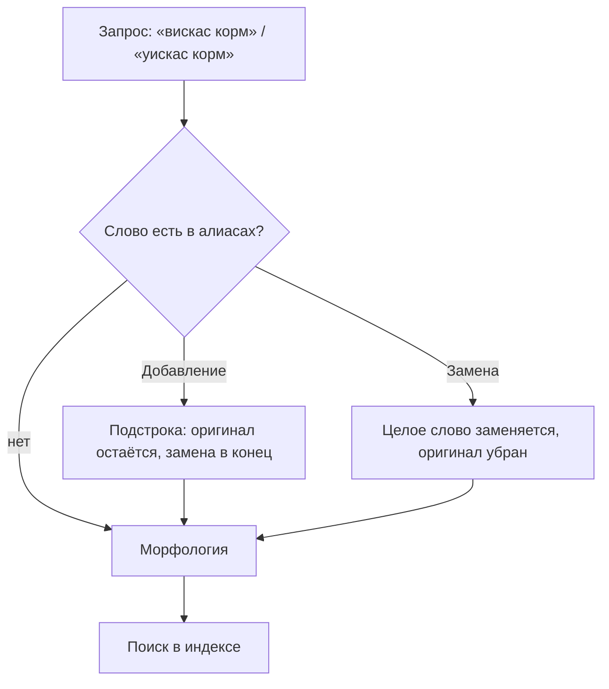

# Алиасы

Вкладка для управления синонимами и заменами поисковых слов.

## Назначение

Алиасы связывают разные написания слов и расширяют результаты поиска. Применяются для:

- Исправления опечаток
- Добавления синонимов
- Транслитерации
- Связывания брендов с альтернативными названиями

## Режимы работы

В админке режим задаётся флагом **«Полная замена»** и отображается в таблице как «Добавление» или «Замена». Сопоставление слова не зависит от регистра.

### Добавление (синоним)

Флаг «Полная замена» выключен. Замена дописывается к запросу, оригинал сохраняется.

**Пример:** алиас `вискас` → `whiskas`

- Запрос: «вискас корм»
- Поиск по: «вискас», «whiskas», «корм»

Срабатывает по вхождению подстроки: если «вискас» встретится внутри другого слова, замена всё равно допишется в конец запроса.

### Замена

Флаг «Полная замена» включён. Исходное слово заменяется на замену.

**Пример:** алиас `уискас` → `whiskas`

- Запрос: «уискас корм»
- Поиск по: «whiskas», «корм»

Срабатывает только на целое слово (по границам слова) — вхождения внутри других слов не затрагиваются.

## Интерфейс

### Таблица алиасов

| Колонка | Описание |
|---------|----------|
| Слово | Исходное слово (что ищет пользователь) |
| Замена | Слово для замены/добавления |
| Полная замена | `Замена` — замена, `Добавление` — синоним |
| Активен | Статус алиаса |

### Действия

| Кнопка | Описание |
|--------|----------|
| Создать алиас | Добавить новый алиас |
| Редактировать | Изменить существующий алиас |
| Удалить | Удалить алиас (запрашивает подтверждение) |

## Создание алиаса

1. Нажмите **Создать алиас**
2. Заполните поля:
   - **Слово** — что ищет пользователь (обязательно)
   - **Замена** — на что заменить или что добавить (обязательно)
   - **Полная замена** — включить для режима замены
   - **Активен** — включить/отключить алиас
3. Нажмите **Сохранить**

Поля «Слово» и «Замена» обязательны — без них сохранение не пройдёт.

## Примеры использования

### Исправление опечаток

| Слово | Замена | Режим |
|-------|--------|-------|
| `самсунг` | `samsung` | Замена |
| `эпл` | `apple` | Замена |
| `ксяоми` | `xiaomi` | Замена |

### Добавление синонимов

| Слово | Замена | Режим |
|-------|--------|-------|
| `телефон` | `смартфон` | Синоним |
| `ноутбук` | `лэптоп` | Синоним |
| `принтер` | `мфу` | Синоним |

### Транслитерация брендов

| Слово | Замена | Режим |
|-------|--------|-------|
| `найк` | `nike` | Замена |
| `адидас` | `adidas` | Замена |
| `пума` | `puma` | Замена |

### Обработка сокращений

| Слово | Замена | Режим |
|-------|--------|-------|
| `комп` | `компьютер` | Синоним |
| `телек` | `телевизор` | Синоним |
| `мобила` | `мобильный телефон` | Замена |

## Рекомендации

### Анализируйте запросы

Регулярно проверяйте вкладку [Запросы](/components/msearch/interface/queries):

1. Найдите запросы с нулевыми результатами
2. Определите, есть ли релевантный контент
3. Если контент есть — создайте алиас

### Не злоупотребляйте

- Создавайте алиасы только для реальных синонимов
- Избегайте слишком общих замен
- Тестируйте результаты поиска после добавления

### Приоритет морфологии

Алиасы применяются **до** морфологического анализа. Если слово распознаётся морфологическим словарём, его словоформы также будут учтены.

## Отличия от mSearch2

| Аспект | mSearch2 | mSearch |
|--------|----------|---------|
| Название | Синонимы | Алиасы |
| Режимы | Только синонимы (добавление) | Добавление и замена |
| Интерфейс | ExtJS | Vue 3 + PrimeVue |
