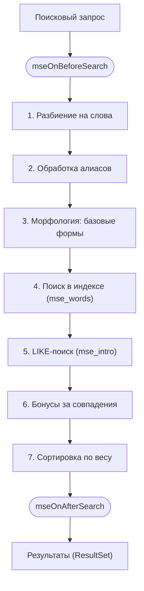

# Поиск

Вкладка для тестирования поисковых запросов в административной панели.

## Назначение

Поиск использует тот же алгоритм и индекс, что и сниппет [mSearch](/components/msearch/snippets/msearch). В результатах — только опубликованные, не удалённые ресурсы с отмеченным параметром searchable: ровно то, что увидит посетитель сайта.

## Интерфейс

### Форма поиска

- **Поле ввода** — введите поисковый запрос
- **Кнопка «Найти»** — запустить поиск (или нажмите Enter)

Пустой запрос не отправляется — выводится предупреждение «Введите поисковый запрос».

### Таблица результатов

| Колонка | Описание |
|---------|----------|
| ID | Идентификатор ресурса |
| Заголовок | Название страницы (pagetitle). Кликабельно — открывает ресурс в новой вкладке |
| Вес | Релевантность результата |

Если ничего не найдено, выводится сообщение «Ничего не найдено». При ошибке запроса показывается уведомление с её текстом.

## Применение

Используйте эту вкладку для:

- **Проверки индексации** — убедитесь, что нужные страницы находятся
- **Отладки морфологии** — проверьте, как обрабатываются словоформы
- **Тестирования алиасов** — убедитесь, что синонимы работают
- **Оценки весов** — посмотрите итоговую релевантность результатов; сами веса полей задаются настройкой `mse_index_fields`, а не на этой вкладке

## Алгоритм поиска

1. Запрос разбивается на слова
2. Применяются [алиасы](/components/msearch/interface/aliases) (синонимы и замены)
3. Для каждого слова ищутся базовые формы через морфологический анализ
4. Поиск слов в индексе
5. Дополнительный LIKE-поиск по полному тексту
6. Применение бонусов за точные совпадения
7. Сортировка по релевантности

