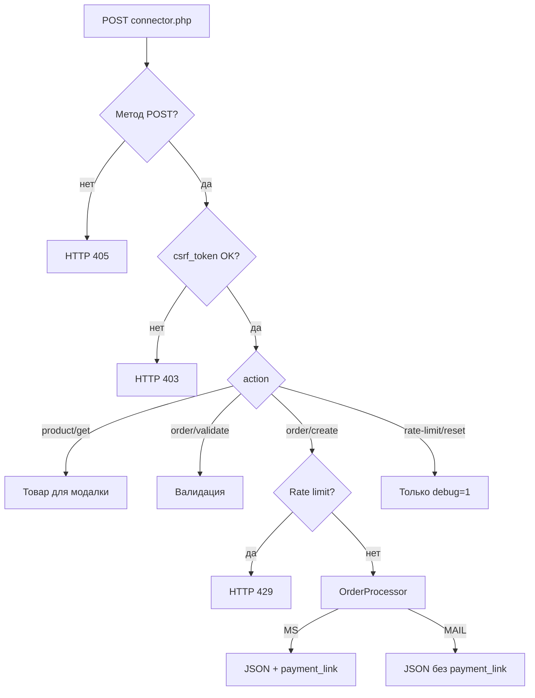
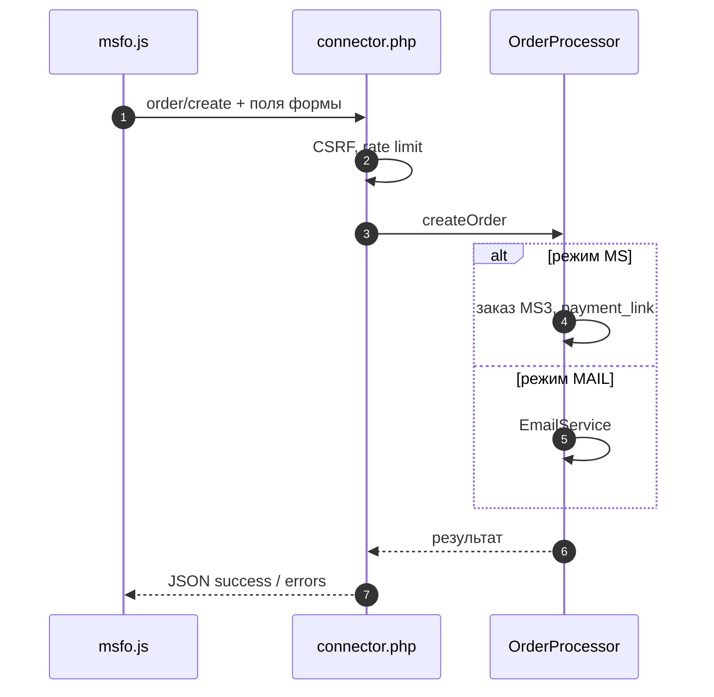

# AJAX API (connector)

Единственная точка входа для фронтенда:

```
POST {msfastorder_connector_url}
Content-Type: application/x-www-form-urlencoded
```

По умолчанию: `/assets/components/msfastorder/connector.php`

Файл: `assets/components/msfastorder/connector.php`
Вызывается из `msfo.js` (`ProductLoader`, `FormHandler`).



## Общие правила

| Правило | Деталь |
|---------|--------|
| Метод | Только **POST** (GET → `405`) |
| `csrf_token` | Обязателен; из `window.msfoConfig.csrfToken` |
| `action` | Whitelist (см. ниже) |
| Ответ | JSON, UTF-8 |
| Rate limit | На `order/create` по IP (сессия) |

При неверном токене: HTTP **403**, `success: false`.

При превышении лимита: HTTP **429**, `message` из lexicon `msfastorder_error_rate_limit`.

## Разрешённые actions

| action | Rate limit | Описание |
|--------|------------|----------|
| `product/get` | нет | Данные товара для модалки |
| `order/validate` | нет | Валидация без создания заказа |
| `order/create` | да | Создание заказа (MS или MAIL) |
| `rate-limit/reset` | — | Только при `msfastorder_debug=1`, сброс счётчика в сессии |



## `product/get`

**Параметры POST:**

| Поле | Тип | Обязательно |
|------|-----|-------------|
| `action` | string | да → `product/get` |
| `csrf_token` | string | да |
| `id` | int | да, ID товара |

**Успех:**

```json
{
  "success": true,
  "data": {
    "id": 123,
    "pagetitle": "Название",
    "alias": "tovar",
    "price": 40461,
    "old_price": 0,
    "article": "SKU-1",
    "weight": 1.2,
    "thumb": "/assets/.../image.jpg",
    "has_variants": true,
    "variants": [
      {
        "id": 42,
        "sku": "...",
        "price": 41000,
        "old_price": 0,
        "count": 10,
        "options": { "color": "red" },
        "name": "red"
      }
    ]
  }
}
```

Если нет превью — `thumb` из `msfastorder_default_image`.

**Ошибка:**

```json
{
  "success": false,
  "message": "Product not found"
}
```

## `order/validate`

Те же поля, что у `order/create`, с `action=order/validate`.

**Успех:**

```json
{
  "success": true,
  "message": "...",
  "errors": null
}
```

**Ошибка валидации:**

```json
{
  "success": false,
  "message": "...",
  "errors": {
    "receiver": "Поле \"ФИО\" обязательно для заполнения"
  }
}
```

Сообщения с подстановкой `[[+field]]` через lexicon `msfastorder_field_*`.

## `order/create`

Режим задаётся **системной настройкой** `msfastorder_method` (`MS` | `MAIL`), не параметром сниппета.

**Параметры POST:**

| Поле | Тип | Обязательно | Описание |
|------|-----|-------------|----------|
| `action` | string | да | `order/create` |
| `csrf_token` | string | да | CSRF |
| `product_id` | int | да | ID товара |
| `count` | int | нет | По умолчанию `1` |
| `options` | string (JSON) | нет | `variant_id` и опции товара |
| `receiver` | string | * | Если в `msfastorder_required_fields` |
| `phone` | string | * | |
| `email` | string | * | |
| `city` | string | нет | |
| `comment` | string | нет | |

Примеры `options`:

```json
{"variant_id": 42}
```

```json
{"variant_id": 42, "options": {"color": "red", "size": "L"}}
```

```json
{"color": "red"}
```

Парсинг: `OrderProcessor::parseOptions()`.

### Успех (MS)

```json
{
  "success": true,
  "message": "...",
  "data": {
    "order_id": 15,
    "order_num": "00015",
    "method": "MS",
    "total": 80922,
    "payment_link": "https://site.ru/..."
  }
}
```

- `payment_link` — из `MiniShop3Integration::getPaymentLink()` для `msfastorder_payment_id`.
- При пустом `email` в MS-режиме PHP может сгенерировать email (`generateEmail()`), чтобы MS3 принял заказ.
- Настройка `msfastorder_generate_email` в транспорте **пока не переключает** это поведение.

| Способ оплаты MS3 | `payment_link` |
|-------------------|----------------|
| DefaultPayment | Страница успеха `?msorder={uuid}` |
| ЮKassa ([msp3YooKassa](https://docs.modx.pro/components/msp3yookassa/)) | URL checkout |

См. [Системные настройки](settings#payment-link), [Интеграция](integration).

### Успех (MAIL)

```json
{
  "success": true,
  "message": "...",
  "data": {
    "order_id": "MAIL-1716200000",
    "method": "MAIL",
    "total": 40461
  }
}
```

`payment_link` отсутствует. Письма через `EmailService`.

### Ошибка

```json
{
  "success": false,
  "message": "Validation failed",
  "errors": {
    "phone": "..."
  }
}
```

или без `errors`:

```json
{
  "success": false,
  "message": "Order creation failed"
}
```

## Коды HTTP

| Код | Причина |
|-----|---------|
| 405 | Не POST |
| 403 | Неверный CSRF; `rate-limit/reset` без debug |
| 400 | Недопустимый `action` |
| 429 | Rate limit на `order/create` |
| 500 | Исключение; при `msfastorder_debug` в JSON может быть `debug` |

## Пример curl

```bash
# Токен — из HTML страницы с [[!msFastOrder]]
curl -sS -X POST 'https://example.com/assets/components/msfastorder/connector.php' \
  -H 'Content-Type: application/x-www-form-urlencoded' \
  --data-urlencode 'action=order/create' \
  --data-urlencode 'csrf_token=YOUR_TOKEN' \
  --data-urlencode 'product_id=123' \
  --data-urlencode 'count=2' \
  --data-urlencode 'receiver=Иван' \
  --data-urlencode 'phone=+79991234567' \
  --data-urlencode 'options={"variant_id":null}'
```

Сброс rate limit (staging, `msfastorder_debug=1`):

```bash
curl -X POST '.../connector.php' \
  -d 'action=rate-limit/reset' \
  -d 'csrf_token=YOUR_TOKEN'
```

## PHP (плагины, кастом)

```php
$modx->lexicon->load('msfastorder:default');
$processor = new \MsFastOrder\Processors\OrderProcessor($modx);
$result = $processor->createOrder([
    'product_id' => 123,
    'count' => 2,
    'receiver' => 'Иван',
    'phone' => '+79991234567',
    'email' => 'a@b.c',
    'options' => json_encode(['variant_id' => 5]),
]);
```

Сервисы:

| Класс | Назначение |
|-------|------------|
| `MiniShop3Integration` | Товар, заказ MS3, `payment_link` |
| `OrderService` | `msfastorder_logs` |
| `EmailService` | Письма MAIL |
| `OrderValidator` | Валидация полей |
| `ClientConfig` | `msfoConfig`, CSRF |

Связка с фронтом: [frontend](frontend).
