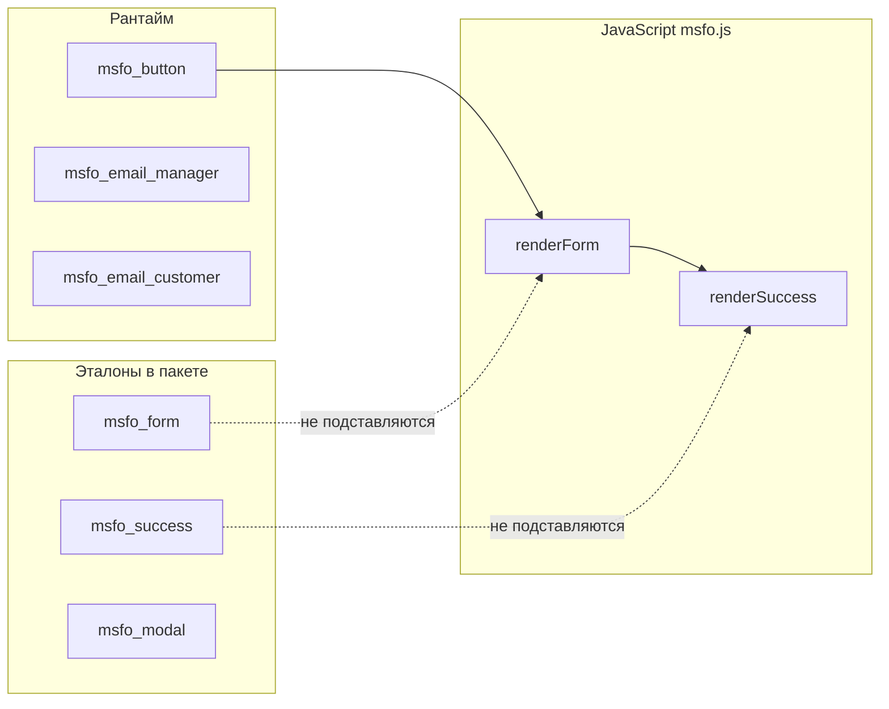

# Чанки msFastOrder

При установке пакета создаются чанки с префиксом **`msfo_`**.

## Обзор

| Чанк | Используется в рантайме | Назначение |
|------|-------------------------|------------|
| `msfo_button` | **Да** | Кнопка «Купить в 1 клик» (сниппет `msFastOrder`, `tplBtn`) |
| `msfo_email_manager` | **Да** | Письмо менеджеру (MAIL и уведомления) |
| `msfo_email_customer` | **Да** | Письмо покупателю |
| `msfo_modal` | Нет | Эталон оболочки модалки |
| `msfo_form` | Нет | Эталон разметки формы |
| `msfo_success` | Нет | Эталон экрана успеха |



::: warning Форма и success в модалке
По умолчанию HTML формы и экрана успеха **не** берётся из чанков `msfo_form` / `msfo_success` на сервере. Их собирает JavaScript (`renderForm`, `renderSuccess` в `msfo.js`). Изменение только чанка **не изменит** модалку — см. [Подключение на сайте](frontend#форма-в-модалке-важно).
:::

## msfo_button

Плейсхолдеры при вызове из сниппета:

| Плейсхолдер | Описание |
|-------------|----------|
| `product_id` | ID товара |
| `hash` | `md5(product_id + site_key)` |
| `primary` | Если true — класс `msfo-trigger--primary` |

Текст кнопки — лексикон `msfastorder_button_text`.

Кастомный чанк кнопки (`tplBtn`):

::: code-group

```fenom
{'!msFastOrder' | snippet : ['tplBtn' => 'my_fast_btn']}
```

```modx
[[!msFastOrder? &tplBtn=`my_fast_btn`]]
```

:::

Пример разметки чанка `my_fast_btn`:

::: code-group

```fenom
<button type="button" class="msfo-trigger" data-msfo-trigger data-msfo-product-id="{$product_id}" data-msfo-hash="{$hash}">
  {$_modx->lexicon('msfastorder_button_text')}
</button>
```

```modx
<button type="button" class="msfo-trigger" data-msfo-trigger data-msfo-product-id="[[+product_id]]" data-msfo-hash="[[+hash]]">
  [[%msfastorder_button_text]]
</button>
```

:::

## msfo_form (эталон)

Плейсхолдеры для серверного рендера или как образец полей:

`product_id`, `pagetitle`, `price`, `old_price`, `thumb`, `count`, `options`, `phone_mask`.

Поля POST при отправке: `product_id`, `count`, `options` (JSON), `receiver`, `phone`, `email`, `city`, `comment`.

## msfo_success (эталон)

Используется как образец для кнопки оплаты:

::: code-group

```fenom
{if $payment_link}
  <a href="{$payment_link}" class="msfo-btn msfo-btn--primary">
    {$_modx->lexicon('msfastorder_pay_button')}
  </a>
{/if}
```

```modx
[[+payment_link:notempty=`
  <a href="[[+payment_link]]" class="msfo-btn msfo-btn--primary">[[%msfastorder_pay_button]]</a>
`]]
```

:::

В рантайме аналогичная разметка создаётся в `FormHandler.renderSuccess()` (чанк на сервере по умолчанию не подставляется).

## Письма

| Чанк | Когда отправляется |
|------|-------------------|
| `msfo_email_manager` | Режим MAIL; также уведомления менеджеру при настройке |
| `msfo_email_customer` | Если указан email клиента |

Проверьте настройку почты MODX (SMTP), если письма не доходят — [FAQ](faq#режим-mail--письмо-не-приходит).

## Кастомизация

| Задача | Подход |
|--------|--------|
| Своя кнопка | Чанк `tplBtn` или HTML с `data-msfo-trigger` |
| Своя форма в модалке | Событие `msfo:modal:loaded`, эталон `msfo_form` — [Подключение на сайте](frontend#форма-в-модалке-важно) |
| Доработка после загрузки | Событие `msfo:modal:loaded` |
| Свой success | Правка `renderSuccess()` или событие `msfo:order:success` |

Лексикон: `core/components/msfastorder/lexicon/ru/default.inc.php` (и `en`).
