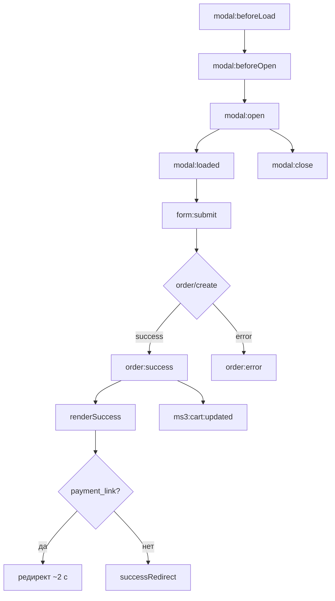

# События JavaScript

Компонент использует внутренний **EventBus** (`msfo.js`) и дублирует каждое событие в DOM как `CustomEvent` с префиксом `msfo:`.

```javascript
// detail совпадает с аргументом EventBus
document.addEventListener('msfo:order:success', function (e) {
  console.log(e.detail);
});

// или через API
msFastOrder.on('order:success', function (data) {
  console.log(data);
});
```

Полный контекст фронтенда: [frontend](frontend).

## Порядок при успешном заказе



Краткий список:

1. `modal:beforeLoad` — клик по кнопке
2. `modal:beforeOpen` → `modal:open` — показ модалки с формой
3. `modal:loaded` — форма инициализирована (`FormHandler`)
4. *(пользователь отправляет форму)*
5. `form:submit` — перед AJAX
6. `order:success` или `order:error` — ответ connector
7. При успехе — разметка success в модалке и опциональный редирект
8. `modal:beforeClose` → `modal:close` — при закрытии

После `order:success` в режиме MS вызывается `MiniShop3Integration.reinitCart()` и событие `ms3:cart:updated`.

## Справочник событий

| EventBus | DOM | Когда |
|----------|-----|-------|
| `modal:beforeLoad` | `msfo:modal:beforeLoad` | Начало `openOrderModal`, до `product/get` |
| `modal:beforeOpen` | `msfo:modal:beforeOpen` | Перед вставкой контента в модалку |
| `modal:open` | `msfo:modal:open` | Модалка открыта |
| `modal:loaded` | `msfo:modal:loaded` | Форма в DOM, `FormHandler` создан |
| `form:submit` | `msfo:form:submit` | Валидация пройдена, перед `order/create` |
| `order:success` | `msfo:order:success` | `success: true` от connector |
| `order:error` | `msfo:order:error` | Ошибка валидации или создания |
| `modal:beforeClose` | `msfo:modal:beforeClose` | Перед закрытием |
| `modal:close` | `msfo:modal:close` | После закрытия |

## Payload по событиям

### `modal:beforeLoad`

```javascript
{ productId: 123 }
```

### `modal:beforeOpen` / `modal:open`

```javascript
{
  content: '<form class="msfo-form">...</form>',
  options: { title: 'Быстрый заказ' }
}
```

### `modal:loaded`

```javascript
{
  productId: 123,
  product: {
    id: 123,
    pagetitle: '...',
    price: 40461,
    thumb: '...',
    variants: []
  }
}
```

Типичное использование — доработка формы после загрузки:

```javascript
document.addEventListener('msfo:modal:loaded', function (e) {
  const form = document.querySelector('.msfo-form');
  if (!form) return;
  const city = form.querySelector('[name="city"]');
  if (city) city.value = 'Москва';
});
```

### `form:submit`

```javascript
{
  data: {
    product_id: '123',
    count: '2',
    options: '{"variant_id":42}',
    receiver: 'Иван',
    phone: '+7 (999) 123-45-67',
    email: '',
    city: '',
    comment: ''
  }
}
```

Можно дописать поля до отправки (UTM, метки):

```javascript
document.addEventListener('msfo:form:submit', function (e) {
  e.detail.data.utm_source = new URLSearchParams(location.search).get('utm_source') || '';
});
```

**Примечание:** изменения в `e.detail.data` после этого события уходят в `order/create`, т.к. объект передаётся в `sendRequest`.

### `order:success`

Тело ответа connector (как в [api](api)):

```javascript
{
  success: true,
  message: '...',
  data: {
    order_id: 15,
    order_num: '00015',
    method: 'MS',
    total: 80922,
    payment_link: 'https://...'
  }
}
```

`payment_link` — из MS3 (`msfastorder_payment_id`). ЮKassa: [integration](integration#оплата-через-юkassa-msp3yookassa).

Редирект на оплату (встроено в `msfo.js`, если задан `successRedirect`):

```javascript
// Дублирует логику компонента при необходимости своего тайминга:
document.addEventListener('msfo:order:success', function (e) {
  const link = e.detail.data && e.detail.data.payment_link;
  if (link) {
    window.location.href = link;
  }
});
```

### `order:error`

```javascript
{
  success: false,
  message: 'Validation failed',
  errors: {
    receiver: 'Поле "ФИО" обязательно для заполнения',
    phone: '...'
  },
  status: 429  // опционально, при rate limit
}
```

## Редирект после заказа

Встроенно (`msfastorder_success_redirect` + `msfoConfig.successRedirect`):

- есть `payment_link` → через ~2 с переход на оплату;
- иначе → переход на `successRedirect`.

Кастомный сценарий:

```javascript
document.addEventListener('msfo:order:success', function (e) {
  if (!e.detail.success) return;
  setTimeout(function () {
    window.location.href = '/thank-you/';
  }, 1500);
});
```

## Аналитика

### Facebook Pixel

```javascript
document.addEventListener('msfo:order:success', function (e) {
  if (typeof fbq !== 'undefined' && e.detail.data) {
    fbq('track', 'Purchase', {
      value: e.detail.data.total,
      currency: 'RUB'
    });
  }
});
```

### Яндекс.Метрика / цели

```javascript
document.addEventListener('msfo:order:success', function (e) {
  if (typeof ym !== 'undefined' && e.detail.data) {
    ym(XXXXXX, 'reachGoal', 'fast_order', { order_id: e.detail.data.order_id });
  }
});
```

### VK Pixel

```javascript
document.addEventListener('msfo:order:success', function (e) {
  if (typeof VK !== 'undefined' && e.detail.data) {
    VK.Goal('purchase', { value: e.detail.data.total });
  }
});
```
