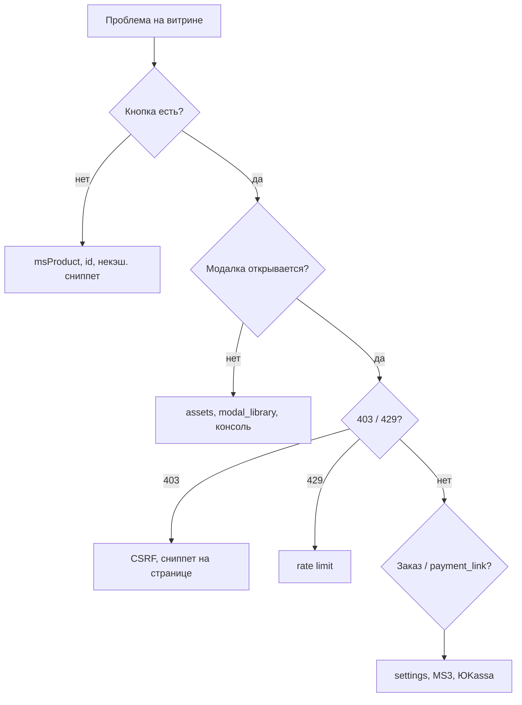

# FAQ msFastOrder



## Кнопка не появляется

**Причины:**

- Ресурс не класса **msProduct** или нет записи `Data` у товара.
- Параметр `&id` указывает на несуществующий или не товарный ресурс.
- Сниппет вызван **кэшированно** — используйте `[[!msFastOrder]]` / `{'!msFastOrder' | snippet}`.

**Проверка:** в элементе сниппет выполняется на странице товара MS3; в HTML есть разметка кнопки с `data-msfo-trigger`.

## Модалка не открывается

1. Консоль браузера — ошибки 404 на `msfo.min.js` / `msfo.min.css`.
2. Настройка `msfastorder_assets_url` и файлы в `assets/components/msfastorder/`.
3. Для `msfastorder_modal_library=bootstrap` или `fancybox` — библиотека подключена на странице.

### Product load error: Unexpected token '<'

Connector вернул **HTML** (PHP-ошибка), а не JSON.

| Причина | Действие |
|---------|----------|
| Неверный путь к `config.core.php` | В `connector.php` должно быть `dirname(__FILE__, 4)` |
| Fatal в MS3 / msFastOrder | Откройте тело ответа в Network → `connector.php` |
| Нет сниппета на странице | Обычно 403 JSON, не HTML — но проверьте вызов `[[!msFastOrder]]` |

## HTTP 403 при отправке формы

- На странице перед отправкой был вызван `msFastOrder` или `msFastOrderClientConfig`.
- В POST уходит `csrf_token` из `window.msfoConfig.csrfToken` (не устаревший из кэша страницы).
- Плагин `msfastorder_web` включён.

После очистки кэша MODX обновите страницу товара (жёсткое обновление в браузере).

## Ошибка валидации телефона

- Сверьте `msfastorder_phone_mask` с форматом ввода.
- При `msfastorder_prefix_enabled=1` — `msfastorder_prefix_country`, `msfastorder_prefix_length`.

Серверная валидация строже клиентской — см. `msfastorder_required_fields` в [настройках](settings).

## Заказ MS не создаётся

- MiniShop3 установлен и инициализирован.
- `msfastorder_payment_id` и `msfastorder_delivery_id` — существующие **активные** ID в MS3.
- **Журнал ошибок** MODX, префикс `[msFastOrder]`.
- Временно `msfastorder_debug=1` на staging.

## payment_link не появляется или не ЮKassa {#payment-link-не-появляется-или-не-юkassa}

После `order/create` в `data.payment_link` ожидается непустая строка.

| Симптом | Что проверить |
|---------|----------------|
| Поле пустое | `msfastorder_method=MS`, активные payment/delivery ID |
| Ссылка на «Спасибо», нужна ЮKassa | В `msfastorder_payment_id` — способ с классом YooKassa; установлен [msp3YooKassa](/components/msp3yookassa/) |
| Статус заказа не «оплачен» | Webhook ЮKassa и ключи msp3YooKassa |
| Нет кнопки «Оплатить» | `payment_link` в ответе; не ломайте `renderSuccess` без кнопки |

Пошагово: [Интеграция → ЮKassa](integration#оплата-через-юkassa-msp3yookassa).

## Режим MAIL — письмо не приходит {#режим-mail--письмо-не-приходит}

- Заполнен `msfastorder_email_manager`.
- Настроен SMTP / sendmail в MODX.
- Папка «Спам», лог `modMail`.

## Вариант товара не учитывается

- Класс формы `ms3variants-product-{id}`.
- Поле `ms3variant_id` обновляется при смене варианта.
- Сначала выберите вариант на странице, затем «в 1 клик».

[Интеграция → ms3Variants](integration#интеграция-с-ms3variants).

## Изменения в чанке msfo_form не видны

Форма в модалке строится в **JS** (`renderForm`), success — `renderSuccess`. Чанки — эталоны.

[Подключение на сайте → форма](frontend#форма-в-модалке-важно), [Чанки](chunks).

## Неверное количество в каталоге

Используйте класс с ID товара:

::: code-group

```fenom
<input type="number" name="count" class="msfastorder-count-{$id}" value="1" min="1">
```

```modx
<input type="number" name="count" class="msfastorder-count-[[+id]]" value="1" min="1">
```

:::

## HTTP 429

Превышен rate limit на `order/create`. Настройки: `msfastorder_rate_limit_attempts`, `msfastorder_rate_limit_window`.

На staging при `msfastorder_debug=1`: POST `action=rate-limit/reset` — [AJAX API](api).

## Ошибка «Поле "" обязательно»

Обновите пакет **msFastOrder** через ModStore до актуальной версии — в клиенте должны подставляться подписи из `msfoConfig.lexicon.field_*`.

## Логи и отладка

**Таблица** `msfastorder_logs`:

```sql
SELECT * FROM msfastorder_logs ORDER BY created_at DESC LIMIT 20;
```

**AJAX:** Network → `connector.php` → JSON `success`, `message`, `errors`, `debug`.
