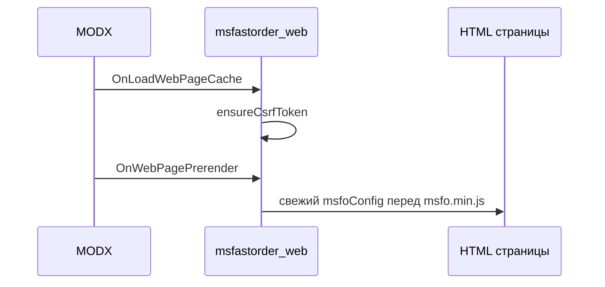
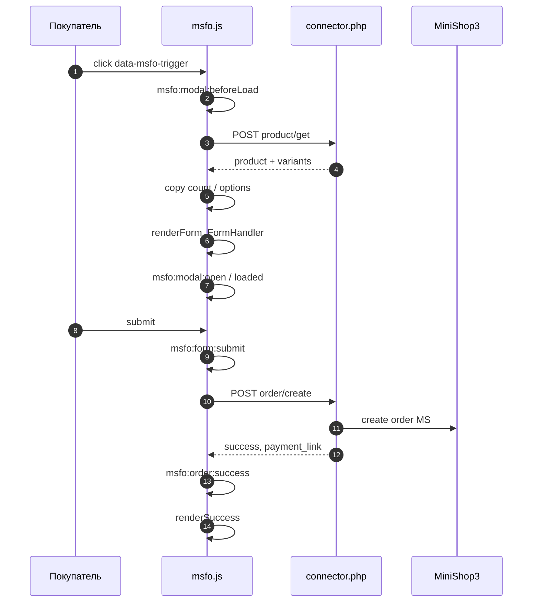
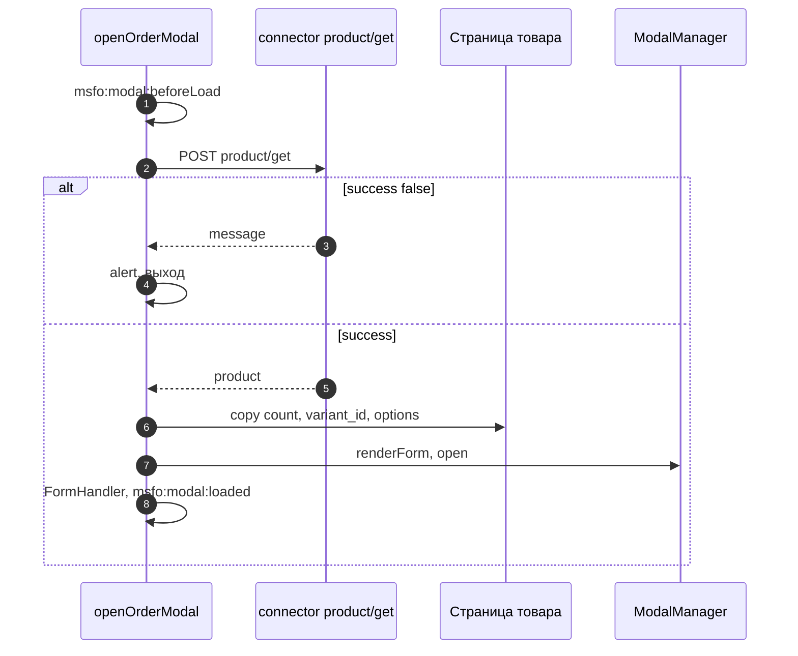

# Подключение на сайте

Фронтенд: JavaScript, разметка, конфиг.

Документ описывает всё, что происходит в браузере после вызова `[[!msFastOrder]]`: подключение скриптов, `window.msfoConfig`, глобальный API, разметку формы, AJAX и события.

См. также: [AJAX API](api), [События JavaScript](events), [Сниппеты](snippets/index).

## Подключение на странице

Сниппет `msFastOrder` при каждом вызове:

1. Проверяет, что ресурс — товар MS3 (`msProduct`).
2. Рендерит чанк кнопки (`tplBtn`, по умолчанию `msfo_button`).
3. Регистрирует CSS: `{msfastorder_assets_url}css/msfo.min.css?v={mtime}`.
4. Регистрирует JS: `{msfastorder_assets_url}js/msfo.min.js?v={mtime}`.
5. Создаёт/обновляет CSRF в сессии (`$_SESSION['msfastorder.csrf_token']`).

Плагин `msfastorder_web` (события `OnLoadWebPageCache`, `OnWebPagePrerender`) подставляет **свежий** `window.msfoConfig` перед `msfo.min.js`, чтобы токен не «застывал» в кэше ресурса.



Опционально на шаблоне можно вывести сниппет `msFastOrderClientConfig` — тот же `ClientConfig::getConfigScript()` без кнопки.

## Жизненный цикл (клик → заказ)



## window.msfoConfig

Генерируется классом `MsFastOrder\ClientConfig` (PHP). Пример структуры:

```javascript
{
  connectorUrl: '/assets/components/msfastorder/connector.php',
  csrfToken: '64hex...',
  modalLibrary: 'native',           // native | bootstrap | fancybox
  phoneMask: '+7 (999) 999-99-99',
  successRedirect: '',              // URL или пусто
  requiredFields: ['receiver', 'phone'],  // с сервера, для справки
  lexicon: {
    modal_title: '...',
    submit_button: '...',
    field_receiver: '...',
    field_phone: '...',
    error_required: 'Поле "[[+field]]" обязательно...',
    error_rate_limit: '...',
    total: 'Итого',
    currency: '₽',
    // ...
  }
}
```

Расширение **до** загрузки `msfo.min.js` (или после сниппета, если скрипт ниже):

::: code-group

```fenom
<script>
window.msfoConfig = Object.assign(window.msfoConfig || {}, {
  successRedirect: '/spasibo/',
  modalLibrary: 'fancybox'
});
</script>
```

```modx
<script>
window.msfoConfig = Object.assign(window.msfoConfig || {}, {
  successRedirect: '/spasibo/',
  modalLibrary: 'fancybox'
});
</script>
```

:::

| Поле | Источник (настройка MODX) |
|------|---------------------------|
| `connectorUrl` | `msfastorder_connector_url` |
| `modalLibrary` | `msfastorder_modal_library` |
| `phoneMask` | `msfastorder_phone_mask` |
| `successRedirect` | `msfastorder_success_redirect` |
| `requiredFields` | `msfastorder_required_fields` |
| `lexicon.*` | lexicon `msfastorder:*` |

## Глобальный объект msFastOrder

Доступен после `msfo.min.js`: `window.msFastOrder`.

| Метод | Описание |
|-------|----------|
| `openOrderModal(productId)` | Загрузить товар, открыть модалку с формой |
| `closeModal()` | Закрыть текущую модалку |
| `getModalLibrary()` | Текущая библиотека (`native` / `bootstrap` / `fancybox`) |
| `setModalLibrary(name)` | Переключить библиотеку; при отсутствии BS/Fancybox — fallback на `native` |
| `on(event, callback)` | Подписка на EventBus |
| `off(event, callback)` | Отписка |

Подробнее о вызове без стандартной кнопки: [Программное открытие модалки](#программное-открытие-модалки).

## Разметка кнопки

Обязательные атрибуты (делегирование клика на `document`):

| Атрибут | Обязательно | Описание |
|---------|-------------|----------|
| `data-msfo-trigger` | да | Маркер кнопки быстрого заказа |
| `data-msfo-product-id` | да | ID ресурса-товара MS3 |

Опционально:

| Атрибут / класс | Описание |
|-----------------|----------|
| `data-msfo-hash` | md5(`product_id` + `site_key`) — в стандартном чанке |
| `msfo-trigger--primary` | Стиль кнопки (`&primary=1` в сниппете) |

Клик по такой кнопке внутри вызывает тот же `openOrderModal`, что и ручной вызов из JS (делегирование на `document`).

## Программное открытие модалки

Используйте, когда кнопка «в 1 клик» не из сниппета `msFastOrder`: своя вёрстка в каталоге, ссылка «Купить сейчас», виджет, сравнение товаров, открытие из другого скрипта.

### Что должно быть на странице

| Условие | Зачем |
|---------|--------|
| Подключены `msfo.min.css` и `msfo.min.js` | Модалка и AJAX |
| На странице есть `window.msfoConfig` с `csrfToken` и `connectorUrl` | Запросы к connector |
| Загружен `msfo.min.js` до вызова API | Иначе `msFastOrder` ещё не создан |

Конфиг и CSRF дают:

- **`[[!msFastOrder]]`** на этой же странице (кнопка необязательна, но сниппет подключает assets и конфиг), **или**
- **`[[!msFastOrderClientConfig]]`** + ручное подключение CSS/JS в шаблоне — см. [msFastOrderClientConfig](snippets/msFastOrderClientConfig).

Без свежего CSRF запросы вернут **403** — на кэшируемых страницах помогает плагин `msfastorder_web`.

### Метод `openOrderModal(productId)`

```javascript
// productId — ID ресурса msProduct (число или строка)
await window.msFastOrder.openOrderModal(123);
```

| Параметр | Тип | Описание |
|----------|-----|----------|
| `productId` | `number` \| `string` | ID товара MODX (`msProduct`) для `action=product/get` |

Метод **асинхронный** (`async`). Явного `return` с результатом нет: при ошибке загрузки товара показывается `alert()` с текстом из ответа connector.

Закрыть модалку программно: `msFastOrder.closeModal()`.

### Последовательность при открытии



1. Событие **`modal:beforeLoad`** / `msfo:modal:beforeLoad` — `{ productId }`.
2. **POST** `product/get` (токен из `msfoConfig.csrfToken`).
3. При `success: false` — `alert`, модалка **не** открывается.
4. **`MiniShop3Integration.copyFromProductPage(productId)`** — с страницы берутся `count` (класс `msfastorder-count-{id}` или `input[name="count"]`) и `options` (форма `.ms3variants-product-{id}`).
5. HTML формы собирается **`renderForm()`**, модалка открывается (`modal:beforeOpen` → `modal:open`).
6. На форму вешается **`FormHandler`** (маска телефона, submit, success).
7. Событие **`modal:loaded`** — `{ productId, product }`; удобная точка для правки DOM формы.

Полный список событий: [События JavaScript](events).

### Своя кнопка без сниппета msFastOrder

В **layout** один раз — конфиг и assets. На карточке — только разметка и вызов API.

::: code-group

```fenom
{* head / footer шаблона *}
{'!msFastOrderClientConfig' | snippet}
<link rel="stylesheet" href="{'assets_url' | option}components/msfastorder/css/msfo.min.css">
<script src="{'assets_url' | option}components/msfastorder/js/msfo.min.js"></script>

{* карточка товара или каталог *}
<button type="button" class="btn-buy-now" data-fast-order-id="{$id}">
  Купить в 1 клик
</button>
<script>
document.addEventListener('click', function (e) {
  var btn = e.target.closest('[data-fast-order-id]');
  if (!btn || !window.msFastOrder) return;
  e.preventDefault();
  window.msFastOrder.openOrderModal(btn.getAttribute('data-fast-order-id'));
});
</script>
```

```modx
[[!msFastOrderClientConfig]]
<link rel="stylesheet" href="[[++assets_url]]components/msfastorder/css/msfo.min.css">
<script src="[[++assets_url]]components/msfastorder/js/msfo.min.js"></script>

<button type="button" class="btn-buy-now" data-fast-order-id="[[+id]]">
  Купить в 1 клик
</button>
<script>
document.addEventListener('click', function (e) {
  var btn = e.target.closest('[data-fast-order-id]');
  if (!btn || !window.msFastOrder) return;
  e.preventDefault();
  window.msFastOrder.openOrderModal(btn.getAttribute('data-fast-order-id'));
});
</script>
```

:::

Эквивалент без отдельного скрипта — атрибуты msFastOrder (делегирование встроено в `msfo.js`):

::: code-group

```fenom
<button type="button" class="msfo-trigger" data-msfo-trigger data-msfo-product-id="{$id}">
  Купить в 1 клик
</button>
```

```modx
<button type="button" class="msfo-trigger" data-msfo-trigger data-msfo-product-id="[[+id]]">
  Купить в 1 клик
</button>
```

:::

На странице при этом всё равно нужен вызов `msFastOrder` или `msFastOrderClientConfig` (CSRF).

### Примеры сценариев

**Открытие после выбора варианта** (синхронизация `_variant_id` → `variant_id` перед загрузкой):

```javascript
document.addEventListener('msfo:modal:beforeLoad', function () {
  var src = document.querySelector('input[name="_variant_id"]');
  var dst = document.querySelector('input[name="variant_id"], input[name="ms3variant_id"]');
  if (src && dst && src.value) dst.value = src.value;
});
```

**Проверка, что API готов** (скрипт в конце страницы):

```javascript
document.addEventListener('DOMContentLoaded', function () {
  if (!window.msFastOrder || typeof msFastOrder.openOrderModal !== 'function') {
    console.warn('[msFastOrder] msfo.min.js или msfoConfig не подключены');
  }
});
```

**Открытие с карточки в каталоге** — `productId` из data-атрибута строки; на странице списка желательно поле `count` с классом `msfastorder-count-{id}` для каждого товара (см. [Быстрый старт](quick-start#шаг-5-рекомендуемая-разметка-варианты-и-количество)).

**Смена библиотеки модалки на лету** (если на странице есть Bootstrap 5 или Fancybox):

```javascript
msFastOrder.setModalLibrary('bootstrap'); // или 'fancybox', 'native'
msFastOrder.openOrderModal(42);
```

### Типичные проблемы

| Симптом | Причина |
|---------|---------|
| `msFastOrder is not defined` | `msfo.min.js` не подключён или вызов до его загрузки |
| 403 в Network на `connector.php` | Нет свежего `csrfToken` — добавьте сниппет на страницу или проверьте `msfastorder_web` |
| `alert` при открытии | Товар не `msProduct`, неверный `productId`, ошибка connector — смотрите JSON ответа |
| Неверное количество / вариант | Нет формы `ms3variants-product-{id}` или класса `msfastorder-count-{id}` на странице |

См. также: [FAQ](faq), [Интеграция](integration), [Сниппет msFastOrder](snippets/msFastOrder#программное-открытие-модалки).

## Форма в модалке: важно

По умолчанию HTML формы **не** берётся из чанка `msfo_form` на сервере. Его собирает JavaScript — метод `MsFastOrder.renderForm()` в `msfo.js` (после `product/get`).

| Чанк / шаблон | Используется в рантайме по умолчанию |
|---------------|--------------------------------------|
| `msfo_button` | Да (сниппет) |
| `msfo_form` | **Нет** (эталон для копирования; правки только в чанке не изменят модалку) |
| `msfo_success` | **Нет** (success рисуется `FormHandler.renderSuccess()` в JS) |
| `msfo_modal` | Нет (оболочка создаётся `ModalManager`) |
| `msfo_email_*` | Да (режим MAIL / письма MS) |

Чтобы изменить форму на фронте без правки ядра пакета:

1. На событии **`msfo:modal:loaded`** меняйте DOM формы (добавление полей, разметка, валидация на клиенте).
2. Подписывайтесь на **`msfo:form:submit`** и дополняйте отправку (UTM, метки) — см. [События JavaScript](events).
3. Эталоны разметки для копирования — чанки `msfo_form` / `msfo_success` ([Чанки](chunks)); сами чанки в стандартном потоке на сервере не подставляются.

### Поля формы (POST `order/create`)

| `name` | Тип | Описание |
|--------|-----|----------|
| `product_id` | hidden | ID товара |
| `count` | number | Количество, min 1 |
| `options` | hidden, JSON | `{ "variant_id": N, "color": "...", ... }` |
| `receiver` | text | ФИО |
| `phone` | tel | Телефон (маска `PhoneMask`) |
| `email` | email | Email |
| `city` | text | Город |
| `comment` | textarea | Комментарий |

Устаревшее: `count_display` — если есть, JS подменяет на `count` перед отправкой.

### Количество и «Итого»

- Поле `count` в модалке; пересчёт **Итого** = `data-unit-price` × `count` (см. `[data-msfo-order-total]`).
- Со страницы товара количество копируется при открытии модалки (`MiniShop3Integration.copyFromProductPage`):
  - предпочтительно: `input.msfastorder-count-{productId}`;
  - иначе: первый на странице `input[name="count"]` (на **каталоге** может быть чужой товар — задавайте класс с ID).

Настройка `msfastorder_copy_count` в транспорте пакета описана, но **в JS пока не отключает** копирование (всегда выполняется).

### Копирование варианта и опций со страницы

Ищется форма:

```text
.ms3variants-product-{productId}
.ms3_form[data-product-id="{productId}"]
```

Из неё читаются:

- `input[name="ms3variant_id"]` или `input[name="variant_id"]` → `options.variant_id`;
- `input[name^="options["]` → ключи в `options`.

Итог уходит в hidden `options` как JSON, например:

```json
{"variant_id": 42, "options": {"color": "red"}}
```

или плоский объект опций — сервер нормализует в `OrderProcessor::parseOptions()`.

Подробнее: [integration](integration#интеграция-с-ms3variants).

## Клиентская валидация

- Атрибут `novalidate` на форме — браузерная валидация отключена.
- Проверяются поля с HTML-атрибутом `required` (в `renderForm` жёстко заданы `receiver`, `phone`).
- Сообщения обязательных полей: `formatRequiredError()` подставляет подпись из `msfoConfig.lexicon.field_*`.
- Email проверяется regex, если поле не пустое.
- Серверная валидация строже (`msfastorder_required_fields`) — см. [api](api).

**Расхождение:** если в настройках обязателен `email`, в стандартной JS-форме атрибут `required` на email **не** добавляется автоматически — добавьте в кастомной разметке или полагайтесь на ответ сервера.

## AJAX из браузера

Все запросы: `POST`, `Content-Type: application/x-www-form-urlencoded`, поле `csrf_token` обязательно.

| action | Кто вызывает | Назначение |
|--------|--------------|------------|
| `product/get` | `ProductLoader.load` | Данные товара для модалки |
| `order/create` | `FormHandler.sendRequest` | Создание заказа |
| `order/validate` | вручную / тесты | Проверка без заказа |
| `rate-limit/reset` | только при `msfastorder_debug` | Сброс лимита в сессии |

При HTTP **429** показывается `lexicon.error_rate_limit`.

Полное описание ответов: [api](api).

## Экран успеха и редирект

После `order/create` с `success: true`:

1. Событие `order:success` (и `msfo:order:success`).
2. Тело модалки заменяется на HTML из `renderSuccess(data)` (не чанк `msfo_success`).
3. Если задан `successRedirect`:
   - при наличии `data.payment_link` — редирект на **оплату** через ~2 с;
   - иначе — редирект на `successRedirect`.

Кнопка «Оплатить» появляется при непустом `data.payment_link`.

## Модальные библиотеки

| `msfastorder_modal_library` | Зависимости на странице |
|-----------------------------|-------------------------|
| `native` | нет |
| `bootstrap` | Bootstrap 5 Modal JS |
| `fancybox` | Fancybox 4/5; подключайте `msfo.min.css` **после** CSS Fancybox |

`ModalManager` блокирует скролл страницы (`msfo-modal-open` на `body`/`html`) и снимает блокировку при `closeModal()` / `closeAll()`.

## CSS

Файл: `assets/components/msfastorder/css/msfo.min.css`.

Переопределение переменных в теме:

```css
:root {
  --msfo-primary: #007bff;
  --msfo-modal-radius: 8px;
  --msfo-gray-300: #dee2e6;
}
```

Классы ошибок: `msfo-field--error`, `msfo-field__error`, `msfo-form__error`.

## События

Полный список, payload и примеры: [events](events).

Кратко:

| EventBus | DOM |
|----------|-----|
| `modal:beforeLoad` | `msfo:modal:beforeLoad` |
| `modal:beforeOpen` | `msfo:modal:beforeOpen` |
| `modal:open` | `msfo:modal:open` |
| `modal:loaded` | `msfo:modal:loaded` |
| `form:submit` | `msfo:form:submit` |
| `order:success` | `msfo:order:success` |
| `order:error` | `msfo:order:error` |
| `modal:beforeClose` | `msfo:modal:beforeClose` |
| `modal:close` | `msfo:modal:close` |

После успешного MS-заказа вызывается `MiniShop3Integration.reinitCart()` (`ms3:cart:updated`).

На витрине подключается **`msfo.min.js`** из пакета (`assets/components/msfastorder/js/`). Версия в URL обновляется по `mtime` файла при обновлении дополнения через ModStore.
