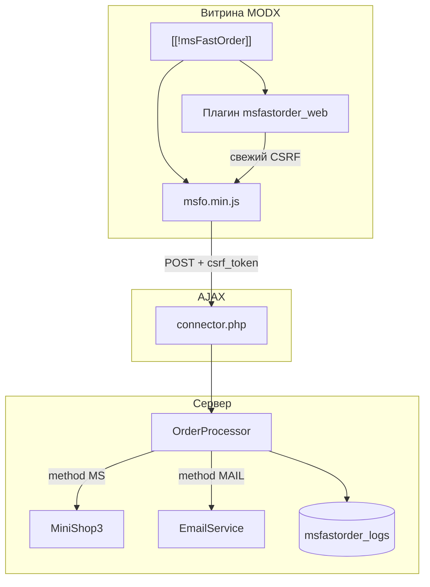
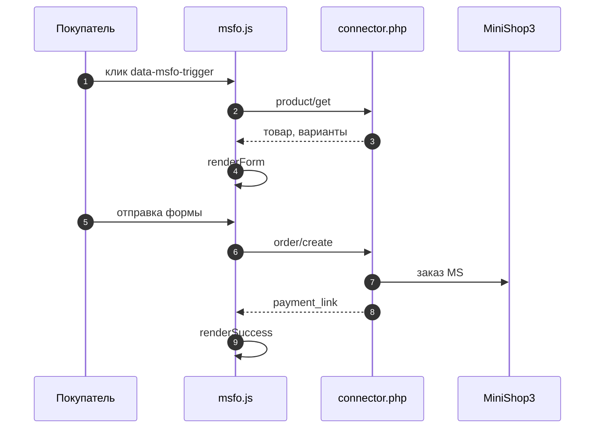

# msFastOrder

**msFastOrder** — дополнение для [MODX Revolution 3](https://modx.com/) и [MiniShop3](/components/minishop3/): оформление заказа «в один клик» с карточки товара через модальное окно, без перехода в корзину..

С чего начать: [Быстрый старт](quick-start).

## Минимальный путь к кнопке на витрине

1. Установить пакет и убедиться, что на сайте работает **MiniShop3**.
2. В **Системные настройки** (область `msfastorder`) задать `msfastorder_method`, email менеджера (для MAIL) и ID оплаты/доставки MS3 (для MS).
3. На шаблоне **страницы товара** (`msProduct`) **некэшированно** вывести `[[!msFastOrder]]`.
4. **Настройки → Очистить кэш** и проверить: клик по кнопке → модалка → заказ или письмо.

Детали: [Быстрый старт](quick-start), разметка карточки: [Подключение на сайте](frontend).

## Быстрые ссылки

| Нужно | Документ |
| --- | --- |
| Установить и проверить первый заказ | [Быстрый старт](quick-start) |
| Все ключи `msfastorder_*` и режимы MS/MAIL | [Системные настройки](settings) |
| Сниппеты, параметры, кнопка на каталоге | [Сниппеты](snippets/index) |
| `msfoConfig`, форма в JS, модалки | [Подключение на сайте](frontend) |
| ms3Variants, ЮKassa, аналитика | [Интеграция](integration) |
| `connector.php`, actions, JSON | [AJAX API](api) |
| События `msfo:*` | [События JavaScript](events) |
| Ошибки 403, payment_link, чанки | [FAQ](faq) |

## Кому что читать

- **Менеджеру / интегратору:** [Быстрый старт](quick-start) → [Системные настройки](settings) → [Интеграция](integration).
- **Вёрстальщику:** [Сниппеты](snippets/msFastOrder) → [Подключение на сайте](frontend) → [Чанки](chunks).
- **Разработчику:** [AJAX API](api) → [События JavaScript](events) → `assets/components/msfastorder/js/msfo.min.js`.

## Возможности

- **Модальное окно** — `native` (по умолчанию), Bootstrap 5 Modal или Fancybox 4/5
- **Режим MS** — полноценный заказ в MiniShop3 с одной позицией, покупателем и `payment_link`
- **Режим MAIL** — письмо менеджеру без записи в MS3
- **Количество и итого** — поле `count`, пересчёт суммы в браузере
- **Варианты** — подхват `variant_id` и опций со страницы ([ms3Variants](/components/ms3variants/))
- **Оплата** — ссылка из способа оплаты MS3, в том числе [msp3YooKassa](/components/msp3yookassa/)
- **Безопасность** — CSRF в сессии, rate limit на `order/create`, журнал `msfastorder_logs`
- **Расширяемость** — DOM-события `msfo:*` и EventBus `msFastOrder.on()`

## Системные требования

| Требование | Версия |
|------------|--------|
| MODX Revolution | 3.0+ |
| PHP | 8.2+ |
| MiniShop3 | 1.0+ |
| pdoTools | 3.0+ (рекомендуется для Fenom) |

### Зависимости

- **[MiniShop3](/components/minishop3/)** — товары, заказы, способы оплаты и доставки

### Опционально

- **[ms3Variants](/components/ms3variants/)** — выбор варианта на карточке товара
- **[msp3YooKassa](/components/msp3yookassa/)** — онлайн-оплата после быстрого заказа

## Установка

1. [Подключите репозиторий ModStore](https://modstore.pro/info/connection).
2. **Extras → Installer** → **Download Extras** — найдите **msFastOrder**, **Download**, **Install**.
3. Убедитесь, что установлен **MiniShop3**.
4. Настройте область **`msfastorder`** в системных настройках.
5. **Настройки → Очистить кэш**.

Каталог пакета: [modstore.pro/packages/integration/msfastorder](https://modstore.pro/packages/integration/msfastorder).

После установки появляются: namespace `msfastorder`, сниппеты `msFastOrder` и `msFastOrderClientConfig`, чанки `msfo_*`, плагин `msfastorder_web`, таблица `msfastorder_logs`. Резолвер может создать способы оплаты и доставки «Fast Order» и прописать их ID в настройки.

Подробнее: [Быстрый старт → Шаг 1](quick-start#шаг-1-установка-пакета).

## Термины

| Термин | Описание |
|--------|----------|
| **connector** | `assets/components/msfastorder/connector.php` — единая точка AJAX (только POST) |
| **msfoConfig** | `window.msfoConfig` — URL connector, CSRF, маска телефона, лексикон для JS |
| **MS / MAIL** | Режимы: заказ в MiniShop3 или только email |
| **payment_link** | URL оплаты из обработчика MS3 (`msfastorder_payment_id`) |
| **renderForm** | JS-сборка HTML формы в модалке (чанк `msfo_form` по умолчанию не рендерится на сервере) |

## Документация по разделам

- [Быстрый старт](quick-start) — установка, настройки, вывод на карточке товара, проверка
- [Системные настройки](settings) — все ключи, MS/MAIL, `payment_link`, безопасность
- [Сниппеты](snippets/index) — `msFastOrder`, `msFastOrderClientConfig`
- [Чанки](chunks) — кнопка, письма, эталоны формы и success
- [Подключение на сайте](frontend) — жизненный цикл, `msfoConfig`, поля формы, CSS
- [Интеграция и сценарии](integration) — шаблон товара, ms3Variants, ЮKassa, метрики
- [AJAX API](api) — actions, поля POST, ответы, PHP
- [События JavaScript](events) — `msfo:*`, аналитика
- [FAQ](faq) — типичные ошибки и диагностика

## Архитектура (кратко)

Сценарий «клик → заказ» на временной шкале:

Подробнее: [Подключение на сайте](frontend#жизненный-цикл-клик--заказ), [AJAX API](api).

## Лицензия

MIT — `core/components/msfastorder/docs/license.txt`.
