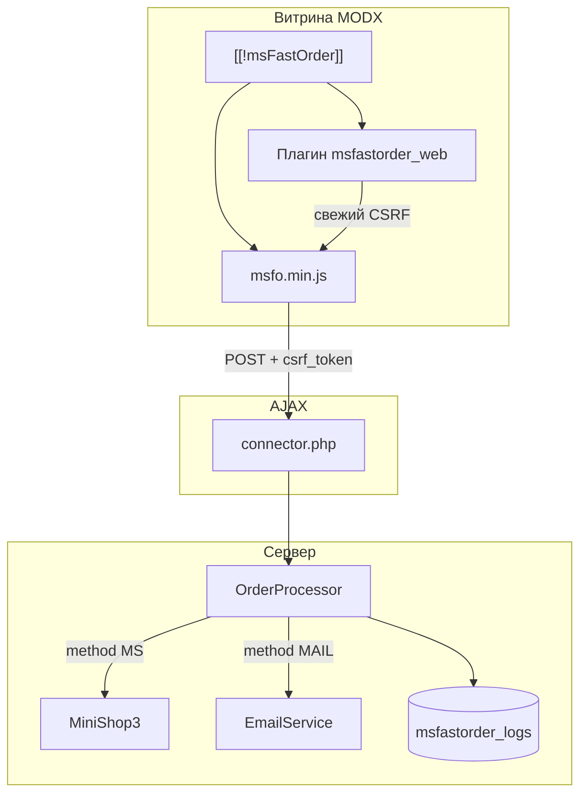
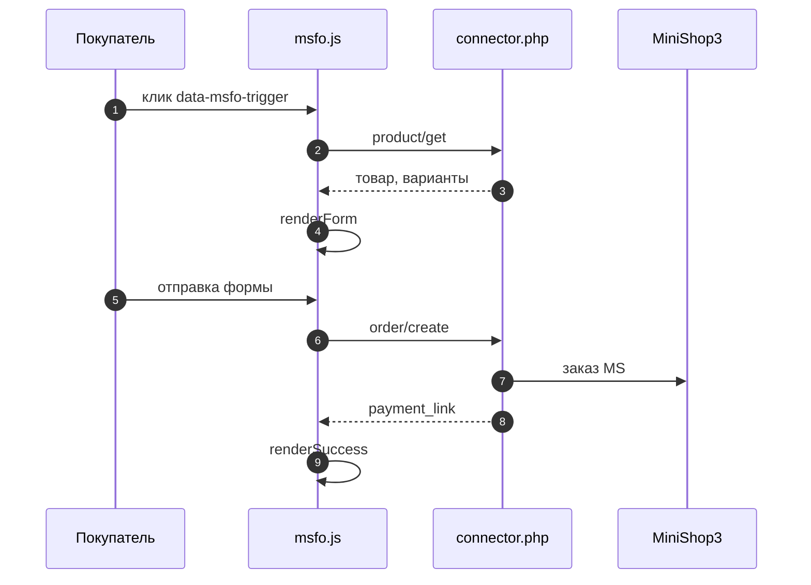

# msFastOrder

**msFastOrder** оформляет заказ «в один клик» с карточки товара: модальное окно, без перехода в корзину. Нужны [MODX Revolution 3](https://modx.com/) и [MiniShop3](/components/minishop3/).

[Быстрый старт](/components/msfastorder/quick-start).

## Минимальный путь к кнопке на витрине

Установите пакет, задайте настройки и выведите `[[!msFastOrder]]` на странице товара.

1. Установите пакет. На сайте должен работать **MiniShop3**.
2. В **Системные настройки** (область `msfastorder`) задайте `msfastorder_method`, email менеджера (для MAIL) и ID оплаты/доставки MS3 (для MS).
3. На шаблоне **страницы товара** (`msProduct`) **некэшированно** выведите `[[!msFastOrder]]`.
4. **Настройки → Очистить кэш**. Проверьте: клик по кнопке → модалка → заказ или письмо.

Разметка карточки: [Подключение на сайте](/components/msfastorder/frontend).

## Быстрые ссылки

| Нужно | Документ |
| --- | --- |
| Установить и проверить первый заказ | [Быстрый старт](/components/msfastorder/quick-start) |
| Все ключи `msfastorder_*` и режимы MS/MAIL | [Системные настройки](/components/msfastorder/settings) |
| Сниппеты, параметры, кнопка на каталоге | [Сниппеты](/components/msfastorder/snippets/) |
| `msfoConfig`, форма в JS, модалки | [Подключение на сайте](/components/msfastorder/frontend) |
| ms3Variants, ЮKassa, аналитика | [Интеграция](/components/msfastorder/integration) |
| `connector.php`, actions, JSON | [AJAX API](/components/msfastorder/api) |
| События `msfo:*` | [События JavaScript](/components/msfastorder/events) |
| Ошибки 403, payment_link, чанки | [FAQ](/components/msfastorder/faq) |

## Кому что читать

- **Менеджеру / интегратору:** [Быстрый старт](/components/msfastorder/quick-start) → [Системные настройки](/components/msfastorder/settings) → [Интеграция](/components/msfastorder/integration).
- **Верстальщику:** [Сниппеты](/components/msfastorder/snippets/msFastOrder) → [Подключение на сайте](/components/msfastorder/frontend) → [Чанки](/components/msfastorder/chunks).
- **Разработчику:** [AJAX API](/components/msfastorder/api) → [События JavaScript](/components/msfastorder/events) → `assets/components/msfastorder/js/msfo.min.js`.

## Возможности

- **Модальное окно** — `native` (по умолчанию), глобальный `bootstrap.Modal` или `window.Fancybox`
- **Режим MS** — заказ в MiniShop3 с одной позицией, покупателем и `payment_link`
- **Режим MAIL** — письмо менеджеру без записи в MS3
- **Количество и итого** — поле `count`, пересчёт суммы в браузере
- **Варианты** — подхват `variant_id` и опций со страницы ([ms3Variants](/components/ms3variants/))
- **Оплата** — ссылка из способа оплаты MS3, в том числе [msp3YooKassa](/components/msp3yookassa/)
- **Безопасность** — CSRF в сессии, rate limit на **успешные** `order/create` с IP, журнал `msfastorder_logs`
- **Расширяемость** — DOM-события `msfo:*` и EventBus `msFastOrder.on()`

## Системные требования

| Требование | Версия |
|------------|--------|
| MODX Revolution | 3.0+ |
| PHP | 8.2+ |
| MiniShop3 | 1.0+ |
| pdoTools | 3.0+ (жёсткая зависимость транспорта) |

**[MiniShop3](/components/minishop3/)** даёт товары, заказы, способы оплаты и доставки. **pdoTools** 3.0+ — требование установщика пакета.

### Опционально

- **[ms3Variants](/components/ms3variants/)** — выбор варианта на карточке товара
- **[msp3YooKassa](/components/msp3yookassa/)** — онлайн-оплата после быстрого заказа

## Установка

1. [Подключите репозиторий ModStore](https://modstore.pro/info/connection).
2. **Extras → Installer** → **Download Extras** — найдите **msFastOrder**, **Download**, **Install**.
3. Убедитесь, что установлен **MiniShop3**.
4. Настройте область **`msfastorder`** в системных настройках.
5. **Настройки → Очистить кэш**.

Каталог пакета: [modstore.pro/packages/integration/msfastorder](https://modstore.pro/packages/integration/msfastorder).

После установки появляются: namespace `msfastorder`, сниппеты `msFastOrder` и `msFastOrderClientConfig`, чанки `msfo_*`, плагин `msfastorder_web`, таблица `msfastorder_logs`. Резолвер может создать способы **Fast Order Payment** / **Fast Order Delivery** и прописать их ID в настройки.

Подробнее: [Быстрый старт → Шаг 1](/components/msfastorder/quick-start#шаг-1-установка-пакета).

## Термины

| Термин | Описание |
|--------|----------|
| **connector** | `assets/components/msfastorder/connector.php` — единая точка AJAX (только POST) |
| **msfoConfig** | `window.msfoConfig` — URL connector, CSRF, маска телефона, лексикон для JS |
| **MS / MAIL** | Режимы: заказ в MiniShop3 или только email |
| **payment_link** | URL оплаты из обработчика MS3 (`msfastorder_payment_id`) |
| **renderForm** | JS-сборка HTML формы в модалке (чанк `msfo_form` по умолчанию на сервере не собирается) |

## Архитектура (кратко)

```mermaid
flowchart TB
  subgraph vitrina [Витрина MODX]
    S["[[!msFastOrder]]"]
    P[Плагин msfastorder_web]
    J[msfo.min.js]
    S --> P
    S --> J
    P -->|свежий CSRF| J
  end
  subgraph ajax [AJAX]
    C[connector.php]
    J -->|POST + csrf_token| C
  end
  subgraph server [Сервер]
    OP[OrderProcessor]
    C --> OP
    OP -->|method MS| MS3[MiniShop3]
    OP -->|method MAIL| EM[EmailService]
    OP --> LOG[(msfastorder_logs)]
  end
```

Сценарий «клик → заказ» на временной шкале:

```mermaid
sequenceDiagram
  autonumber
  participant U as Покупатель
  participant JS as msfo.js
  participant API as connector.php
  participant MS as MiniShop3

  U->>JS: клик data-msfo-trigger
  JS->>API: product/get
  API-->>JS: товар, варианты
  JS->>JS: renderForm
  U->>JS: отправка формы
  JS->>API: order/create
  API->>MS: заказ MS
  API-->>JS: payment_link
  JS->>JS: renderSuccess
```

Подробнее: [Подключение на сайте](/components/msfastorder/frontend#жизненный-цикл-клик--заказ), [AJAX API](/components/msfastorder/api).

## Лицензия

В транспорте пакета указана **GPL v2** (`core/components/msfastorder/docs/license.txt`). В корне репозитория пакета может лежать **MIT** (`LICENSE`, `composer.json`). Сверяйте лицензию с тем артефактом, из которого ставите дополнение.
