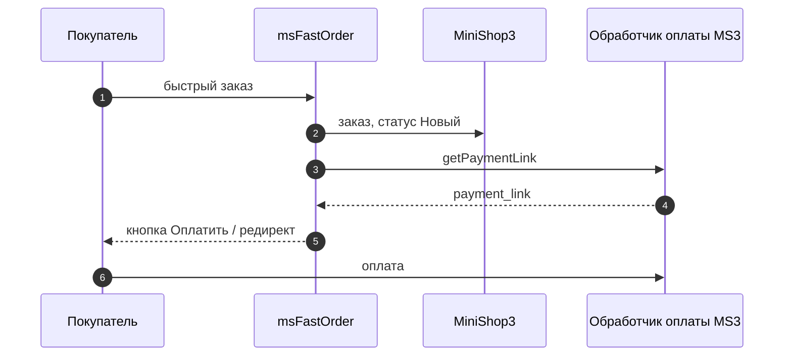
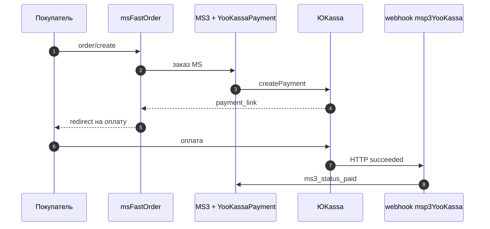

# Интеграция и сценарии

Документ для интегратора и разработчика: шаблоны витрины, варианты, оплата и метрики.

| Тема | Где в документе |
|------|-----------------|
| Разметка карточки товара | [Шаблон товара](#интеграция-с-шаблонами) |
| ms3Variants | [Интеграция с ms3Variants](#интеграция-с-ms3variants) |
| ЮKassa | [Оплата через ЮKassa](#оплата-через-юkassa-msp3yookassa) |
| Аналитика | [Google Analytics / Метрика](#интеграция-с-google-analytics) |
| Полный цикл JS | [Подключение на сайте](frontend) |

## Интеграция с шаблонами

### Стандартный шаблон товара

::: code-group

```fenom
<div class="product-card">
  <h1>{$_modx->resource.pagetitle}</h1>
  <div class="price">{$price} ₽</div>

  <form class="ms3_form" method="post">
    <input type="hidden" name="id" value="{$_modx->resource.id}">
    <input type="number" name="count" value="1">
    <button type="submit" name="ms3_action" value="cart/add">В корзину</button>
  </form>

  {'!msFastOrder' | snippet}
</div>
```

```modx
<div class="product-card">
  <h1>[[*pagetitle]]</h1>
  <div class="price">[[+price]] ₽</div>

  <form class="ms3_form" method="post">
    <input type="hidden" name="id" value="[[*id]]">
    <input type="number" name="count" value="1">
    <button type="submit" name="ms3_action" value="cart/add">В корзину</button>
  </form>

  [[!msFastOrder]]
</div>
```

:::

### Кастомная кнопка

::: code-group

```fenom
{'!msFastOrder' | snippet : [
  'tplBtn' => 'my_button',
  'primary' => 1
]}
```

```modx
[[!msFastOrder?
  &tplBtn=`my_button`
  &primary=`1`
]]
```

:::

Чанк `my_button` (обязательны `data-msfo-trigger` и `data-msfo-product-id`):

::: code-group

```fenom
<button type="button" class="btn btn-fast-order" data-msfo-trigger data-msfo-product-id="{$product_id}">
  <i class="icon-flash"></i>
  Купить в 1 клик
</button>
```

```modx
<button type="button" class="btn btn-fast-order" data-msfo-trigger data-msfo-product-id="[[+product_id]]">
  <i class="icon-flash"></i>
  Купить в 1 клик
</button>
```

:::

## Интеграция с ms3Variants

msFastOrder полностью поддерживает компонент ms3Variants для работы с вариантами товаров.

### Структура интеграции

ms3Variants хранит данные в таблицах:
- `ms3_product_variants` — варианты (SKU, цена, остатки, вес, изображение)
- `ms3_variant_options` — опции вариантов (color, size и др.)

### Автоматическое копирование вариантов

Для автоматического копирования выбранного варианта в форму быстрого заказа, убедитесь что:

1. Форма на странице товара имеет класс `ms3variants-product-{$id}`:

::: code-group

```fenom
{set $productId = $_modx->resource.id}

<form class="ms3variants-product-{$productId} ms3_form" method="post" data-product-id="{$productId}">
  {'!msProductVariants' | snippet : ['product' => $productId]}
  <input type="hidden" name="variant_id" value="">
  <input type="number" name="count" class="msfastorder-count-{$productId}" value="1" min="1">
</form>

{'!msFastOrder' | snippet}
```

```modx
<form class="ms3variants-product-[[*id]] ms3_form" method="post" data-product-id="[[*id]]">
  [[!msProductVariants]]
  <input type="hidden" name="variant_id" value="">
  <input type="number" name="count" class="msfastorder-count-[[*id]]" value="1" min="1">
</form>
[[!msFastOrder]]
```

:::

2. При изменении варианта ms3Variants обновляет цену, изображение и поле `input[name="_variant_id"]` (см. [ms3Variants](/components/ms3variants/frontend/product)).

3. msFastOrder при открытии модалки копирует количество и `variant_id` / `ms3variant_id` из этой формы — в заказ уходит `options.variant_id`.

### Ручная передача варианта

Если нужно передать конкретный вариант программно:

```javascript
document.addEventListener('msfo:modal:beforeLoad', function () {
  const src = document.querySelector('input[name="_variant_id"]');
  const dst = document.querySelector('input[name="variant_id"], input[name="ms3variant_id"]');
  if (src && dst && src.value) {
    dst.value = src.value;
  }
});
```

## Интеграция с платежными системами

### Как работает `payment_link`

После успешного заказа в режиме **MS** msFastOrder:

1. Создаёт заказ в MiniShop3 и переводит его в статус **«Новый»** (`ms3_status_new`).
2. Регистрирует заказ в `$_SESSION['ms3']['orders']` (как стандартный checkout MS3).
3. Запрашивает ссылку у обработчика оплаты MS3: `Payment::getPaymentLink()` через `ms3_payment_service`.
4. Возвращает её в AJAX (`data.payment_link`) и на экране успеха (чанк `msfo_success`).



**Отдельный URL оплаты в настройках msFastOrder указывать не нужно** — ссылка формируется автоматически из способа оплаты, заданного в `msfastorder_payment_id`.

| Тип способа оплаты MS3 | Что будет в `payment_link` |
|------------------------|----------------------------|
| Без класса (`DefaultPayment`) | Страница успеха MS3: `?msorder={uuid}` (нормализуется для `ms3_get_order`) |
| С классом провайдера (ЮKassa и др.) | URL платёжной системы от обработчика |

Подробнее о настройках: [Системные настройки](settings#режим-ms).

### Оплата через ЮKassa (msp3YooKassa)

Рекомендуемый способ подключения онлайн-оплаты для быстрого заказа — дополнение [msp3YooKassa](https://docs.modx.pro/components/msp3yookassa/) для MiniShop3.

#### Шаг 1. Установить msp3YooKassa

1. Установите пакет **msp3YooKassa** через [ModStore](https://modstore.pro/) (**Extras → Installer** → **Download Extras**).
2. Убедитесь, что на сайте уже работают **MODX 3**, **MiniShop3** и **msFastOrder**.

Документация провайдера: [msp3YooKassa на docs.modx.pro](https://docs.modx.pro/components/msp3yookassa/).

#### Шаг 2. Настроить ключи и webhook в MODX

В **Системные настройки** (область **msp3yookassa** или как указано в документации пакета):

| Параметр | Назначение |
|----------|------------|
| Shop ID | Идентификатор магазина в ЮKassa |
| Secret Key | Секретный ключ API |
| Webhook URL | URL для уведомлений о статусе платежа (как в личном кабинете ЮKassa) |

В личном кабинете [ЮKassa](https://yookassa.ru/) создайте магазин, получите ключи и пропишите **webhook** на URL, который указан в настройках msp3YooKassa (обычно отдельный endpoint компонента).

Без корректного webhook статусы заказов в MS3 могут не обновляться после оплаты.

#### Шаг 3. Способ оплаты в MiniShop3

1. **Компоненты → MiniShop3 → Способы оплаты**.
2. Создайте или откройте способ **«Оплата через ЮKassa»** (класс обработчика: `Msp3YooKassa\Payment\YooKassaPayment` или аналог из документации msp3YooKassa).
3. Включите способ (**активен**).
4. Запомните **числовой ID** записи (колонка `id` в списке).

#### Шаг 4. Настройки msFastOrder

| Настройка | Значение |
|-----------|----------|
| `msfastorder_method` | `MS` |
| `msfastorder_payment_id` | ID способа «Оплата через ЮKassa» из MS3 |
| `msfastorder_delivery_id` | ID активной доставки MS3 |
| `ms3_order_success_page_id` | Ресурс «Спасибо» со сниппетом `[[!ms3_get_order]]` (для просмотра заказа; при ЮKassa основная оплата идёт по `payment_link`) |

Режим **MAIL** для оплаты через ЮKassa не используется — заказ в MS3 не создаётся.

#### Шаг 5. Проверка

Связка с [msp3YooKassa](/components/msp3yookassa/) (оплата и webhook после редиректа):



1. Оформите быстрый заказ на карточке товара.
2. В ответе connector (`action=order/create`) в `data.payment_link` должна быть **непустая** строка — обычно URL страницы оплаты ЮKassa, а не `spasibo?msorder=...`.
3. На экране успеха — кнопка «Оплатить» (лексикон `msfastorder_pay_button`) с этой ссылкой.
4. Событие `msfo:order:success` в `detail.data.payment_link` содержит тот же URL.

Пример ответа API:

```json
{
  "success": true,
  "data": {
    "order_id": 15,
    "method": "MS",
    "payment_link": "https://yoomoney.ru/checkout/payments/..."
  }
}
```

Опционально: `msfastorder_success_redirect` — если задан URL и в ответе есть `payment_link`, через ~2 с выполнится автоматический переход на оплату (см. [Системные настройки](settings)).

#### Что не нужно делать

- Не прописывайте URL ЮKassa вручную в настройках msFastOrder — только **ID способа оплаты** MS3.
- Не дублируйте логику оплаты в чанках: достаточно стандартного `msfo_success` с `{$payment_link}`.

### Базовая оплата MS3 (без внешнего провайдера)

Если msp3YooKassa не установлен:

1. Создайте способ оплаты в MS3 (часто «При получении» / пустой класс).
2. Укажите его ID в `msfastorder_payment_id`.
3. `payment_link` ведёт на страницу успеха с `msorder={uuid}` — покупатель видит заказ через `ms3_get_order`.

### Вывод ссылки в шаблоне успеха

Чанк `msfo_success` — эталон кнопки оплаты. В рантайме ту же разметку создаёт JS (`renderSuccess`). При правке чанка или своего шаблона:

::: code-group

```fenom
{if $payment_link}
  <a href="{$payment_link}" class="msfo-btn msfo-btn--primary">
    {$_modx->lexicon('msfastorder_pay_button')}
  </a>
{/if}
```

```modx
[[+payment_link:notempty=`
  <a href="[[+payment_link]]" class="msfo-btn msfo-btn--primary">[[%msfastorder_pay_button]]</a>
`]]
```

:::

## Интеграция с AjaxForm

Форма в модалке собирается в **msfo.js** и отправляется на `connector.php` (`order/create`). Оборачивать её в `[[!AjaxForm]]` не нужно: у AjaxForm другой сценарий — серверный чанк формы и сниппет-обработчик ([AjaxForm](/components/ajaxform)).

На одной странице msFastOrder и AjaxForm **не конфликтуют**: быстрый заказ живёт отдельно, AjaxForm — для ваших обычных форм (обратная связь, подписка и т.п.).

Если на сайте уже подключён AjaxForm, можно использовать его всплывающие сообщения для быстрого заказа и добавить свои проверки до отправки:

```javascript
// Уведомления AjaxForm вместо/в дополнение к разметке в модалке
document.addEventListener('msfo:order:success', function (e) {
  if (typeof AjaxForm === 'undefined') return;
  const msg = e.detail?.message || 'Заказ принят';
  AjaxForm.Message.success(msg);
});

document.addEventListener('msfo:order:error', function (e) {
  if (typeof AjaxForm === 'undefined') return;
  AjaxForm.Message.error(e.detail?.message || 'Ошибка оформления', 1);
});

// Дополнительная проверка полей после открытия модалки
document.addEventListener('msfo:modal:loaded', function () {
  const form = document.querySelector('.msfo-form');
  if (!form || form.dataset.msfoExtraValidate) return;
  form.dataset.msfoExtraValidate = '1';

  form.addEventListener('submit', function (ev) {
    const agreement = form.querySelector('[name="agreement"]');
    if (agreement && !agreement.checked) {
      ev.preventDefault();
      ev.stopImmediatePropagation();
      if (typeof AjaxForm !== 'undefined') {
        AjaxForm.Message.error('Подтвердите согласие на обработку данных', 1);
      }
    }
  }, true);
});
```

Чекбокс `agreement` добавьте в форму в обработчике `msfo:modal:loaded` (см. [События JavaScript → modal:loaded](events#modal-loaded)). Серверная проверка без создания заказа — action `order/validate` ([AJAX API](api#order-validate)).

## Интеграция с Google Analytics

```javascript
document.addEventListener('msfo:order:success', function(e) {
    gtag('event', 'purchase', {
        transaction_id: e.detail.data.order_id,
        value: e.detail.data.total,
        currency: 'RUB',
        items: [{
            item_id: e.detail.data.product_id,
            quantity: e.detail.data.count
        }]
    });
});
```

## Интеграция с Яндекс.Метрикой

```javascript
document.addEventListener('msfo:order:success', function(e) {
    ym(YOUR_COUNTER_ID, 'reachGoal', 'fast_order', {
        order_id: e.detail.data.order_id,
        order_price: e.detail.data.total
    });
});
```

## Интеграция с CRM / внешними системами

На фронте — событие `msfo:order:success` и отправка данных на свой endpoint.

На бэкенде — плагин MODX на сохранение заказа MS3 или кастомный хук после `OrderProcessor::createOrder` (расширение через fork/плагин в вашем проекте).
