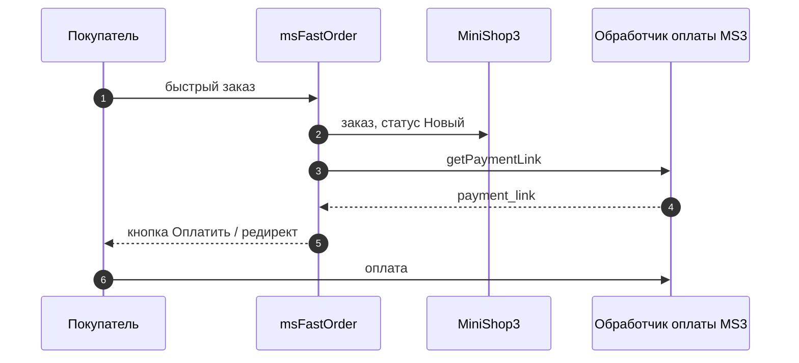
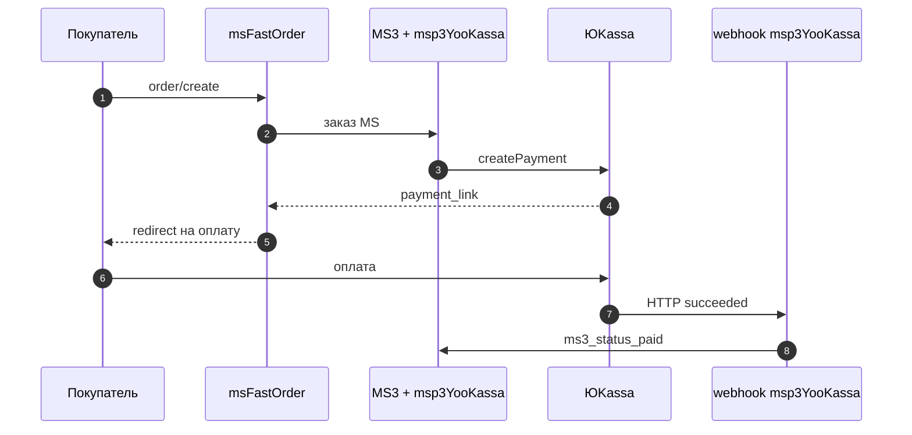

# Интеграция и сценарии

| Тема | Где в документе |
|------|-----------------|
| Разметка карточки товара | [Шаблон товара](#интеграция-с-шаблонами) |
| ms3Variants | [Интеграция с ms3Variants](#интеграция-с-ms3variants) |
| ЮKassa | [Оплата через ЮKassa](#оплата-через-юkassa-msp3yookassa) |
| Аналитика | [Google Analytics / Метрика](#интеграция-с-google-analytics) |
| Полный цикл JS | [Подключение на сайте](/components/msfastorder/frontend) |

## Интеграция с шаблонами

### Стандартный шаблон товара

::: code-group

```fenom
<form class="ms3_form" method="post">
  <input type="hidden" name="id" value="{$_modx->resource.id}">
  <input type="number" name="count" value="1">
  <button type="submit" name="ms3_action" value="cart/add">В корзину</button>
</form>
{'!msFastOrder' | snippet}
```

```modx
<form class="ms3_form" method="post">
  <input type="hidden" name="id" value="[[*id]]">
  <input type="number" name="count" value="1">
  <button type="submit" name="ms3_action" value="cart/add">В корзину</button>
</form>
[[!msFastOrder]]
```

:::

### Своя кнопка

::: code-group

```fenom
{'!msFastOrder' | snippet : [
  'tplBtn' => 'my_button',
  'primary' => 1
]}
```

```modx
[[!msFastOrder?
  &tplBtn=`my_button`
  &primary=`1`
]]
```

:::

Чанк `my_button` (обязательны `data-msfo-trigger` и `data-msfo-product-id`):

::: code-group

```fenom
<button type="button" data-msfo-trigger data-msfo-product-id="{$product_id}">
  Купить в 1 клик
</button>
```

```modx
<button type="button" data-msfo-trigger data-msfo-product-id="[[+product_id]]">
  Купить в 1 клик
</button>
```

:::

## Интеграция с ms3Variants

msFastOrder копирует выбранный вариант и количество со страницы товара в модалку.

### Структура интеграции

ms3Variants хранит данные в таблицах:

- `ms3_product_variants` — варианты (SKU, цена, остатки, вес, изображение)
- `ms3_variant_options` — опции вариантов (color, size и др.)

### Автоматическое копирование вариантов

Форма на странице товара должна иметь класс `ms3variants-product-{$id}`:

::: code-group

```fenom
{set $productId = $_modx->resource.id}

<form class="ms3variants-product-{$productId} ms3_form" method="post" data-product-id="{$productId}">
  {'!msProductVariants' | snippet : ['product' => $productId]}
  <input type="hidden" name="variant_id" value="">
  <input type="number" name="count" class="msfastorder-count-{$productId}" value="1" min="1">
</form>

{'!msFastOrder' | snippet}
```

```modx
<form class="ms3variants-product-[[*id]] ms3_form" method="post" data-product-id="[[*id]]">
  [[!msProductVariants]]
  <input type="hidden" name="variant_id" value="">
  <input type="number" name="count" class="msfastorder-count-[[*id]]" value="1" min="1">
</form>
[[!msFastOrder]]
```

:::

При смене варианта ms3Variants обновляет цену, изображение и поле `input[name="_variant_id"]` (см. [ms3Variants](/components/ms3variants/frontend/product)).

msFastOrder при открытии модалки копирует количество и `variant_id` / `ms3variant_id` из этой формы. В заказ уходит `options.variant_id`.

### Ручная передача варианта

Если нужно передать конкретный вариант программно:

```javascript
document.addEventListener('msfo:modal:beforeLoad', function () {
  const src = document.querySelector('input[name="_variant_id"]');
  const dst = document.querySelector('input[name="variant_id"], input[name="ms3variant_id"]');
  if (src && dst && src.value) {
    dst.value = src.value;
  }
});
```

## Интеграция с платежными системами

### Как работает `payment_link`

После успешного заказа в режиме **MS** msFastOrder:

1. Создаёт заказ в MiniShop3 и переводит его в статус **«Новый»** (`ms3_status_new`).
2. Регистрирует заказ в `$_SESSION['ms3']['orders']` (как стандартный checkout MS3).
3. Запрашивает ссылку у обработчика оплаты MS3: `Payment::getPaymentLink()` через `ms3_payment_service`.
4. Возвращает её в AJAX (`data.payment_link`) и на экране успеха (JS `FormHandler.renderSuccess`; чанк `msfo_success` — только эталон).


```mermaid
sequenceDiagram
  autonumber
  participant U as Покупатель
  participant FO as msFastOrder
  participant MS as MiniShop3
  participant PAY as Обработчик оплаты MS3

  U->>FO: быстрый заказ
  FO->>MS: заказ, статус Новый
  FO->>PAY: getPaymentLink
  PAY-->>FO: payment_link
  FO-->>U: кнопка Оплатить / редирект
  U->>PAY: оплата
```

Отдельный URL оплаты в настройках msFastOrder не нужен. Ссылка берётся из способа оплаты в `msfastorder_payment_id`. Типы ссылок (DefaultPayment / ЮKassa): [Системные настройки](/components/msfastorder/settings#режим-ms).

### Оплата через ЮKassa (msp3YooKassa)

Онлайн-оплата после быстрого заказа — дополнение [msp3YooKassa](/components/msp3yookassa/) для MiniShop3.

#### Шаг 1. Установить msp3YooKassa

1. Установите пакет **msp3YooKassa** через [ModStore](https://modstore.pro/) (**Extras → Installer** → **Download Extras**).
2. Убедитесь, что на сайте уже работают **MODX 3**, **MiniShop3** и **msFastOrder**.

#### Шаг 2. Настроить ключи и webhook в MODX

В **Системные настройки** (область **msp3yookassa** или как указано в документации пакета):

| Параметр | Назначение |
|----------|------------|
| Shop ID | Идентификатор магазина в ЮKassa |
| Secret Key | Секретный ключ API |
| Webhook URL | URL для уведомлений о статусе платежа (как в личном кабинете ЮKassa) |

В личном кабинете [ЮKassa](https://yookassa.ru/) создайте магазин, получите ключи и пропишите **webhook** на URL из настроек msp3YooKassa (обычно отдельный endpoint компонента).

Без корректного webhook статусы заказов в MS3 могут не обновляться после оплаты.

#### Шаг 3. Способ оплаты в MiniShop3

1. **Компоненты → MiniShop3 → Способы оплаты**.
2. Создайте или откройте способ **«Оплата через ЮKassa»** (класс обработчика — см. [документацию msp3YooKassa](/components/msp3yookassa/)).
3. Включите способ (**активен**).
4. Запомните **числовой ID** записи (колонка `id` в списке).

#### Шаг 4. Настройки msFastOrder

| Настройка | Значение |
|-----------|----------|
| `msfastorder_method` | `MS` |
| `msfastorder_payment_id` | ID способа «Оплата через ЮKassa» из MS3 |
| `msfastorder_delivery_id` | ID активной доставки MS3 |
| `ms3_order_success_page_id` | Ресурс «Спасибо» со сниппетом `[[!ms3_get_order]]` (для просмотра заказа; при ЮKassa основная оплата идёт по `payment_link`) |
| `ms3_order_redirect_thanks_id` | Запас, если `ms3_order_success_page_id` пуст. Иначе запасной вариант — `site_start` |

Режим **MAIL** для оплаты через ЮKassa не используется: заказ в MS3 не создаётся.

#### Шаг 5. Проверка

Связка с [msp3YooKassa](/components/msp3yookassa/) (оплата и webhook после редиректа):


```mermaid
sequenceDiagram
  autonumber
  participant U as Покупатель
  participant FO as msFastOrder
  participant MS as MS3 + msp3YooKassa
  participant Y as ЮKassa
  participant W as webhook msp3YooKassa

  U->>FO: order/create
  FO->>MS: заказ MS
  MS->>Y: createPayment
  Y-->>FO: payment_link
  FO-->>U: redirect на оплату
  U->>Y: оплата
  Y->>W: HTTP succeeded
  W->>MS: ms3_status_paid
```

1. Оформите быстрый заказ на карточке товара.
2. В ответе connector (`action=order/create`) в `data.payment_link` должна быть **непустая** строка — обычно URL страницы оплаты ЮKassa, а не `spasibo?msorder=...`.
3. На экране успеха — кнопка «Оплатить» (лексикон `msfastorder_pay_button`) с этой ссылкой.
4. Событие `msfo:order:success` в `detail.data.payment_link` содержит тот же URL.

Пример ответа API:

```json
{
  "success": true,
  "data": {
    "order_id": 15,
    "method": "MS",
    "payment_link": "https://…"
  }
}
```

Опционально: `msfastorder_success_redirect` — если задан URL и в ответе есть `payment_link`, через ~2 с выполнится автоматический переход на оплату (см. [Системные настройки](/components/msfastorder/settings)).

#### Что не нужно делать

- Не прописывайте URL ЮKassa вручную в настройках msFastOrder — только **ID способа оплаты** MS3.
- Не дублируйте логику оплаты в чанках: кнопку «Оплатить» рисует JS; `msfo_success` — эталон разметки.

### Базовая оплата MS3 (без внешнего провайдера)

Если msp3YooKassa не установлен:

1. Создайте способ оплаты в MS3 (часто «При получении» / пустой класс).
2. Укажите его ID в `msfastorder_payment_id`.
3. `payment_link` ведёт на страницу успеха с `msorder={uuid}` — покупатель видит заказ через `ms3_get_order`.

### Вывод ссылки в шаблоне успеха

Чанк `msfo_success` — эталон кнопки оплаты. В рантайме ту же разметку создаёт JS (`renderSuccess`). При правке чанка или своего шаблона:

::: code-group

```fenom
{if $payment_link}
  <a href="{$payment_link}" class="msfo-btn msfo-btn--primary">
    {$_modx->lexicon('msfastorder_pay_button')}
  </a>
{/if}
```

```modx
[[+payment_link:notempty=`
  <a href="[[+payment_link]]" class="msfo-btn msfo-btn--primary">[[%msfastorder_pay_button]]</a>
`]]
```

:::

## Интеграция с AjaxForm

Форму в модалке не оборачивайте в `[[!AjaxForm]]`: её собирает **msfo.js** и шлёт на `connector.php` (`order/create`). AjaxForm — другой сценарий (серверный чанк и сниппет-обработчик, [AjaxForm](/components/ajaxform)). На одной странице они не конфликтуют.

Если AjaxForm уже подключён, можно **отдельно** (msFastOrder его не вызывает) подписаться на `msfo:*` и показать сообщения:

```javascript
// Пример со сторонним AjaxForm, не часть msFastOrder
document.addEventListener('msfo:order:success', function (e) {
  if (typeof AjaxForm === 'undefined') return;
  const msg = e.detail?.message || 'Заказ принят';
  AjaxForm.Message.success(msg);
});

document.addEventListener('msfo:order:error', function (e) {
  if (typeof AjaxForm === 'undefined') return;
  AjaxForm.Message.error(e.detail?.message || 'Ошибка оформления', 1);
});

// Дополнительная проверка полей после открытия модалки
document.addEventListener('msfo:modal:loaded', function () {
  const form = document.querySelector('.msfo-form');
  if (!form || form.dataset.msfoExtraValidate) return;
  form.dataset.msfoExtraValidate = '1';

  form.addEventListener('submit', function (ev) {
    const agreement = form.querySelector('[name="agreement"]');
    if (agreement && !agreement.checked) {
      ev.preventDefault();
      ev.stopImmediatePropagation();
      if (typeof AjaxForm !== 'undefined') {
        AjaxForm.Message.error('Подтвердите согласие на обработку данных', 1);
      }
    }
  }, true);
});
```

Чекбокс `agreement` добавьте в форму в обработчике `msfo:modal:loaded` (см. [События JavaScript → modal:loaded](/components/msfastorder/events#modal-loaded)). Серверная проверка без создания заказа — action `order/validate` ([AJAX API](/components/msfastorder/api#order-validate)).

## Интеграция с Google Analytics

```javascript
// product_id и count в ответе order/create нет — возьмите из form:submit или со страницы
let lastProductId = null;
let lastCount = 1;

document.addEventListener('msfo:form:submit', function (e) {
  lastProductId = e.detail.data.product_id;
  lastCount = e.detail.data.count || 1;
});

document.addEventListener('msfo:order:success', function (e) {
  if (!e.detail.data) return;
  gtag('event', 'purchase', {
    transaction_id: e.detail.data.order_id,
    value: e.detail.data.total,
    currency: 'RUB',
    items: [{
      item_id: lastProductId,
      quantity: lastCount
    }]
  });
});
```

## Интеграция с Яндекс.Метрикой

```javascript
document.addEventListener('msfo:order:success', function(e) {
    ym(YOUR_COUNTER_ID, 'reachGoal', 'fast_order', {
        order_id: e.detail.data.order_id,
        order_price: e.detail.data.total
    });
});
```

## Интеграция с CRM / внешними системами

На фронте — событие `msfo:order:success` и отправка данных на свой endpoint.

На бэкенде — плагин MODX на сохранение заказа MS3 или свой хук после `OrderProcessor::createOrder` (расширение через fork/плагин в вашем проекте).
