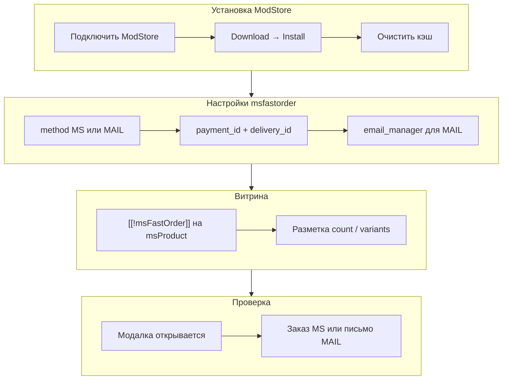

# Быстрый старт

Как за 10–15 минут включить кнопку «Купить в 1 клик» на странице товара MiniShop3.



## Требования

| Требование | Версия |
|------------|--------|
| MODX Revolution | 3.0+ |
| PHP | 8.2+ |
| MiniShop3 | установлен и настроен (каталог, оплата, доставка) |
| pdoTools | 3.x (для примеров Fenom) |

## Шаг 1: Установка пакета

### Через ModStore

1. [Подключите репозиторий ModStore](https://modstore.pro/info/connection) в настройках MODX.
2. Перейдите в **Extras → Installer** и нажмите **Download Extras** (в MODX 3: **Пакеты → Установщик**).
3. Убедитесь, что на сайте уже установлен **MiniShop3** (и при необходимости **pdoTools** 3.x для примеров Fenom в этой документации).
4. Найдите **msFastOrder** в списке пакетов, нажмите **Download**, затем **Install** и дождитесь завершения резолверов (таблица логов, настройки, чанки, сниппеты, плагин).
5. **Настройки → Очистить кэш**.

Пакет в каталоге: [msFastOrder на modstore.pro](https://modstore.pro/packages/integration/msfastorder).

### После установки проверьте

| Элемент | Ожидание |
|---------|----------|
| Сниппет `msFastOrder` | В списке элементов |
| Сниппет `msFastOrderClientConfig` | В списке элементов |
| Чанки `msfo_*` | Установлены |
| Плагин `msfastorder_web` | Включён (события `OnLoadWebPageCache`, `OnWebPagePrerender`) |
| Таблица `msfastorder_logs` | Создана в БД |

## Шаг 2: Системные настройки

**Настройки → Системные настройки**, фильтр по пространству имён **`msfastorder`** (или область **msfastorder** / **msfastorder_main** в зависимости от сборки транспорта).

Минимум для режима **MS** (заказ в магазине):

| Ключ | Что указать |
|------|-------------|
| `msfastorder_method` | `MS` |
| `msfastorder_payment_id` | Числовой **ID активного** способа оплаты в MiniShop3 |
| `msfastorder_delivery_id` | ID способа доставки MS3 |
| `msfastorder_email_manager` | Email для уведомлений (опционально для MS, обязателен для MAIL) |

Для **MAIL** (только письмо, без заказа в MS3): `msfastorder_method` = `MAIL` и непустой `msfastorder_email_manager`.

Резолвер установки может создать способы **Fast Order Payment** / **Fast Order Delivery** и записать их ID в `msfastorder_payment_id` и `msfastorder_delivery_id` — проверьте в **MiniShop3 → Способы оплаты / доставки**.

Подробная таблица всех ключей: [Системные настройки](settings).

## Шаг 3: Страница «Спасибо» (режим MS)

Для способа оплаты без внешнего провайдера (`DefaultPayment`) в `payment_link` подставляется страница просмотра заказа с `msorder={uuid}`.

1. Создайте ресурс «Спасибо за заказ» (alias, например `spasibo-zakaz`).
2. В контент или шаблон добавьте сниппет просмотра заказа MS3, например `[[!ms3_get_order]]` (по документации вашей сборки MS3).
3. Укажите ID ресурса в настройке MiniShop3 **`ms3_order_success_page_id`** (или аналог в вашей версии MS3).

## Шаг 4: Сниппет на карточке товара

Откройте шаблон или чанк **страницы товара** (`msProduct`). Вызов должен быть **некэшированным** — иначе CSRF и скрипты могут не обновиться.

::: code-group

```fenom
{'!msFastOrder' | snippet}
```

```modx
[[!msFastOrder]]
```

:::

С явным ID товара (каталог, список в mFilter и т.д.):

::: code-group

```fenom
{'!msFastOrder' | snippet : ['id' => $id]}
```

```modx
[[!msFastOrder? &id=`[[+id]]`]]
```

:::

Параметры сниппета: [Сниппет msFastOrder](snippets/msFastOrder).

## Шаг 5: Рекомендуемая разметка (варианты и количество)

Если на сайте есть [ms3Variants](/components/ms3variants/), оберните селекторы вариантов и поле количества в одну форму с классом `ms3variants-product-{id}` — msFastOrder при открытии модалки скопирует количество и `variant_id` со страницы.

::: code-group

```fenom
{set $productId = $_modx->resource.id}

<form class="ms3variants-product-{$productId} ms3_form" method="post" data-product-id="{$productId}">
  {'!msProductVariants' | snippet : ['product' => $productId]}

  {* msFastOrder читает name="variant_id" или name="ms3variant_id" *}
  <input type="hidden" name="variant_id" value="">

  <input type="number" name="count" class="msfastorder-count-{$productId}" value="1" min="1">
</form>

{'!msFastOrder' | snippet}
```

```modx
<form class="ms3variants-product-[[*id]] ms3_form" method="post" data-product-id="[[*id]]">
  [[!msProductVariants]]
  <input type="hidden" name="variant_id" value="">
  <input type="number" name="count" class="msfastorder-count-[[*id]]" value="1" min="1">
</form>
[[!msFastOrder]]
```

:::

ms3Variants по умолчанию пишет выбранный вариант в `input[name="_variant_id"]`. Если в шаблоне остаётся только это поле, при смене варианта копируйте значение в `variant_id` (событие `msfo:modal:beforeLoad` или правка чанка `ms3_variants`) — см. [Интеграция → ms3Variants](integration#интеграция-с-ms3variants).

На **каталоге** в цикле товаров задайте класс `msfastorder-count-{id}` у поля количества:

::: code-group

```fenom
<input type="number" name="count" class="msfastorder-count-{$id}" value="1" min="1">
{'!msFastOrder' | snippet : ['id' => $id]}
```

```modx
<input type="number" name="count" class="msfastorder-count-[[+id]]" value="1" min="1">
[[!msFastOrder? &id=`[[+id]]`]]
```

:::

Иначе может подтянуться чужой `input[name="count"]` со страницы.

См. [Интеграция → ms3Variants](integration#интеграция-с-ms3variants).

## Шаг 6: Проверка на фронте

1. Откройте страницу товара в браузере (не в режиме предпросмотра с устаревшим кэшем).
2. В исходном коде страницы должны быть:
   - `msfo.min.css`, `msfo.min.js`;
   - блок `<script>window.msfoConfig = …</script>` с `csrfToken` и `connectorUrl`.
3. Нажмите кнопку быстрого заказа — откроется модалка с формой.
4. Заполните **ФИО** и **телефон**, отправьте заказ.
5. **Режим MS:** заказ в **MiniShop3 → Заказы**, строка в таблице `msfastorder_logs`.
6. **Режим MAIL:** письмо на `msfastorder_email_manager`, в MS3 заказа нет.

### Проверка connector

| Проверка | Ожидание |
|----------|----------|
| GET `…/assets/components/msfastorder/connector.php` | HTTP **405** (разрешён только POST) |
| POST без `csrf_token` | HTTP **403**, JSON `success: false` |

## Шаг 7: Оплата через ЮKassa (опционально)

Если нужна ссылка на оплату ЮKassa в ответе и на экране успеха:

1. Установите [msp3YooKassa](/components/msp3yookassa/).
2. Настройте Shop ID, Secret Key и webhook.
3. В MS3 включите способ **«Оплата через ЮKassa»**, возьмите его **ID**.
4. Пропишите ID в **`msfastorder_payment_id`**, `msfastorder_method` = `MS`.

Пошагово: [Интеграция → ЮKassa](integration#оплата-через-юkassa-msp3yookassa).

## Что подключается на странице

| Файл | Назначение |
|------|------------|
| `{msfastorder_assets_url}css/msfo.min.css` | Стили модалки и формы |
| `{msfastorder_assets_url}js/msfo.min.js` | Модалка, AJAX, события |
| inline `window.msfoConfig` | CSRF, лексикон, URL connector (обновляет плагин `msfastorder_web`) |

## Что дальше

- [Системные настройки](settings) — маска телефона, модалки, rate limit, редирект
- [Подключение на сайте](frontend) — кастомизация формы, `msFastOrder.openOrderModal()`
- [Интеграция](integration) — кастомная кнопка, аналитика, CRM
- [FAQ](faq) — если модалка не открывается или нет `payment_link`
