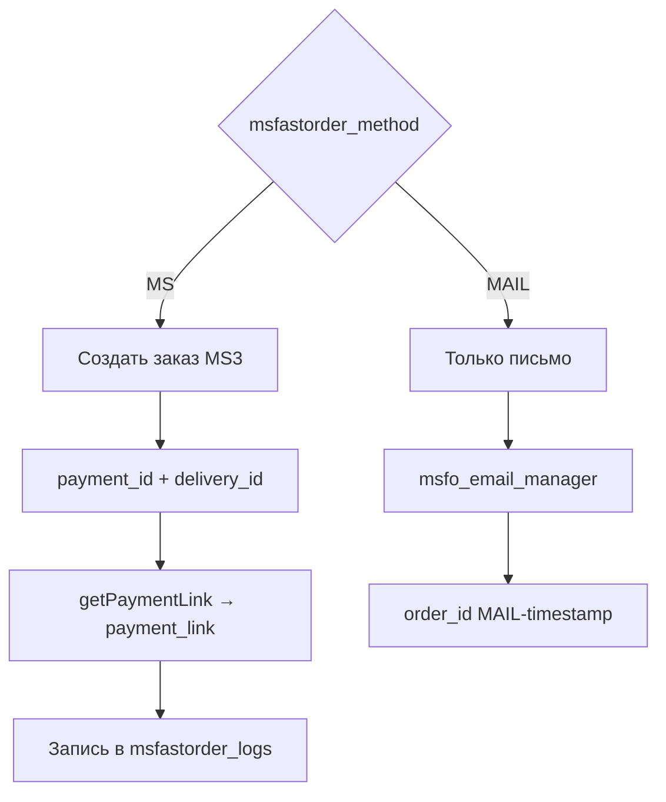
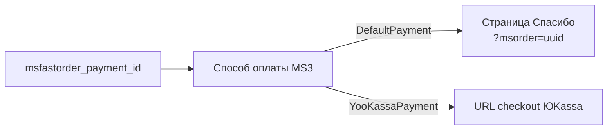

# Системные настройки msFastOrder

Краткая последовательность: [Быстрый старт](quick-start).

Все ключи в пространстве имён **`msfastorder`**. В БД: префикс `msfastorder_`. Область в интерфейсе может называться **msfastorder** или **msfastorder_main** (зависит от версии транспорта).

**Где менять:** **Настройки → Системные настройки**, фильтр `msfastorder`.



## Основные

| Ключ | Тип | По умолчанию | Описание |
|------|-----|--------------|----------|
| `msfastorder_method` | текст | `MS` | Режим: **`MS`** — заказ в MiniShop3; **`MAIL`** — только письмо менеджеру. Параметр сниппета `&method=` **не читается** PHP |
| `msfastorder_required_fields` | текст | `receiver,phone` | Обязательные поля на **сервере** (через запятую): `receiver`, `phone`, `email`, `city`, `comment` |
| `msfastorder_email_manager` | текст | *(пусто)* | Email менеджера. Для **MAIL** обязателен. Для MS — уведомления при настройке почты |
| `msfastorder_phone_mask` | текст | `+7 (999) 999-99-99` | Маска поля телефона в модалке (`PhoneMask` в JS) |
| `msfastorder_success_redirect` | текст | *(пусто)* | URL редиректа после успеха, если нет `payment_link`. При наличии `payment_link` — редирект на оплату через ~2 с |

## MiniShop3 (режим MS) {#minishop3}

| Ключ | Тип | По умолчанию | Описание |
|------|-----|--------------|----------|
| `msfastorder_payment_id` | число / текст | `0` или пусто | ID **активного** способа оплаты MS3. Для ЮKassa — ID «Оплата через ЮKassa» |
| `msfastorder_delivery_id` | число / текст | `0` или пусто | ID способа доставки MS3 |
| `msfastorder_default_image` | текст | `/assets/components/minishop3/img/web/ms3_small.png` | Превью товара в модалке, если у товара нет изображения |

При установке резолвер может создать способы **Fast Order Payment** / **Fast Order Delivery** и записать ID в эти настройки.

### Связанные настройки MiniShop3

| Ключ MS3 | Зачем |
|----------|--------|
| `ms3_order_success_page_id` | Страница «Спасибо» с просмотром заказа (`msorder=uuid`) для DefaultPayment |
| `ms3_status_new` | Статус нового заказа после быстрого оформления |

## Интерфейс и assets

| Ключ | Тип | По умолчанию | Описание |
|------|-----|--------------|----------|
| `msfastorder_modal_library` | текст | `native` | Модалка: `native`, `bootstrap`, `fancybox` |
| `msfastorder_connector_url` | текст | `/assets/components/msfastorder/connector.php` | URL AJAX (только POST) |
| `msfastorder_assets_url` | текст | `/assets/components/msfastorder/` | База для `css/msfo.min.css` и `js/msfo.min.js` |
| `msfastorder_copy_count` | да/нет | Да | В транспорте: копировать количество со страницы. **В JS копирование выполняется всегда** — см. [Подключение на сайте](frontend#количество-и-итого) |
| `msfastorder_generate_email` | да/нет | Да | В транспорте: автогенерация email. В **MS** при пустом email PHP вызывает `generateEmail()` **независимо** от этой настройки |
| `msfastorder_frontend_css` | текст | *(пусто)* | Зарезервировано под свой CSS; стандартный сниппет подключает `msfo.min.css` |
| `msfastorder_frontend_js` | текст | *(пусто)* | Зарезервировано под свой JS; стандартный сниппет подключает `msfo.min.js` |

Для `bootstrap` на странице нужен Bootstrap 5 Modal. Для `fancybox` — Fancybox 4/5; подключайте `msfo.min.css` **после** CSS Fancybox.

## Телефон и префикс страны

| Ключ | Тип | По умолчанию | Описание |
|------|-----|--------------|----------|
| `msfastorder_prefix_enabled` | да/нет | Нет | Включить проверку длины и кода страны на сервере |
| `msfastorder_prefix_country` | текст | `7` | Код страны без `+` |
| `msfastorder_prefix_length` | число | `11` | Ожидаемое число цифр в номере |

## Безопасность и отладка

| Ключ | Тип | По умолчанию | Описание |
|------|-----|--------------|----------|
| `msfastorder_debug` | да/нет | Нет | В JSON-ответах connector при ошибках добавляется `debug`; доступен `action=rate-limit/reset` |
| `msfastorder_rate_limit_attempts` | число | `5` | Лимит запросов `order/create` с одного IP за окно |
| `msfastorder_rate_limit_window` | число | `300` | Длина окна в секундах (5 минут) |

CSRF: токен в `$_SESSION['msfastorder.csrf_token']`, в HTML — `window.msfoConfig.csrfToken`. Плагин **`msfastorder_web`** обновляет конфиг при `OnWebPagePrerender`, чтобы токен не «застывал» в кэше страницы. Подробнее: [AJAX API](api).

## Режим MS {#режим-ms}

1. Создаётся заказ MiniShop3 с одной позицией (товар, количество, опции/`variant_id`).
2. Покупатель заполняется из полей формы.
3. Заказ регистрируется в сессии MS3, статус «Новый».
4. В ответе AJAX — `payment_link` (если способ оплаты это поддерживает).
5. Запись в `msfastorder_logs`.

### payment_link {#payment-link}

URL возвращает обработчик оплаты MiniShop3 (`Payment::getPaymentLink()`). Отдельный URL в msFastOrder **не задаётся** — только `msfastorder_payment_id`.

**Где используется:**

- `data.payment_link` в ответе `order/create`
- кнопка «Оплатить» на экране успеха (JS `renderSuccess`)
- событие `msfo:order:success`
- чанк `msfo_email_customer` (если отправка клиенту включена)

| Тип способа оплаты | `payment_link` |
|--------------------|----------------|
| DefaultPayment | `https://site.ru/spasibo?msorder={uuid}` |
| ЮKassa ([msp3YooKassa](/components/msp3yookassa/)) | URL checkout ЮKassa |

Пошаговая настройка ЮKassa: [Интеграция](integration#оплата-через-юkassa-msp3yookassa).



При непустом `msfastorder_success_redirect` и наличии `payment_link` фронт через ~2 с перенаправляет на оплату.

## Режим MAIL {#режим-mail}

1. Заказ в MS3 **не создаётся**.
2. Письмо менеджеру — чанк `msfo_email_manager` на `msfastorder_email_manager`.
3. При указанном email клиента — `msfo_email_customer`.
4. В лог: `method = MAIL`, `order_id` вида `MAIL-{timestamp}`.

## Получение в коде

```php
$modx->getOption('msfastorder_method', null, 'MS');
$modx->getOption('msfastorder_payment_id', null, 0);
```

## Элементы пакета

| Элемент | Назначение |
|---------|------------|
| Сниппет `msFastOrder` | Кнопка, CSS/JS, CSRF в сессии |
| Сниппет `msFastOrderClientConfig` | Только `<script>window.msfoConfig</script>` |
| Плагин `msfastorder_web` | Свежий CSRF при отдаче страницы |

См. [Сниппеты](snippets/index).
