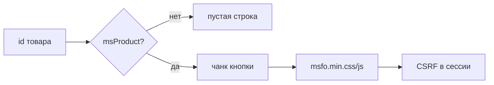

# Сниппет msFastOrder

Выводит кнопку открытия модалки быстрого заказа и регистрирует фронтенд-ресурсы компонента.

## Что делает



1. Проверяет, что ресурс с `id` — товар MiniShop3 (`msProduct` + `Data`).
2. Рендерит чанк кнопки (`tplBtn`, по умолчанию `msfo_button`).
3. Устанавливает флаг `msfastorder.page_active` для плагина `msfastorder_web`.
4. Подключает `msfo.min.css` и `msfo.min.js` с версией по `mtime` файла.
5. Создаёт CSRF-токен в сессии (`ClientConfig::ensureCsrfToken`).

Плагин **`msfastorder_web`** перед отдачей страницы подставляет актуальный `window.msfoConfig` (в т.ч. свежий `csrfToken`).

## Параметры

| Параметр | По умолчанию | Используется в PHP | Описание |
|----------|--------------|-------------------|----------|
| `id` | ID текущего ресурса | да | ID товара MS3 |
| `tplBtn` | `msfo_button` | да | Имя чанка кнопки |
| `primary` | `0` | да | Класс `msfo-trigger--primary` на кнопке |
| `tplModal` | `msfo_modal` | нет* | Эталон оболочки модалки |
| `tplForm` | `msfo_form` | нет* | Эталон формы |
| `tplSuccess` | `msfo_success` | нет* | Эталон экрана успеха |
| `method` | — | нет | Режим MS/MAIL только из `msfastorder_method` |

\* Сохранены для совместимости; стандартный UI строится в `msfo.js` (`renderForm`, `renderSuccess`, `ModalManager`).

Если товар не найден или `id` ≤ 0 — сниппет возвращает пустую строку.

## Использование

### Страница товара

::: code-group

```fenom
{'!msFastOrder' | snippet}
```

```modx
[[!msFastOrder]]
```

:::

### Каталог / список товаров

::: code-group

```fenom
{'!msFastOrder' | snippet : [
  'id' => $id,
  'primary' => 1
]}
```

```modx
[[!msFastOrder?
  &id=`[[+id]]`
  &tplBtn=`my_fast_order_btn`
  &primary=`1`
]]
```

:::

## Разметка кнопки (чанк `msfo_button`)

Обязательные атрибуты для делегирования клика в `msfo.js`:

::: code-group

```fenom
<button type="button"
  class="msfo-trigger{if $primary} msfo-trigger--primary{/if}"
  data-msfo-trigger
  data-msfo-product-id="{$product_id}"
  data-msfo-hash="{$hash}">
  {$_modx->lexicon('msfastorder_button_text')}
</button>
```

```modx
<button type="button"
  class="msfo-trigger[[+primary:is=`1`:then=` msfo-trigger--primary`]]"
  data-msfo-trigger
  data-msfo-product-id="[[+product_id]]"
  data-msfo-hash="[[+hash]]">
  [[%msfastorder_button_text]]
</button>
```

:::

| Атрибут | Описание |
|---------|----------|
| `data-msfo-trigger` | Маркер кнопки |
| `data-msfo-product-id` | ID товара для `product/get` |

Плейсхолдеры чанка: `product_id`, `hash` (md5 от `product_id` + `site_key`), `primary`.

Своя кнопка без чанка — те же `data-msfo-trigger` и `data-msfo-product-id` (см. [msFastOrderClientConfig](msFastOrderClientConfig)).

## Поля заказа (POST)

Отправляются на `order/create` (см. [AJAX API](../api)):

| Поле | Описание |
|------|----------|
| `product_id` | ID товара |
| `count` | Количество |
| `options` | JSON, например `{"variant_id":42}` |
| `receiver`, `phone`, `email`, `city`, `comment` | Данные покупателя |

## Программное открытие модалки

После загрузки `msfo.min.js` на странице доступен `window.msFastOrder.openOrderModal(productId)` — открытие формы без кнопки из чанка `msfo_button`.

Краткий вызов:

```javascript
await msFastOrder.openOrderModal(123); // ID ресурса msProduct
```

**Обязательно** на той же странице: `window.msfoConfig` (через этот сниппет или [msFastOrderClientConfig](msFastOrderClientConfig)) и подключённый `msfo.min.js`.

Подробно: сценарии, события, своя кнопка, каталог, ошибки — [Подключение на сайте → Программное открытие модалки](../frontend#программное-открытие-модалки).

## См. также

- [msFastOrderClientConfig](msFastOrderClientConfig) — только конфиг
- [Подключение на сайте](../frontend)
- [Системные настройки](../settings)
