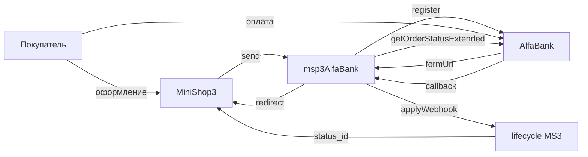

# msp3AlfaBank

**msp3AlfaBank** подключает [интернет-эквайринг Альфа-Банка](https://alfabank.ru/sme/payservice/internet-acquiring/docs/documentation/) к [MiniShop3](/components/minishop3/) в MODX Revolution 3. Статус «оплачен» выставляет MiniShop3. Пакет статус заказа не меняет. Письма покупателю шлёт Центр уведомлений MiniShop3.

Старый пакет `mspAlfaBank` при установке не удаляется.

- Сумма в заказе в рублях. В банк пакет шлёт копейки.
- Отдельной подписи у колбэка нет.
- Пустые логин и пароль во properties и в системных настройках: `webhook.php` отвечает `401`.
- Пакет не сравнивает логин и пароль из тела колбэка. Он запрашивает статус у банка и сверяет сумму с попыткой оплаты.

Пространство имён настроек: **`msp3alfabank`**. Адрес уведомлений: `assets/components/msp3alfabank/webhook.php`.

## Возможности

- Обычная оплата, деньги списываются сразу: способ **Оплата через Альфа-Банк**.
- Холд, деньги сначала блокируются: способ **Оплата через Альфа-Банк (двухстадийная)**. Списание кнопкой во вкладке заказа.
- Банк присылает колбэк на сайт. Пакет спрашивает статус платежа у банка и не берёт статус из текста колбэка.
- Номер платежа в банке пакет сохраняет у попытки оплаты. Списание, отмена холда и возврат работают и до колбэка, если номер уже есть.
- Во вкладке заказа: попытки, возврат, списание холда, отмена холда, синхронизация.

## Системные требования

| Требование | Версия |
| --- | --- |
| MODX Revolution | 3.0+ |
| MiniShop3 | 1.14.0-beta1 и новее |
| PHP | 8.2+ |
| pdoTools | 3.0.0 и новее (в манифесте установки) |
| Доступ | логин с суффиксом `-api` и пароль из письма банка |
| Сайт | HTTPS на webhook без 301 |

Публичного демо-кабинета у банка нет. Логин и пароль приходят в письме.

Без **pdoTools** 3.x установка через **Управление пакетами** не пройдёт проверку зависимостей. Заказы и способы оплаты даёт [MiniShop3](/components/minishop3/).

## Установка

1. Установите **MiniShop3**.
2. Добавьте провайдер **modstore.pro** (**Система → Управление пакетами → Провайдеры**): URL `https://modstore.pro/extras/`, email и API-ключ из личного кабинета modstore.
3. Установите пакет **msp3AlfaBank** через **Управление пакетами** (в **Show Details** выберите провайдер **modstore.pro**).
4. **Очистите кэш** MODX.

Плагин **`msp3alfabank_bootstrap`** подключает автозагрузку классов и вкладку заказа в админке (события `OnMODXInit`, `msOnManagerCustomCssJs`).

Резолвер создаёт два активных способа:

| Название | Класс |
| --- | --- |
| Оплата через Альфа-Банк | `Msp3AlfaBank\Payment\AlfaBankPayment` |
| Оплата через Альфа-Банк (двухстадийная) | `Msp3AlfaBank\Payment\AlfaBankTwoStagePayment` |

Создание платежа берёт логин и пароль из `msPayment.properties`, если они не пусты. Имена: `user_name` или `login`, `password` или `secret` и другие алиасы. См. [настройки](settings). Иначе пакет берёт системные ключи.

**`webhook.php`** берёт логин и пароль по той же цепочке: properties способа, системные ключи, затем устаревшие `mspalfabank_*`. Пустые креды во всех местах дают `401`.

Откуда брать логин и какой адрес шлюза выбрать: [Быстрый старт](quick-start#откуда-брать-ключи).

Заказ дешевле 1 копейки пакет на оплату не отправляет.

## Быстрая настройка webhook

Пакет сам передаёт адрес колбэка при создании платежа. В кабинете банка укажите тот же URL:

```text
https://ваш-домен.ru/assets/components/msp3alfabank/webhook.php
```

HTTPS без 301. JSON-адрес ядра MiniShop3 для колбэка Альфа-Банка не подходит.

## Архитектура



## Быстрые ссылки

| Нужно | Документ |
| --- | --- |
| Установить и принять первый платёж | [Быстрый старт](quick-start) |
| Все ключи `msp3alfabank_*` | [Системные настройки](settings) |
| Колбэк, холд, переход со старого пакета | [Интеграция](integration) |
| Логин, 401, кэш | [FAQ](faq) |
| Оформление заказа MS3 | [MiniShop3: заказ](/components/minishop3/frontend/order) |
