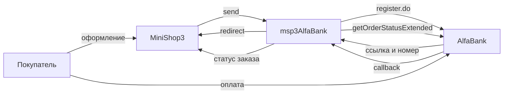

# Интеграция msp3AlfaBank

Нужны только шаги установки? Откройте [Быстрый старт](quick-start).

## Запросы к банку

| Действие | Запрос банка | Когда |
| --- | --- | --- |
| Обычная оплата | `register.do` | Способ **Оплата через Альфа-Банк** |
| Холд | `registerPreAuth.do` | Способ **Оплата через Альфа-Банк (двухстадийная)** |
| Узнать статус | `getOrderStatusExtended.do` | Колбэк и кнопка «Синхронизировать» |
| Списать холд | `deposit.do` | Вкладка заказа, статус блокировки |
| Отменить холд | `reverse.do` | До списания |
| Вернуть деньги | `refund.do` | После списания. Сумму вводите в рублях, пакет переводит в копейки |

В каждом запросе уходят логин и пароль. Отдельной подписи колбэка у банка нет.

## Webhook

Адрес на сайте:

```text
https://ваш-домен.ru/assets/components/msp3alfabank/webhook.php
```

Пакет кладёт тот же адрес в платёж при создании ссылки. В кабинете банка укажите его ещё раз. JSON-маршрут ядра MiniShop3 для этого колбэка не подходит.

Обработчик не читает статус из тела колбэка. Он запрашивает `getOrderStatusExtended.do` по номеру платежа банка или по номеру заказа в пакете.

| Код банка | Что это | Попытка оплаты |
| --- | --- | --- |
| 2 | Деньги списаны | paid |
| 1 | Деньги заблокированы | authorized |
| 6 | Отказ | failed |
| 3 | Холд отменён | cancelled |
| 4 | Возврат | refunded |
| 0 | Платёж только зарегистрирован | пакет пропускает |

После списания MiniShop3 ставит заказу `ms3_status_paid`. Неуспех: `ms3_payment_on_failed_status` (по умолчанию 0, статус не меняется). Полный возврат: `ms3_payment_on_refunded_status` (по умолчанию 5).

Без логина и пароля webhook отвечает `401`. Пустое тело: `200` и текст `empty`.

## Как проходит оплата



Номер попытки в пакете имеет вид `{номер заказа}-{случайная строка}`. Покупатель уходит на `formUrl`. Текст платежа: `Order #<номер>`, не длиннее 100 символов.

Пока колбэк не пришёл, синхронизация ищет платёж по номеру попытки.

Событие `msp3AlfaBankOnProviderEvent` получает ответ банка о статусе или тело колбэка. Строки лога начинаются с `[msp3AlfaBank]`.

`send()` отклоняет заказ дешевле 1 копейки.

## Вкладка заказа

После блокировки заказ ещё не оплачен. Спишите холд, тогда MiniShop3 отметит оплату. Отмена до списания снимает блокировку. Возврат доступен после списания.

Пока попытка ждёт оплату или деньги только заблокированы, вкладка возврат не отправляет. Сначала нужен колбэк или списание.

| Действие | Запрос | Что нужно |
| --- | --- | --- |
| Синхронизировать | `getOrderStatusExtended.do` | Номер платежа банка или номер попытки |
| Списать холд | `deposit.do` | Номер платежа банка, статус блокировки |
| Отменить холд | `reverse.do` | Номер платежа банка |
| Возврат | `refund.do` | Номер платежа банка |

## Переход со старого mspAlfaBank {#переход-со-старого-mspalfabank}

Резолвер копирует непустые `mspalfabank_user_name`, `password`, `test_mode`, `api_base_url`, `success_url`, `fail_url`, `json_params_extra`, `debug` в ключи `msp3alfabank_*`, если новые пусты. Старый способ оплаты не удаляется. Выключите его. Адрес колбэка сменится на `msp3alfabank/webhook.php`.

Ключи `mspalfabank_status_authorized` и `status_refunded` больше не нужны. Статус заказа задаёт MiniShop3.
