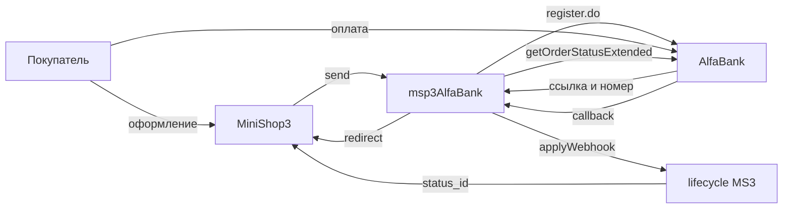

# Интеграция msp3AlfaBank

Шаги установки: [Быстрый старт](quick-start).

## Запросы к банку

| Действие | Запрос банка | Когда |
| --- | --- | --- |
| Обычная оплата | `register.do` | Способ **Оплата через Альфа-Банк** |
| Холд | `registerPreAuth.do` | Способ **Оплата через Альфа-Банк (двухстадийная)** |
| Узнать статус | `getOrderStatusExtended.do` | Колбэк и кнопка «Синхронизировать» |
| Списать холд | `deposit.do` | Вкладка заказа, статус блокировки |
| Отменить холд | `reverse.do` | До списания |
| Вернуть деньги | `refund.do` | После списания. Сумму вводите в рублях, пакет переводит в копейки |

В каждом запросе уходят логин и пароль. Отдельной подписи колбэка у банка нет.

## Webhook

Адрес на сайте:

```text
https://ваш-домен.ru/assets/components/msp3alfabank/webhook.php
```

Пакет кладёт тот же адрес в платёж при создании ссылки. В кабинете банка укажите его ещё раз. JSON-адрес ядра MiniShop3 для этого колбэка не подходит.

Обработчик не читает статус из тела колбэка. Он запрашивает `getOrderStatusExtended.do` по номеру платежа банка или по номеру заказа в пакете.

| Код банка | Что это | Попытка оплаты |
| --- | --- | --- |
| 2 | Деньги списаны | paid |
| 1 | Деньги заблокированы | authorized |
| 6 | Отказ | failed |
| 3 | Холд отменён | cancelled |
| 4 | Возврат | refunded |
| 0 | Платёж только зарегистрирован | пакет пропускает |

После списания MiniShop3 ставит заказу `ms3_status_paid`. Неуспех: `ms3_payment_on_failed_status` (по умолчанию 0, статус не меняется). Полный возврат: `ms3_payment_on_refunded_status` (по умолчанию 5).

Без логина и пароля в properties способа и в системных ключах webhook отвечает `401`. Логин и пароль из тела колбэка не проверяются. Пустое тело или нет `mdOrder` и `orderNumber`: HTTP `200`, JSON с полем `message` = `empty` (не сырой текст).

## Как проходит оплата



| Что | Значение |
| --- | --- |
| Номер попытки | `{номер заказа}-{случайная строка}` |
| Покупатель уходит на | `formUrl` |
| Текст платежа | `Order #<номер>`, не длиннее 100 символов |
| Язык страницы оплаты | `language` = `ru` |

Пока колбэк не пришёл, синхронизация ищет платёж по номеру попытки.

Событие `msp3AlfaBankOnProviderEvent` получает ответ `getOrderStatusExtended.do`, не сырое тело колбэка. Строки лога начинаются с `[msp3AlfaBank]`.

Заказ дешевле 1 копейки пакет на оплату не отправляет.

## Вкладка заказа

Плагин **`msp3alfabank_bootstrap`** подключает вкладку для способов с классом `Msp3AlfaBank\Payment\` и для устаревшего `MspAlfaBank\Payment\`. Список попыток отдаёт connector: действие `mgr/getlist`.

После блокировки заказ ещё не оплачен. Спишите холд, тогда MiniShop3 отметит оплату. **Отменить холд** шлёт только `reverse.do` в банк. Попытка остаётся `authorized`. Статус заказа меняет MiniShop3 после колбэка и lifecycle. Возврат доступен после списания.

Пока попытка ждёт оплату или деньги только заблокированы, вкладка возврат не отправляет. Сначала нужен колбэк или списание.

| Действие | Запрос | Что нужно |
| --- | --- | --- |
| Синхронизировать | `getOrderStatusExtended.do` | Номер платежа банка или номер попытки |
| Списать холд | `deposit.do` | Номер платежа банка, статус блокировки |
| Отменить холд | `reverse.do` | Номер платежа банка |
| Возврат | `refund.do` | Номер платежа банка |

**Синхронизировать** без настроенных логина и пароля не ходит в банк. Ответ успешный, в данных есть `note` с текстом «не настроено». Ошибки нет.

## Переход со старого mspAlfaBank {#переход-со-старого-mspalfabank}

При **первой установке** резолвер копирует непустые `mspalfabank_*` в `msp3alfabank_*`, если новые пусты. Список: `user_name`, `password`, `test_mode`, `api_base_url`, `success_url`, `fail_url`, `json_params_extra`, `debug`.

При обновлении пакета копирования нет. Старый способ оплаты не удаляется. Выключите его. Адрес колбэка сменится на `msp3alfabank/webhook.php`.

Вкладка заказа показывается и для класса `MspAlfaBank\Payment\`, пока способ не выключен.

Ключи `mspalfabank_status_authorized` и `status_refunded` больше не нужны. Статус заказа задаёт MiniShop3.
