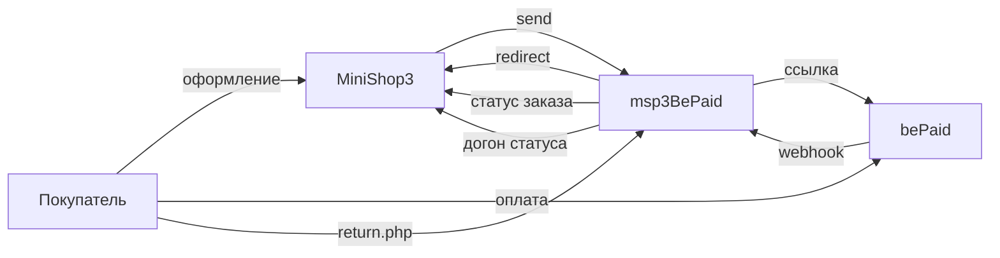

# msp3BePaid

**msp3BePaid** подключает [bePaid](https://bepaid.by/) к [MiniShop3](/components/minishop3/) в MODX Revolution 3. Покупатель уходит на страницу оплаты bePaid. Статус «оплачен» выставляет MiniShop3 по webhook. Пакет сам статус заказа не меняет.

В заказе сумма в валюте магазина. В bePaid пакет отправляет её в мелких единицах. Для белорусского рубля это копейки. Нужен PHP-модуль `bcmath`.

Уведомление приходит с логином и паролем магазина. Подпись в заголовке `Content-Signature` пакет проверяет, если сохранён публичный ключ. Пустой ключ проверку пропускает.

- [Документация API](https://docs.bepaid.by/)

Пространство имён настроек: **`msp3bepaid`**. Уведомления: `assets/components/msp3bepaid/webhook.php`. Возврат покупателя: `assets/components/msp3bepaid/return.php`.

Плагин **`msp3bepaid_bootstrap`** на `OnMODXInit` и `msOnManagerCustomCssJs` подключает автозагрузку и вкладку заказа в менеджере.

## Возможности

Один способ оплаты: **Оплата через BePaid**. Карта, ERIP и другие типы задаёт настройка `payment_types`.

- Пакет создаёт токен checkout с `transaction_type: payment`. Холда и `capture` в пакете нет.
- bePaid шлёт уведомление на один адрес магазина. В токен checkout пакет пишет `notification_url` на `webhook.php`.
- bePaid возвращает покупателя на `return.php`. Страница сверяет токен и при успехе может догнать оплату в MiniShop3. Источник истины — webhook.
- Во вкладке заказа: попытки, синхронизация статуса ссылки, возврат по номеру транзакции. Кнопка отмены ссылки отвечает, что API ограничено.
- Пока уведомление не подтвердило оплату, возврат денег не уходит.
- Отменить токен checkout через API bePaid нельзя.

Валюта по умолчанию: BYN. Тестовый режим после установки включён (`msp3bepaid_test` = Да).

## Системные требования

| Требование | Версия |
| --- | --- |
| MODX Revolution | 3.0+ |
| MiniShop3 | 1.14.0-beta1 и новее |
| pdoTools | 3.0.0 и новее |
| PHP | 8.2+ |
| PHP-модуль | `bcmath` |
| Доступ | Shop ID и секретный ключ магазина |
| Сайт | HTTPS на webhook без 301 |

### Зависимости

- [MiniShop3](/components/minishop3/): заказы и способы оплаты.

## Установка

1. Установите **MiniShop3**.
2. Добавьте провайдер **modstore.pro** (**Система → Управление пакетами → Провайдеры**). URL: `https://modstore.pro/extras/`. Email и API-ключ возьмите в личном кабинете modstore.
3. Установите пакет **msp3BePaid** через **Управление пакетами** (в **Show Details** выберите провайдер **modstore.pro**).
4. **Очистите кэш** MODX.

Резолвер создаёт один активный способ:

| Название | Класс |
| --- | --- |
| Оплата через BePaid | `Msp3BePaid\Payment\BePaidPayment` |

Ключи можно хранить в `msPayment.properties`: `store_id`, `secret_key`, `public_key`, `webhook_secret`. Секрет также читается как `secret`. Дополнительно из properties: `checkout_url`, `currency`, `test`. Если properties пусты, пакет читает системные настройки `msp3bepaid_*`.

Способ **настроен**, когда непустые Shop ID и секрет. Подробнее: [Системные настройки](settings).

Откуда брать Shop ID и секрет: [Быстрый старт](quick-start#откуда-брать-ключи).

## Быстрая настройка уведомлений

В кабинете bePaid укажите один адрес на магазин:

```text
https://ваш-домен.ru/assets/components/msp3bepaid/webhook.php
```

При создании checkout пакет передаёт тот же URL в `notification_url`. Кабинет всё равно настройте.

Покупатель после оплаты возвращается на `return.php`. Эти адреса пакет подставляет в токен checkout сам.

Ядро MiniShop3 принимает уведомления по адресу `/api/v1/payment/webhook/{payment_method_id}`. Кабинет bePaid обычно ждёт один URL. Используйте `webhook.php`.

Неизвестные тела webhook пакет подтверждает и передаёт в событие MODX **`msp3BePaidOnProviderEvent`**.

## Архитектура



## Быстрые ссылки

| Нужно | Документ |
| --- | --- |
| Установить и принять первый платёж | [Быстрый старт](quick-start) |
| Ключи `msp3bepaid_*` | [Системные настройки](settings) |
| Уведомление, возврат, вкладка заказа | [Интеграция](integration) |
| Возврат до оплаты и страница return | [FAQ](faq) |
| Оформление заказа MiniShop3 | [MiniShop3: заказ](/components/minishop3/frontend/order) |
