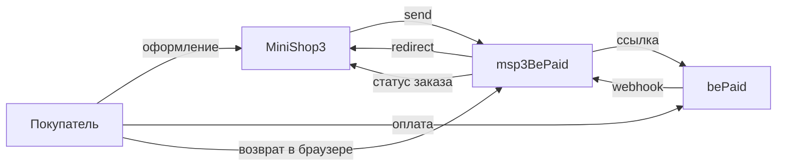

# msp3BePaid

**msp3BePaid** подключает [bePaid](https://bepaid.by/) к [MiniShop3](/components/minishop3/) в MODX Revolution 3. Покупатель уходит на страницу оплаты bePaid. Статус «оплачен» выставляет MiniShop3, когда приходит уведомление. Пакет сам статус заказа не меняет.

В заказе сумма в валюте магазина. В bePaid пакет отправляет её в мелких единицах. Для белорусского рубля это копейки. Нужен PHP-модуль `bcmath`.

Уведомление приходит с логином и паролем магазина. Подпись в заголовке пакет проверяет, если вы сохранили публичный ключ.

- [Документация API](https://docs.bepaid.by/)

Пространство имён настроек: **`msp3bepaid`**. Уведомления: `assets/components/msp3bepaid/webhook.php`. Возврат покупателя: `assets/components/msp3bepaid/return.php`.

С чего начать: [Быстрый старт](quick-start).

## Возможности

- Один способ: **Оплата через BePaid**. Карта, ERIP и другие типы из настройки `payment_types`.
- Пакет создаёт ссылку на оплату и сохраняет её номер у попытки.
- bePaid присылает уведомление на один адрес магазина.
- Страница возврата сверяет ссылку и отправляет покупателя дальше. Сам переход в браузере заказ не оплачивает.
- Во вкладке заказа: попытки, синхронизация статуса ссылки, возврат по номеру транзакции.
- Пока оплата не подтверждена уведомлением, возврат не уходит.
- Отменить ссылку на оплату через API bePaid нельзя.

Валюта по умолчанию: BYN.

## Системные требования

| Требование | Версия |
| --- | --- |
| MODX Revolution | 3.0+ |
| MiniShop3 | [1.14.0-beta1](https://github.com/modx-pro/MiniShop3/releases/tag/v1.14.0-beta1) и новее |
| PHP | 8.2+ |
| PHP-модуль | `bcmath` |
| Доступ | Shop ID, секретный ключ и публичный ключ магазина |
| Сайт | HTTPS на webhook без 301 |

### Зависимости

- [MiniShop3](/components/minishop3/): заказы и способы оплаты.

## Установка

Пакет зашифрован. Перед установкой добавьте провайдер **modstore.pro** в менеджере пакетов MODX.

1. Установите **MiniShop3**.
2. Добавьте провайдер **modstore.pro** (**Система → Управление пакетами → Провайдеры**): URL `https://modstore.pro/extras/`, email и API-ключ из личного кабинета modstore.
3. Установите пакет **msp3BePaid** через **Управление пакетами** (в **Show Details** выберите провайдер **modstore.pro**).
4. **Очистите кэш** MODX.

Без провайдера установка завершится ошибкой `Package provider not found`.

Резолвер создаёт один активный способ:

| Название | Класс |
| --- | --- |
| Оплата через BePaid | `Msp3BePaid\Payment\BePaidPayment` |

Ключи удобнее хранить в `msPayment.properties`: `store_id`, `secret_key`, `public_key`, `webhook_secret`. Если properties пусты, пакет читает системные настройки `msp3bepaid_*`.

Откуда брать Shop ID и секрет: [Быстрый старт](quick-start#откуда-брать-ключи).

## Быстрая настройка уведомлений

В кабинете bePaid укажите один адрес на магазин:

```text
https://ваш-домен.ru/assets/components/msp3bepaid/webhook.php
```

Покупатель после оплаты возвращается на `return.php`. Этот адрес пакет передаёт сам при создании ссылки.

Ядро MiniShop3 умеет принимать уведомления по адресу `/api/v1/payment/webhook/{payment_method_id}`. Кабинет bePaid обычно ждёт один URL. Используйте `webhook.php`.

## Архитектура



## Быстрые ссылки

| Нужно | Документ |
| --- | --- |
| Установить и принять первый платёж | [Быстрый старт](quick-start) |
| Ключи `msp3bepaid_*` | [Системные настройки](settings) |
| Уведомление, возврат, вкладка заказа | [Интеграция](integration) |
| Возврат до оплаты и страница return | [FAQ](faq) |
| Оформление заказа MS3 | [MiniShop3: заказ](/components/minishop3/frontend/order) |

## Документация по разделам

- [Быстрый старт](quick-start): провайдер modstore, Shop ID, секрет и публичный ключ.
- [Системные настройки](settings): ключи из README пакета.
- [Интеграция и сценарии](integration): webhook, `return.php`, возврат денег.
- [FAQ](faq): ограничения из README.
