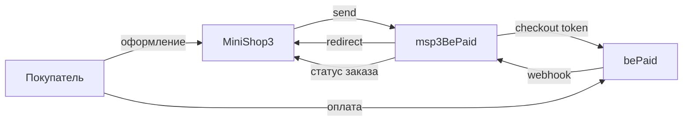

# Интеграция msp3BePaid

Нужны только шаги установки? Откройте [Быстрый старт](quick-start).

## Как проходит оплата

`send()` создаёт ссылку на оплату (checkout token) и сохраняет её вместе с `tracking_id` в попытку. `tracking_id` это UUID заказа. В `additional_data` уходят `order_id`, `order_num`, `order_hash`, `order_uuid`.

Покупатель платит на стороне bePaid. Сумма в запросе в мелких единицах валюты. Для перевода нужен `bcmath`.



## Webhook

Один адрес на магазин:

```text
https://ваш-домен.ru/assets/components/msp3bepaid/webhook.php
```

Запрос приходит с Basic Auth: Shop ID и секретный ключ. В заголовке `Content-Signature` может быть подпись. Пакет проверяет её публичным ключом, если ключ сохранён.

| Статус уведомления | Попытка оплаты |
| --- | --- |
| `successful` | paid |
| `failed` | failed |
| `expired` | failed |

Ядро MiniShop3 также принимает `/api/v1/payment/webhook/{payment_method_id}`. Кабинет bePaid обычно ждёт один URL. Используйте `webhook.php`.

## Возврат покупателя

Адреса успеха и ошибки в ссылке указывают на:

```text
https://ваш-домен.ru/assets/components/msp3bepaid/return.php?msorder={uuid}&outcome=success|fail|…
```

`return.php` сверяет токен ссылки, при необходимости догоняет уже известный статус и перенаправляет на страницу благодарности. Само открытие этой страницы заказ не оплачивает. Оплату подтверждает webhook.

Свои `success_url` и `fail_url` должны быть на том же хосте, что сайт.

## Вкладка заказа

| Действие | Куда ходит пакет | Когда |
| --- | --- | --- |
| Синхронизация | статус ссылки по токену | Пока есть сохранённый токен |
| Возврат | `POST https://gateway.bepaid.by/transactions/refunds` | После webhook оплаты. Нужен UID транзакции |

Пока попытка в `pending`, возврат не уходит. Сначала нужно уведомление об оплате.

Отменить checkout token через API bePaid нельзя. Кнопки отмены ссылки во вкладке нет.
