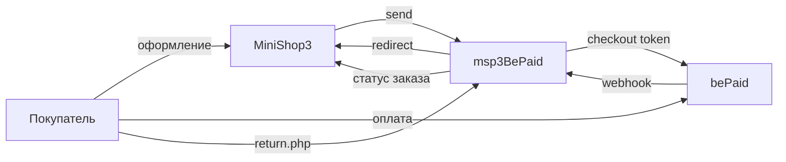

# Интеграция msp3BePaid

Шаги установки: [Быстрый старт](quick-start).

## Как проходит оплата

`send()` создаёт токен checkout с `transaction_type: payment`. Двухстадийного холда в пакете нет. Ссылку и `tracking_id` пакет сохраняет в попытку.

`tracking_id` — UUID заказа, если он задан. Иначе `{id заказа}-{uniqid}`.

В `additional_data` уходят `order_id`, `order_num`, `order_hash`, `order_uuid`.

Покупатель платит на стороне bePaid. Сумма в запросе в мелких единицах валюты. Для перевода нужен `bcmath`.

При создании ссылки пакет сам передаёт `notification_url` на `webhook.php`. Адрес в кабинете bePaid всё равно укажите. Некоторые сценарии провайдера не берут URL только из токена.



## Webhook

Один адрес на магазин:

```text
https://ваш-домен.ru/assets/components/msp3bepaid/webhook.php
```

Запрос приходит с Basic Auth: Shop ID и секретный ключ. В заголовке `Content-Signature` может быть подпись. Пакет проверяет её публичным ключом, если ключ сохранён. Пустой `public_key` проверку пропускает.

| Событие | Попытка оплаты |
| --- | --- |
| `transaction.status` = `successful` / `success` | paid |
| `transaction.status` = `failed` / `expired` / `error` / `declined` | failed |
| `transaction.type` = `refund` | refunded |
| Тело с `expired: true` или `message` = «Token is expired.» | без смены статуса. Попытка остаётся `pending` |

Уведомление об истечении **токена** checkout не переводит попытку в `failed`. Неуспех только по статусу транзакции в webhook.

Неизвестное тело пакет подтверждает ответом `200` и вызывает событие MODX **`msp3BePaidOnProviderEvent`** с безопасной копией тела запроса.

Ядро MiniShop3 также принимает `/api/v1/payment/webhook/{payment_method_id}`. Кабинет bePaid обычно ждёт один URL. Используйте `webhook.php`.

## Возврат покупателя

bePaid всегда отправляет покупателя на `return.php`. В токене checkout в полях `success_url`, `decline_url`, `fail_url` и `cancel_url` пакет подставляет этот же скрипт с параметром `outcome`.

```text
https://ваш-домен.ru/assets/components/msp3bepaid/return.php?msorder={uuid}&outcome=success|fail|…
```

`return.php` сверяет токен checkout. При успешном и завершённом checkout страница может вызвать тот же сценарий, что webhook (`applyWebhook`), и выставить `paid`, если уведомление ещё не дошло. **Источник истины — webhook.** Возврат в браузере только догоняет статус.

После сверки покупателя перенаправляют на страницу благодарности MiniShop3 или на **`msp3bepaid_success_url`** / **`msp3bepaid_fail_url`**, если URL задан и совпадает по хосту с сайтом. Это запасной переход, не адрес из кабинета bePaid.

## Вкладка заказа

| Действие | Куда ходит пакет | Когда |
| --- | --- | --- |
| Синхронизация | статус checkout по токену | Есть сохранённый токен. Без Shop ID и секрета запрос в bePaid не уходит, вкладка возвращает список попыток и текст `msp3bepaid.err_not_configured` |
| Возврат | `POST https://gateway.bepaid.by/transactions/refunds` | После webhook оплаты. Нужен UID транзакции |
| Отмена ссылки | без вызова API bePaid | Кнопка есть. Ответ всегда ошибка: API bePaid токен checkout не отменяет |

Пока попытка в `pending`, возврат денег не уходит. Сначала нужно уведомление об оплате.

Плагин **`msp3bepaid_bootstrap`** на событиях `OnMODXInit` и `msOnManagerCustomCssJs` подключает автозагрузку и вкладку заказа.
