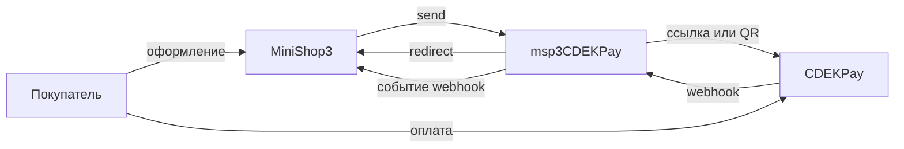

# msp3CDEKPay

**msp3CDEKPay** подключает [CDEK Pay](https://api.cdekfin.ru/) к [MiniShop3](/components/minishop3/) в MODX Revolution 3. Покупатель платит по ссылке или QR СБП. Статус «оплачен» ставит MiniShop3 по уведомлению. Пакет статус заказа не меняет. Письма покупателю шлёт Центр уведомлений MiniShop3.

Сумма в заказе в рублях. В CDEK Pay пакет шлёт её в копейках. Боевая валюта в запросе `RUR`, тестовая `TST`. Код `RUB` пакет не передаёт.

Холда нет. Заказ дешевле 1 рубля пакет не отправляет.

Пакет считает подпись уведомления секретным ключом магазина. Для валюты `RUR` это боевой секрет, для `TST` тестовый.

- [OpenAPI](https://api.cdekfin.ru/openapi.yaml)
- [Инструкция кабинета](https://files.cdekfin.ru/manuals/%D0%98%D0%BD%D1%81%D1%82%D1%80%D1%83%D0%BA%D1%86%D0%B8%D1%8F_%D0%BF%D0%BE_%D1%80%D0%B0%D0%B1%D0%BE%D1%82%D0%B5_%D1%81_%D0%9B%D0%9A_CDEK_Pay_(%D0%94%D0%BB%D1%8F_%D0%98%D0%9C).pdf)

Пространство имён настроек: **`msp3cdekpay`**. Адрес уведомлений: `assets/components/msp3cdekpay/webhook.php`.

## Возможности

- Оплата по ссылке: способ **Оплата через CDEK Pay**.
- QR СБП: способ **Оплата через CDEK Pay (СБП QR)**.
- Один адрес уведомлений в кабинете. Пакет ищет попытку по ключу ссылки среди **активных** способов CDEK Pay (ссылка и СБП QR).
- Чек 54-ФЗ уходит вместе с заказом на оплату, если включена настройка и в кабинете есть касса. Нужен email покупателя.
- Во вкладке заказа: попытки, возврат, блокировка ссылки, синхронизация, список чеков, чек полного расчёта, коррекция.
- Привязка карты и счёта СБП сниппетами. Расписания списаний в пакете нет.

Выплата наложенного платежа статус заказа не меняет.

## Системные требования

| Требование | Версия |
| --- | --- |
| MODX Revolution | 3.0+ |
| MiniShop3 | 1.14.0-beta1 и новее |
| PHP | 8.2+ |
| Расширения PHP | `ext-curl`, `ext-json` |
| pdoTools 3.x | только если сниппету `cdekPayBindings` задан параметр `tpl` |
| Доступ | логин магазина, боевой и тестовый секреты |
| Сайт | HTTPS на webhook без 301 |

### Зависимости

- [MiniShop3](/components/minishop3/): заказы и способы оплаты.

## Установка

1. Установите **MiniShop3**.
2. Добавьте провайдер **modstore.pro** (**Система → Управление пакетами → Провайдеры**). URL: `https://modstore.pro/extras/`. Email и API-ключ возьмите в кабинете modstore.pro.
3. Установите пакет **msp3CDEKPay** через **Управление пакетами**. В **Show Details** выберите провайдер **modstore.pro**.
4. **Очистите кэш** MODX.

Резолвер создаёт два активных способа:

| Название | Класс |
| --- | --- |
| Оплата через CDEK Pay | `Msp3CDEKPay\Payment\CdekPayPayment` |
| Оплата через CDEK Pay (СБП QR) | `Msp3CDEKPay\Payment\CdekPaySbpPayment` |

Логин и секреты: [Системные настройки](settings#логин-и-секреты). `send()`, `webhook.php` и вкладка заказа читают свойства способа, затем ключи `msp3cdekpay_*`.

Откуда брать значения: [Быстрый старт](quick-start#откуда-брать-ключи).

## Быстрая настройка уведомлений

В кабинете CDEK Pay откройте **Интеграция → Настройка API** и укажите:

```text
https://ваш-домен.ru/assets/components/msp3cdekpay/webhook.php
```

HTTPS без 301. Уведомление приходит как JSON-объект. Обычная форма не подойдёт.

Для одного способа можно указать адрес ядра MiniShop3. Для магазина удобнее один URL пакета. Подробнее: [Интеграция](integration#webhook).

## Архитектура



## Быстрые ссылки

| Нужно | Документ |
| --- | --- |
| Установить и принять первый платёж | [Быстрый старт](quick-start) |
| Все ключи `msp3cdekpay_*` | [Системные настройки](settings) |
| Уведомление, вкладка, чек | [Интеграция](integration) |
| Карта и СБП в личном кабинете | [Привязки](bindings) |
| 403, пустой webhook, редирект | [FAQ](faq) |
| Оформление заказа MS3 | [MiniShop3: заказ](/components/minishop3/frontend/order) |
