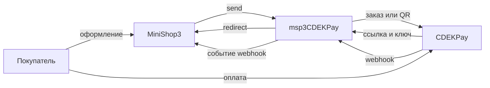

# Интеграция msp3CDEKPay

Шаги установки: [Быстрый старт](quick-start).

## Запросы к CDEK Pay

| Действие | Запрос | Когда |
| --- | --- | --- |
| Ссылка на оплату | создание заказа на оплату | Способ **Оплата через CDEK Pay** |
| QR СБП | QR СБП | Способ **Оплата через CDEK Pay (СБП QR)** |
| Возврат | `cancellation_requests` | После webhook. Нужны id платежа, сумма и причина |
| Заблокировать ссылку | `payment_orders/{access_key}/block` | Ключ ссылки у попытки |
| Синхронизировать | `GET payments` | Фильтр по ключу ссылки |
| Список чеков | `GET cashbox/receipts` | Кнопка **Чеки** на вкладке заказа |
| Чек полного расчёта | `POST cashbox/full_payment_requests` | id платежа CDEK |
| Чек коррекции | `POST cashbox/correction` | `receipt_id` |

Холда нет. `send()` отклоняет заказ дешевле 1 рубля. Сумма в API в копейках. Текст платежа: `Order #<номер>`, не длиннее 100 символов.

Ключ ссылки `access_key` пакет сохраняет как номер платежа и внешний номер попытки. Id платежа CDEK: другое поле. Оно приходит в webhook. Возврат и чек полного расчёта без этого id не проходят.

Пока попытка не оплачена, вкладка возврат не отправляет.

## Webhook {#webhook}

Один адрес на магазин:

```text
https://ваш-домен.ru/assets/components/msp3cdekpay/webhook.php
```

Тело: JSON с объектом `payment` и подписью SHA-256 из полей объекта и секретного ключа. Для валюты `TST` берётся тестовый секрет, для `RUR` боевой. Неверная подпись отвечает `401`. Пустое тело и обычная форма отвечают `400`.

Пакет отмечает попытку оплаченной или возвращённой. Он перебирает только **активные** способы **Оплата через CDEK Pay** и **Оплата через CDEK Pay (СБП QR)**.

| HTTP | Когда |
| --- | --- |
| `400` | Нет объекта `payment` или подписи |
| `401` | Неверная подпись |
| `500` | В MODX не зарегистрирован сервис `ms3_payment_lifecycle` |
| `409` | Ошибка применения webhook в lifecycle (кроме «попытка не найдена») |
| `200` | Успех, выплата наложенного платежа, неизвестный тип уведомления (`ignored`), нет подходящей попытки |

Неизвестный ключ ссылки тоже отвечает `200`, чтобы CDEK Pay не слал повтор.

Для одного способа можно указать адрес ядра:

```text
https://ваш-домен.ru/assets/components/minishop3/api.php/api/v1/payment/webhook/{ID_СПОСОБА}
```

После оплаты MiniShop3 ставит заказу `ms3_status_paid`. Неуспех: `ms3_payment_on_failed_status` (по умолчанию 0, статус не меняется). Полный возврат: `ms3_payment_on_refunded_status` (по умолчанию 5).

Выплата наложенного платежа (`payout_amount`) статус заказа не меняет. Пакет отвечает `200` и вызывает событие `msp3CdekPayOnPayout`. Если в MiniShop3 есть класс `EventGate`, события идут через него.

Строки лога начинаются с `[msp3CDEKPay]`.

## Как проходит оплата



Статус заказа ставит MiniShop3 после обработки попытки.

Ссылка на оплату приходит в поле `link`. У QR СБП это `qr_link`, плюс картинка `qr_image`.

## Вкладка заказа

Вкладку подключает plugin **`msp3cdekpay_bootstrap`**: **`OnMODXInit`** (автозагрузка) и **`msOnManagerCustomCssJs`** (скрипт и стили на странице заказа).

| Действие | Что нужно |
| --- | --- |
| Возврат | id платежа из webhook, сумма, причина |
| Заблокировать ссылку | ключ ссылки попытки |
| Синхронизировать | ключ ссылки. Логин или секрет пустые: ответ успешный, список попыток без запроса к API, в интерфейсе пояснение (`note`) |
| Чеки | запрос `GET cashbox/receipts` по заказу |
| Чек полного расчёта | id платежа CDEK |
| Чек коррекции | `receipt_id` |

Учётные данные для кнопок вкладки: [логин и секреты](settings#логин-и-секреты) (сначала свойства способа заказа).

## Чек 54-ФЗ

Включите **`msp3cdekpay_payment_receipt`** и кассу в кабинете. Без корректного email покупателя чек не уходит.

В чек попадают товары заказа (предмет расчёта `1`) и доставка, если её стоимость больше нуля. Сумма строк подгоняется под сумму заказа.

Строку чека можно поправить событием `msp3CdekPayOnPrepareReceiptItem`. В него приходят позиция, заказ и товар заказа.
