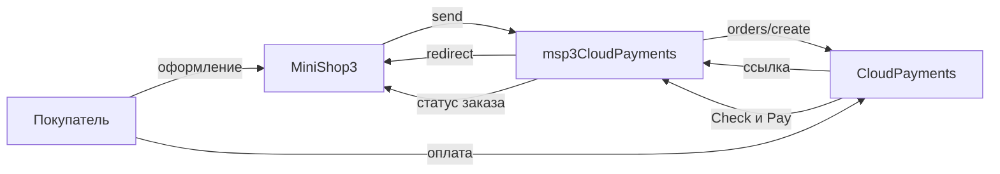

# msp3CloudPayments

**msp3CloudPayments** подключает [CloudPayments](https://developers.cloudpayments.ru/) к [MiniShop3](/components/minishop3/) в MODX Revolution 3. Пакет создаёт счёт, покупатель переходит по ссылке. Статус «оплачен» выставляет MiniShop3. Пакет сам статус заказа не меняет.

Сумма уходит с двумя знаками после запятой. Валюта по умолчанию RUB.

Уведомление подписано секретом API. Эту проверку выключить нельзя. Чек 54-ФЗ, если он включён, уходит вместе со счётом. Для чека в заказе нужен email.

Старый пакет `mspCloudPayments` при установке не удаляется.

- [Документация API](https://developers.cloudpayments.ru/)
- [Кабинет](https://merchant.cloudpayments.ru/)

Пространство имён настроек: **`msp3cloudpayments`**. Уведомления: `assets/components/msp3cloudpayments/webhook.php`.

Версия пакета: 1.0.0-pl. Лицензия: GPL v2 и новее.

С чего начать: [Быстрый старт](quick-start).

## Возможности

- Обычная оплата, деньги списываются сразу: способ **Оплата через CloudPayments**.
- Холд, деньги сначала блокируются: способ **Оплата через CloudPayments (двухстадийная)**. Заказ станет оплаченным после списания или уведомления Confirm.
- Шесть адресов уведомлений: оплата, проверка, отказ, подтверждение, возврат, отмена.
- Проверка перед оплатой статус заказа не меняет. Она ищет попытку и сверяет сумму.
- Во вкладке заказа: списание холда, отмена холда, возврат, отмена неоплаченного счёта, запрос статуса у CloudPayments.
- Номер счёта пакет сохраняет сам. Отмена неоплаченного счёта webhook не ждёт.

Тестовый Public ID виджета `test_api_00000000000000000000001` для счетов не подходит.

## Системные требования

| Требование | Версия |
| --- | --- |
| MODX Revolution | 3.0+ |
| MiniShop3 | [1.14.0-beta1](https://github.com/modx-pro/MiniShop3/releases/tag/v1.14.0-beta1) и новее |
| PHP | 8.2+ |
| Доступ | Public ID и API Secret сайта |
| Чек 54-ФЗ | email в заказе |
| Сайт | HTTPS на webhook без 301 |

### Зависимости

- [MiniShop3](/components/minishop3/): заказы и способы оплаты.

## Установка

Пакет зашифрован. Перед установкой добавьте провайдер **modstore.pro** в менеджере пакетов MODX.

1. Установите **MiniShop3**.
2. Добавьте провайдер **modstore.pro** (**Система → Управление пакетами → Провайдеры**): URL `https://modstore.pro/extras/`, email и API-ключ из личного кабинета modstore.
3. Установите пакет **msp3CloudPayments** через **Управление пакетами** (в **Show Details** выберите провайдер **modstore.pro**).
4. **Очистите кэш** MODX.

Без провайдера установка завершится ошибкой `Package provider not found`.

Резолвер создаёт два активных способа:

| Название | Класс |
| --- | --- |
| Оплата через CloudPayments | `Msp3CloudPayments\Payment\CloudPaymentsPayment` |
| Оплата через CloudPayments (двухстадийная) | `Msp3CloudPayments\Payment\CloudPaymentsTwoStagePayment` |

Ключи удобнее хранить в `msPayment.properties`: `public_id`, `api_secret`, `secret`, `webhook_secret`. Если properties пусты, пакет читает системные настройки.

Откуда брать Public ID и секрет: [Быстрый старт](quick-start#откуда-брать-ключи).

## Быстрая настройка уведомлений

В кабинете CloudPayments укажите шесть адресов. Общий вид:

```text
https://ваш-домен.ru/assets/components/msp3cloudpayments/webhook.php?event=pay
```

Вместо `pay` подставьте `check`, `fail`, `confirm`, `refund`, `cancel`. Полный список: [Быстрый старт](quick-start#шаг-3-шесть-адресов-уведомлений).

JSON-адрес ядра MiniShop3 для этих уведомлений не подходит. CloudPayments шлёт обычную форму.

## Архитектура



## Быстрые ссылки

| Нужно | Документ |
| --- | --- |
| Установить и принять первый платёж | [Быстрый старт](quick-start) |
| Все ключи `msp3cloudpayments_*` | [Системные настройки](settings) |
| Уведомления, холд, чек, старый пакет | [Интеграция](integration) |
| Код 13, код 12, холд | [FAQ](faq) |
| Оформление заказа MS3 | [MiniShop3: заказ](/components/minishop3/frontend/order) |

## Документация по разделам

- [Быстрый старт](quick-start): провайдер modstore, ключи кабинета, шесть URL, тестовая карта.
- [Системные настройки](settings): Public ID, секрет, чек, URL возврата.
- [Интеграция и сценарии](integration): коды уведомлений, вкладка заказа, переход с `mspCloudPayments`.
- [FAQ](faq): типовые сбои из README пакета.

Лицензия пакета: GPL v2 и новее.
