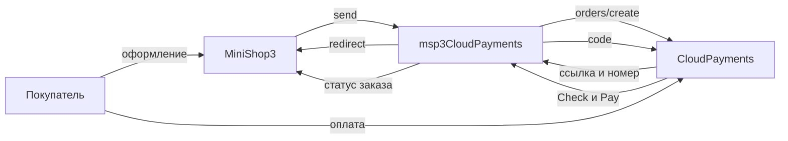

# Интеграция msp3CloudPayments

Шаги установки: [Быстрый старт](quick-start).

## Запросы к CloudPayments

| Действие | Запрос | Когда |
| --- | --- | --- |
| Создать счёт | `POST /orders/create` | Оформление заказа. Покупатель уходит на ссылку из ответа |
| Узнать статус | `v2/payments/find` | Кнопка синхронизации во вкладке. Без Public ID и API Secret запрос в API не уходит: ответ `success` со списком попыток и полем `note` |
| Списать холд | `payments/confirm` | После блокировки. Затем заказ отмечается оплаченным |
| Отменить холд | `payments/void` | До списания |
| Вернуть деньги | `payments/refund` | Нужен `TransactionId` из уведомления Pay |
| Отменить неоплаченный счёт | `orders/cancel` | По номеру счёта. Webhook не ждёт |

В запросах логин это Public ID, пароль это API Secret.

Обычный способ создаёт счёт без подтверждения. Двухстадийный способ передаёт `RequireConfirmation=true`.

## Уведомления

CloudPayments шлёт форму в UTF-8. Подпись в заголовке `X-Content-HMAC`: Base64 от HMAC-SHA256 сырого тела. Ключ: `properties` способа, затем `msp3cloudpayments_api_secret`, затем `mspcloudpayments_api_secret`. Проверку подписи выключить нельзя. Неверная подпись отвечает кодом `13`.

| Тип | URL |
| --- | --- |
| Pay | `webhook.php?event=pay` |
| Check | `webhook.php?event=check` |
| Fail | `webhook.php?event=fail` |
| Confirm | `webhook.php?event=confirm` |
| Refund | `webhook.php?event=refund` |
| Cancel | `webhook.php?event=cancel` |

Полный адрес: `https://ваш-домен.ru/assets/components/msp3cloudpayments/webhook.php?event=pay`. JSON-маршрут ядра MiniShop3 не подходит.

Check статус заказа не меняет. Он ищет попытку по `ms3_ref` и сверяет поле `Amount` с суммой этой попытки, не с `cost` заказа.

| Ответ Check | Значение |
| --- | --- |
| `{"code":0}` | Сумма совпала, попытка найдена |
| `10` | Попытка не найдена. Пустое тело Check тоже отвечает `10` |
| `12` | Сумма в уведомлении не совпала с суммой попытки |
| `13` | Неверная подпись |

Адрес webhook открывайте по HTTPS без редиректа 301. Иначе CloudPayments может не доставить тело запроса. Из‑за редиректа пакет не формирует JSON с кодом `13`.

Неизвестный тип в `?event=` не меняет попытку. Пакет вызывает событие `msp3CloudPaymentsOnProviderEvent` и отвечает `{"code":0}`.

| Событие | Попытка оплаты |
| --- | --- |
| pay и статус Completed | paid |
| pay и статус Authorized | authorized |
| confirm | paid |
| fail | failed |
| cancel | cancelled |
| refund | refunded |

## Как проходит оплата

Номер попытки `ms3_ref` имеет вид `{id заказа}-{8 hex}`. Тот же номер пакет кладёт в `JsonData`. В счёте `InvoiceId` это поле `num` заказа MiniShop3, не `id`.

Для возврата в данных попытки нужен `TransactionId` из уведомления Pay.

## Вкладка заказа

Запросы вкладки идут в `assets/components/msp3cloudpayments/connector.php` с параметром `action`:

| `action` | Назначение |
| --- | --- |
| `mgr/getlist` | Список попыток |
| `mgr/refund` | Возврат |
| `mgr/cancel` | Отмена холда или неоплаченного счёта |
| `mgr/capture` | Списание холда |
| `mgr/sync` | Статус у CloudPayments |

Плагин **`msp3cloudpayments_bootstrap`** на событиях `OnMODXInit` и `msOnManagerCustomCssJs` подключает автозагрузку и вкладку заказа в менеджере.

После Pay со статусом Authorized заказ ещё не оплачен. Спишите холд (`payments/confirm`) или дождитесь Confirm. Оба пути отмечают оплату.

Вкладка не вызывает `payments/refund`, пока попытка ждёт оплату или деньги только заблокированы. Сначала нужно уведомление или списание.

Отмена холда: `payments/void`. Неоплаченный счёт: `orders/cancel` по номеру счёта CloudPayments.

## Чек 54-ФЗ

Включите **`msp3cloudpayments_payment_receipt`**. Тогда вместе со счётом уходит чек. В данных счёта это блок `CloudPayments.CustomerReceipt` внутри `JsonData`. В адресе заказа нужен email или телефон.

Строку чека можно поправить событием `msp3CloudPaymentsOnPrepareReceiptItem`.

Система налогообложения: 0-5. НДС по умолчанию `none`. Признак способа расчёта по умолчанию `4`. Предмет товара `1`, предмет доставки `4`.

## Переход со старого mspCloudPayments {#переход-со-старого-mspcloudpayments}

При **первой установке** резолвер копирует непустые `mspcloudpayments_public_id`, `api_secret`, `currency`, `success_url`, `fail_url`, `json_data_extra`, `debug` в ключи `msp3cloudpayments_*`, если новые пусты. При обновлении пакета копирование не повторяется. Старый способ не удаляется. Выключите его и пропишите шесть новых адресов уведомлений.
