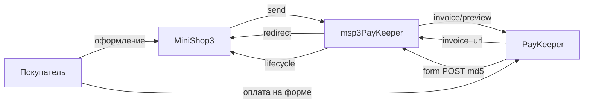

# msp3PayKeeper

**msp3PayKeeper** подключает [PayKeeper](https://docs.paykeeper.ru/) к [MiniShop3](/components/minishop3/) в MODX Revolution 3. Статус «оплачен» выставляет MiniShop3. Пакет сам статус заказа не меняет.

Сумма уходит в рублях, с двумя знаками после запятой. В запросах к PayKeeper логин и пароль те же, что для входа в кабинет.

Пространство имён настроек: **`msp3paykeeper`**. Точка входа уведомлений: `assets/components/msp3paykeeper/webhook.php`.

## Возможности

- Счёт на оплату. Покупатель переходит на страницу PayKeeper. Способ **Оплата через PayKeeper**.
- Холд: способ **Оплата через PayKeeper (двухстадийная)**. В кабинете PayKeeper включите двухэтапный режим. Пока в уведомлении есть дата блокировки и нет списания, заказ ещё не оплачен.
- Возврат идёт по номеру платежа из уведомления, не по номеру счёта.
- Неоплаченный счёт можно отменить во вкладке заказа.
- Во вкладке: попытки, возврат, списание холда, отмена счёта, синхронизация.

## Системные требования

| Требование | Версия |
| --- | --- |
| MODX Revolution | 3.x |
| MiniShop3 | 1.14.0-beta1 и новее |
| PHP | 8.2+ |
| Чек 54-ФЗ | в заказе должен быть email |
| Сайт | HTTPS на webhook без 301 |

### Зависимости

- [MiniShop3](/components/minishop3/): заказы и способы оплаты.

## Установка

Пакет зашифрован. Перед установкой добавьте провайдер **modstore.pro** в менеджере пакетов MODX.

1. Установите **MiniShop3**.
2. Добавьте провайдер **modstore.pro** (**Система → Управление пакетами → Провайдеры**): URL `https://modstore.pro/extras/`, email и API-ключ из личного кабинета modstore.
3. Установите пакет **msp3PayKeeper** через **Управление пакетами** (в **Show Details** выберите провайдер **modstore.pro**).
4. **Очистите кэш** MODX.

Без провайдера установка завершится ошибкой `Package provider not found`.

Резолвер создаёт два способа оплаты. Секреты сначала берутся из `msPayment.properties`, иначе из системных настроек.

| Название | Класс |
| --- | --- |
| Оплата через PayKeeper | `Msp3PayKeeper\Payment\PayKeeperPayment` |
| Оплата через PayKeeper (двухстадийная) | `Msp3PayKeeper\Payment\PayKeeperTwoStagePayment` |

Четыре значения для приёма оплаты:

- **`server_url`**. Адрес вашего кабинета PayKeeper без `/` в конце. Демо-стенд: `https://demo.paykeeper.ru`. Адрес `https://demo.server.paykeeper.ru` с парой `demo` / `demo` токен не отдаёт.
- **Логин и пароль API.** Это логин и пароль пользователя кабинета. Для JSON API PayKeeper советует отдельного пользователя: **Настройки → Доступ к панели администратора**. Проверка: `GET {server_url}/info/settings/token/` с Basic Auth возвращает JSON с `token`.
- **Секретное слово.** Это не пароль API. **Настройки → Получение информации о платежах**: способ уведомлений **POST-оповещения**, URL `webhook.php`, затем сгенерируйте или впишите слово.

Подробнее: [Быстрый старт](quick-start#откуда-брать-ключи).

## Быстрая настройка webhook

В кабинете PayKeeper один URL уведомлений. Ядро MiniShop3 на `/api/v1/payment/webhook/{id}` ждёт JSON, поэтому в личном кабинете указывают пакетный обработчик. PayKeeper шлёт form POST.

```text
https://ваш-домен.ru/assets/components/msp3paykeeper/webhook.php
```

HTTPS без Basic Auth и без 301.

## Архитектура



## Быстрые ссылки

| Нужно | Документ |
| --- | --- |
| Установить и принять первый платёж | [Быстрый старт](quick-start) |
| Все ключи `msp3paykeeper_*` | [Системные настройки](settings) |
| Webhook, чеки, двухстадийная, возврат | [Интеграция](integration) |
| Заказ не оплачен, токен 401 | [FAQ](faq) |
| Оформление заказа MS3 | [MiniShop3: заказ](/components/minishop3/frontend/order) |
