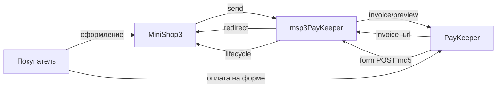

# msp3PayKeeper

**msp3PayKeeper** подключает [PayKeeper](https://docs.paykeeper.ru/) к [MiniShop3](/components/minishop3/) в MODX Revolution 3. Оплата идёт через `ms3_payment_lifecycle`. Пакет не пишет `status_id` заказа.

Суммы передаются в рублях с двумя знаками, не в копейках. HTTP-запросы идут через `file_get_contents` с Basic Auth.

Пространство имён настроек: **`msp3paykeeper`**. Точка входа уведомлений: `assets/components/msp3paykeeper/webhook.php`.

Версия пакета: 2.0.0-pl. Лицензия: GPL v2 и новее.

С чего начать: [Быстрый старт](quick-start).

## Возможности

- Счёт `POST /change/invoice/preview/`. Покупатель уходит на `invoice_url`.
- Одностадийная оплата: `Msp3PayKeeper\Payment\PayKeeperPayment`.
- Холд: `PayKeeperTwoStagePayment`. В кабинете PayKeeper включите двухэтапный режим. Поле `batch_date` в POST ставит попытку `authorized`.
- Возврат: `POST /change/payment/reverse/` по id платежа из поля `id` уведомления, не по `invoice_id`.
- Отмена неоплаченного счёта: `POST /change/invoice/revoke/`.
- Вкладка заказа: попытки, возврат, capture, revoke, синхронизация.

## Системные требования

| Требование | Версия |
| --- | --- |
| MODX Revolution | 3.x |
| MiniShop3 | beta с `ms3_payment_lifecycle` |
| PHP | 8.2+ |
| Чек 54-ФЗ | в заказе должен быть email |
| Сайт | HTTPS на webhook без 301 |

### Зависимости

- [MiniShop3](/components/minishop3/): заказы и способы оплаты.

## Установка

Пакет зашифрован. Перед установкой добавьте провайдер **modstore.pro** в менеджере пакетов MODX.

1. Установите **MiniShop3**.
2. Добавьте провайдер **modstore.pro** (**Система → Управление пакетами → Провайдеры**): URL `https://modstore.pro/extras/`, email и API-ключ из личного кабинета modstore.
3. Установите пакет **msp3PayKeeper** через **Управление пакетами** (в **Show Details** выберите провайдер **modstore.pro**).
4. **Очистите кэш** MODX.

Без провайдера установка завершится ошибкой `Package provider not found`.

Резолвер создаёт два способа оплаты. Секреты сначала берутся из `msPayment.properties`, иначе из системных настроек.

| Название | Класс |
| --- | --- |
| Оплата через PayKeeper | `Msp3PayKeeper\Payment\PayKeeperPayment` |
| Оплата через PayKeeper (двухстадийная) | `Msp3PayKeeper\Payment\PayKeeperTwoStagePayment` |

## Быстрая настройка webhook

В кабинете PayKeeper один URL уведомлений. Ядро MiniShop3 на `/api/v1/payment/webhook/{id}` ждёт JSON, поэтому в личном кабинете указывают пакетный обработчик. PayKeeper шлёт form POST.

```text
https://ваш-домен.ru/assets/components/msp3paykeeper/webhook.php
```

HTTPS без Basic Auth и без 301.

## Архитектура



## Быстрые ссылки

| Нужно | Документ |
| --- | --- |
| Установить и принять первый платёж | [Быстрый старт](quick-start) |
| Все ключи `msp3paykeeper_*` | [Системные настройки](settings) |
| Webhook, чеки, двухстадийная, возврат | [Интеграция](integration) |
| Заказ не оплачен, токен 401 | [FAQ](faq) |
| Оформление заказа MS3 | [MiniShop3: заказ](/components/minishop3/frontend/order) |

## Документация по разделам

- [Быстрый старт](quick-start): провайдер modstore, демо-кабинет, webhook, боевой режим.
- [Системные настройки](settings): URL сервера, Basic Auth, секретное слово, чеки, URL возврата.
- [Интеграция и сценарии](integration): поток оплаты, вкладка заказа, чеки 54-ФЗ.
- [FAQ](faq): типовые сбои.

Лицензия пакета: GPL v2 и новее.
