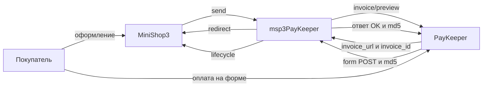

# Интеграция msp3PayKeeper

Нужны только шаги установки? Откройте [Быстрый старт](quick-start). Ниже сопоставлены методы PayKeeper и поведение пакета.

## API и код

| Метод PayKeeper | Назначение |
| --- | --- |
| `POST /change/invoice/preview/` | Счёт. Ответ содержит `invoice_url` и `invoice_id` |
| `GET /info/settings/token/` | Проверка Basic Auth. В ответе поле `token` |
| `POST /change/payment/reverse/` | Возврат по id платежа из поля `id` уведомления |
| `POST /change/invoice/revoke/` | Отмена неоплаченного счёта |
| form POST на `webhook.php` | Уведомление об оплате, подпись md5 |

Одностадийный класс: `Msp3PayKeeper\Payment\PayKeeperPayment`. Двухстадийный: `PayKeeperTwoStagePayment`.

## Webhook

В кабинете PayKeeper один URL уведомлений:

```text
https://ваш-домен.ru/assets/components/msp3paykeeper/webhook.php
```

HTTPS без Basic Auth и без 301. PayKeeper шлёт form POST. Ядро MiniShop3 на `/api/v1/payment/webhook/{id}` ждёт JSON, этот маршрут для PayKeeper не подходит.

Подпись:

```text
key = md5(id + sum + clientid + orderid + secret_word)
```

Ответ: слово `OK`, пробел и `md5(id + secret_word)`. `Content-Type: text/plain`.

Кабинет шлёт `id` платежа, не `invoice_id`. Пакет находит попытку по `orderid`. Поле `invoice_id` в POST не обязательно.

Секрет берётся из `msp3paykeeper_secret_word` или из properties (`secret_word`). Это не пароль API.

## Как проходит оплата



`payment_id` и `external_id` это `invoice_id`. Валюта `RUB`.

Для capture в payload нужен `id` платежа из webhook. Двухстадийный заказ не станет оплаченным, пока не спишете холд (`markPaid`).

В кабинете PayKeeper для холда включите двухэтапный режим и выберите способ **Оплата через PayKeeper (двухстадийная)**. Непустое поле `batch_date` в POST ставит попытку `authorized`.

Событие `msp3PayKeeperOnPrepareReceiptItem` правит строку чека до отправки счёта.

## Вкладка заказа

Попытки лежат в `ms3_payment_attempts`. Во вкладке: возврат, списание холда, отмена счёта, синхронизация invoice и payment.

Пока попытка `pending` или `authorized`, вкладка не вызывает `reverse`. Сначала нужен webhook или capture. Возврат идёт по `id` из уведомления. `invoice_id` для reverse не подходит.

## Чеки 54-ФЗ

При включённом `msp3paykeeper_payment_receipt` и email покупателя `service_name` уходит JSON с `cart`. Код НДС задаёт `msp3paykeeper_vat_code` (список 1-10).
