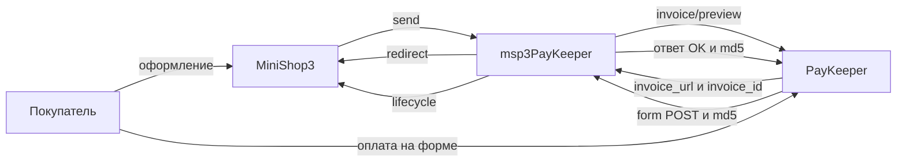

# Интеграция msp3PayKeeper

Шаги установки: [Быстрый старт](quick-start).

## API и код

| Метод PayKeeper | Назначение |
| --- | --- |
| `POST /change/invoice/preview/` | Счёт. Ответ содержит `invoice_url` и `invoice_id` |
| `GET /info/settings/token/` | Проверка Basic Auth. В ответе поле `token` |
| `GET /info/invoice/byid/` | Статус счёта (sync на вкладке) |
| `GET /info/payments/byid/` | Статус платежа (sync на вкладке) |
| `POST /change/payment/reverse/` | Возврат по id платежа из поля `id` уведомления |
| `POST /change/payment/capture/` | Списание холда (двухстадийная схема) |
| `POST /change/invoice/revoke/` | Отмена неоплаченного счёта |
| form POST на `webhook.php` | Уведомление об оплате, подпись md5 |

Одностадийный класс: `Msp3PayKeeper\Payment\PayKeeperPayment`. Двухстадийный: `PayKeeperTwoStagePayment`.

## Webhook

В кабинете PayKeeper один URL уведомлений:

```text
https://ваш-домен.ru/assets/components/msp3paykeeper/webhook.php
```

HTTPS без Basic Auth и без 301. PayKeeper шлёт form POST. Ядро MiniShop3 на `/api/v1/payment/webhook/{id}` ждёт JSON, этот маршрут для PayKeeper не подходит.

Подпись:

```text
key = md5(id + sum + clientid + orderid + secret_word)
```

Ответ: слово `OK`, пробел и `md5(id + secret_word)`. `Content-Type: text/plain`.

Кабинет шлёт `id` платежа, не `invoice_id`. Пакет находит попытку по `orderid`. Поле `invoice_id` в POST не обязательно.

Секрет для проверки подписи на `webhook.php`: сначала `secret_word` в properties активного способа, иначе **`msp3paykeeper_secret_word`**. Это не пароль API.

Неизвестный тип события после валидной подписи: пакет отвечает `OK`. Статус заказа в ядре MiniShop3 не меняет. Пакет вызывает **`msp3PayKeeperOnProviderEvent`** с полем `payload`.

## Как проходит оплата



`payment_id` и `external_id` это `invoice_id`. Валюта `RUB`.

Для capture в payload нужен `id` платежа из webhook. Двухстадийный заказ не станет оплаченным, пока не спишете холд (`markPaid`).

В кабинете PayKeeper для холда включите двухэтапный режим и выберите способ **Оплата через PayKeeper (двухстадийная)**. Непустое поле `batch_date` в POST ставит попытку `authorized`.

## Вкладка заказа

Плагин **`msp3paykeeper_bootstrap`**: `OnMODXInit` подключает autoload, `msOnManagerCustomCssJs` регистрирует вкладку на странице заказа MiniShop3.

Запросы вкладки идут в `assets/components/msp3paykeeper/connector.php` с параметром `action`:

| `action` | Назначение |
| --- | --- |
| `mgr/getlist` | Список попыток оплаты |
| `mgr/refund` | Возврат |
| `mgr/cancel` | Отмена счёта |
| `mgr/capture` | Списание холда |
| `mgr/sync` | Синхронизация с PayKeeper |

Попытки лежат в `ms3_payment_attempts`. Sync вызывает `GET /info/invoice/byid/` и `GET /info/payments/byid/`. Если `Settings::isConfigured()` ложно (пустые `server_url`, логин или пароль API), sync отвечает success: текущие попытки и `note` из лексикона `msp3paykeeper.err_not_configured`.

Пока попытка `pending` или `authorized`, вкладка не вызывает `reverse`. Сначала нужен webhook или capture. Возврат идёт по `id` из уведомления. `invoice_id` для reverse не подходит.

## Чеки 54-ФЗ

При включённом `msp3paykeeper_payment_receipt` и непустом email покупателя `service_name` уходит JSON с `cart`. Без email счёт создаётся, `cart` не добавляется. Код НДС задаёт `msp3paykeeper_vat_code` (список 1-10).

Событие `msp3PayKeeperOnPrepareReceiptItem` правит строку чека до отправки счёта.
