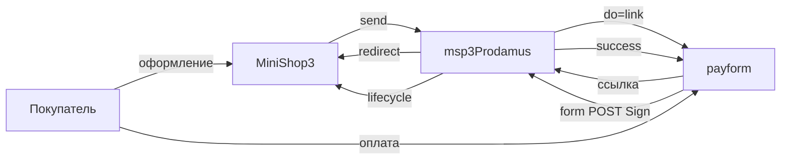

# msp3Prodamus

**msp3Prodamus** подключает [Prodamus](https://prodamus.ru/) (payform) к [MiniShop3](/components/minishop3/) в MODX Revolution 3. Покупатель переходит на страницу оплаты payform. Статус «оплачен» выставляет MiniShop3. Пакет сам статус заказа не меняет. Письма покупателю шлёт Центр уведомлений MiniShop3.

Сумма уходит с двумя знаками после запятой. Валюта задаётся настройкой `msp3prodamus_currency`. Двухстадийной оплаты у Prodamus нет.

Пространство имён настроек: **`msp3prodamus`**. Точка входа уведомлений: `assets/components/msp3prodamus/webhook.php`.

- [Самостоятельная интеграция](https://help.prodamus.ru/payform/integracii/rest-api/instrukcii-dlya-samostoyatelnaya-integracii-servisov)
- [Уведомления](https://help.prodamus.ru/payform/uvedomleniya/kak-ustroena-otpravka-uvedomlenii-ob-oplate)
- [Секрет и URL](https://help.prodamus.ru/payform/integracii/rest-api/url-dlya-uvedomlenii-i-sekretnyi-klyuch)

## Возможности

- Один способ: **Оплата через Prodamus**. Пакет создаёт ссылку на вашу страницу payform.
- Уведомление приходит формой или JSON в теле. Подпись в заголовке `Sign` или в поле `sign`. Секрет страницы считают HMAC-SHA256. При верной подписи сайт отвечает HTTP 200 и текстом `success`. Тот же ответ для неизвестного события и если попытка не найдена.
- Чек 54-ФЗ уходит в составе корзины: налог, способ расчёта и предмет расчёта.
- Во вкладке заказа только список попыток. Возврат, отмена и запрос статуса в Prodamus не уходят. Таких запросов у сервиса нет.

## Системные требования

| Требование | Версия |
| --- | --- |
| MODX Revolution | 3.0+ |
| MiniShop3 | 1.14.0-beta1 и новее |
| PHP | 8.2+ |
| pdoTools | 3.0.0+ (зависимость установщика) |
| Кабинет | URL страницы payform и секрет со страницы настроек |
| Контакт | email или телефон в заказе. Без телефона Prodamus покажет предварительную форму |
| Сайт | HTTPS на webhook без 301 |

### Зависимости

- [MiniShop3](/components/minishop3/): заказы и способы оплаты.
- Плагин `msp3prodamus_bootstrap`: автозагрузка классов и вкладка заказа в менеджере (`OnMODXInit`, `msOnManagerCustomCssJs`).

## Установка

1. Установите **MiniShop3**.
2. Добавьте провайдер **modstore.pro** (**Система → Управление пакетами → Провайдеры**). URL: `https://modstore.pro/extras/`. Email и API-ключ: из личного кабинета modstore.
3. Установите пакет **msp3Prodamus** через **Управление пакетами**. В **Show Details** выберите провайдер **modstore.pro**.
4. **Очистите кэш** MODX.

Резолвер создаёт способ **Оплата через Prodamus**, класс `Msp3Prodamus\Payment\ProdamusPayment`.

Секрет и URL страницы для создания ссылки (`send`) можно положить в `msPayment.properties`. Поля: `secret`, `secret_key` или устаревший `webhook_secret`, `payform_url` или устаревший `form_url`. Непустые properties перекрывают системные настройки. Если properties пусты, `send` читает `msp3prodamus_*`.

**Webhook** (`webhook.php`) проверяет подпись по той же цепочке: properties (`secret`, `secret_key`, `webhook_secret`), затем `msp3prodamus_secret_key`. Пустой секрет во всех местах даёт HTTP 401 `error: signature incorrect`.

| Что | Откуда |
| --- | --- |
| URL страницы | Адрес из адресной строки, обычно `https://имя.payform.ru/`. Это `msp3prodamus_payform_url`. |
| Секрет | Платёжная страница, нижнее меню **Настройки**. Новый ключ в кабинете не выпускается. Его выдаёт поддержка Prodamus. |
| `sys` | Код интеграции. Согласуют с поддержкой Prodamus. Один код на всю интеграцию. Без него Prodamus не примет `urlNotification` из запроса ссылки. |
| URL уведомлений | Та же страница, поле **Настройка уведомлений**. После ввода нажмите **сохранить**. |

Инструкция: [где найти секрет и URL уведомлений](https://help.prodamus.ru/payform/integracii/rest-api/url-dlya-uvedomlenii-i-sekretnyi-klyuch). Подробнее: [Быстрый старт](quick-start#откуда-брать-ключи).

Заказ дешевле 1 копейки пакет на оплату не отправляет.

## Быстрая настройка webhook

В кабинете один URL на страницу:

```text
https://ваш-домен.ru/assets/components/msp3prodamus/webhook.php
```

HTTPS без Basic Auth и без 301. Webhook читает тело из `$_POST`, иначе из JSON или query-строки в теле. Обычно Prodamus шлёт `multipart/form-data`. JSON-маршрут ядра MiniShop3 для form POST не подходит.

Переход на `urlSuccess` оплату не подтверждает. Оплату подтверждает только webhook с верным `Sign`.

## Архитектура



## Быстрые ссылки

| Нужно | Документ |
| --- | --- |
| Установить и принять первый платёж | [Быстрый старт](quick-start) |
| Все ключи `msp3prodamus_*` | [Системные настройки](settings) |
| Webhook, чеки, вкладка заказа | [Интеграция](integration) |
| Подпись, sys, 301 | [FAQ](faq) |
| Оформление заказа MS3 | [MiniShop3: заказ](/components/minishop3/frontend/order) |
