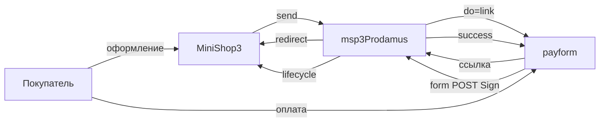

# msp3Prodamus

**msp3Prodamus** подключает [Prodamus](https://prodamus.ru/) (payform) к [MiniShop3](/components/minishop3/) в MODX Revolution 3. Оплата идёт через `ms3_payment_lifecycle`. Пакет не пишет `status_id` заказа. Письма покупателю шлёт Центр уведомлений MiniShop3.

Суммы передаются в рублях с двумя знаками. HTTP-запросы идут через `file_get_contents`. Двухстадийки у Prodamus нет.

Пространство имён настроек: **`msp3prodamus`**. Точка входа уведомлений: `assets/components/msp3prodamus/webhook.php`.

- [Самостоятельная интеграция](https://help.prodamus.ru/payform/integracii/rest-api/instrukcii-dlya-samostoyatelnaya-integracii-servisov)
- [Уведомления](https://help.prodamus.ru/payform/uvedomleniya/kak-ustroena-otpravka-uvedomlenii-ob-oplate)
- [Секрет и URL](https://help.prodamus.ru/payform/integracii/rest-api/url-dlya-uvedomlenii-i-sekretnyi-klyuch)

Версия пакета: 1.0.0-pl. Лицензия: GPL v2 и новее.

С чего начать: [Быстрый старт](quick-start).

## Возможности

- Ссылка на оплату: `Msp3Prodamus\Payment\ProdamusPayment`. POST на вашу страницу payform (`do=link`, `type=json`).
- Webhook кабинета: form POST, заголовок `Sign` (HMAC-SHA256). Ответ HTTP 200 и текст `success`.
- Чеки 54-ФЗ в поле `products` (`tax`, `paymentMethod`, `paymentObject`).
- Вкладка заказа показывает попытки. Возврат, отмена и синхронизация отвечают текстом: у Prodamus нет REST для этих действий.

## Системные требования

| Требование | Версия |
| --- | --- |
| MODX Revolution | 3.0+ |
| MiniShop3 | [1.14.0-beta1](https://github.com/modx-pro/MiniShop3/releases/tag/v1.14.0-beta1) и новее |
| PHP | 8.2+ |
| Кабинет | URL страницы payform и секрет со страницы настроек |
| Контакт | email или телефон в заказе. Без телефона Prodamus покажет предварительную форму |
| Сайт | HTTPS на webhook без 301 |

### Зависимости

- [MiniShop3](/components/minishop3/): заказы и способы оплаты.

## Установка

Пакет зашифрован. Перед установкой добавьте провайдер **modstore.pro** в менеджере пакетов MODX.

1. Установите **MiniShop3**.
2. Добавьте провайдер **modstore.pro** (**Система → Управление пакетами → Провайдеры**): URL `https://modstore.pro/extras/`, email и API-ключ из личного кабинета modstore.
3. Установите пакет **msp3Prodamus** через **Управление пакетами** (в **Show Details** выберите провайдер **modstore.pro**).
4. **Очистите кэш** MODX.

Без провайдера установка завершится ошибкой `Package provider not found`.

Резолвер создаёт способ **Оплата через Prodamus**, класс `Msp3Prodamus\Payment\ProdamusPayment`.

Секрет и URL страницы положите в `msPayment.properties` (`secret` или `secret_key`, `payform_url`). Если properties пусты, пакет читает системные настройки.

`send()` отклоняет заказ дешевле 0.01 ₽.

## Быстрая настройка webhook

В кабинете один URL на страницу:

```text
https://ваш-домен.ru/assets/components/msp3prodamus/webhook.php
```

HTTPS без Basic Auth и без 301. Prodamus шлёт `multipart/form-data`. JSON-маршрут ядра MiniShop3 для form POST не подходит.

Переход на `urlSuccess` оплату не подтверждает. Факт оплаты это только webhook с верным `Sign`.

## Архитектура



## Быстрые ссылки

| Нужно | Документ |
| --- | --- |
| Установить и принять первый платёж | [Быстрый старт](quick-start) |
| Все ключи `msp3prodamus_*` | [Системные настройки](settings) |
| Webhook, чеки, вкладка заказа | [Интеграция](integration) |
| Подпись, sys, 301 | [FAQ](faq) |
| Оформление заказа MS3 | [MiniShop3: заказ](/components/minishop3/frontend/order) |

## Документация по разделам

- [Быстрый старт](quick-start): провайдер modstore, демо-страница, webhook, боевой режим.
- [Системные настройки](settings): URL payform, секрет, `sys`, валюта, чеки, URL возврата.
- [Интеграция и сценарии](integration): поток оплаты, статусы webhook, вкладка заказа.
- [FAQ](faq): типовые сбои.

Лицензия пакета: GPL v2 и новее.
