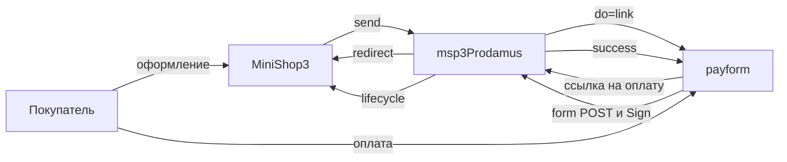

# Интеграция msp3Prodamus

Шаги установки: [Быстрый старт](quick-start). Двухстадийной оплаты у Prodamus нет.

## Webhook

В кабинете один URL на страницу:

```text
https://ваш-домен.ru/assets/components/msp3prodamus/webhook.php
```

HTTPS без Basic Auth и без 301. HTTP на `*.test` часто отвечает 301.

Webhook читает тело из `$_POST`, иначе из JSON или query-строки в теле. Обычно Prodamus шлёт `multipart/form-data`. Подпись: заголовок `Sign` или поле `sign` в теле. HMAC-SHA256 по полям уведомления и секрету из **`msp3prodamus_secret_key`** (не из properties способа).

| Ответ | Когда |
| --- | --- |
| HTTP 200, `success` | подпись верна. Ответ один и тот же для неизвестного статуса, отсутствия попытки и успешного разбора через lifecycle |
| HTTP 401, `error: signature incorrect` | неверный секрет или поля |
| HTTP 400, `error: empty` | пустое тело |
| HTTP 500, `error: lifecycle` | в MODX не зарегистрирован сервис `ms3_payment_lifecycle` |
| HTTP 409, `error: …` | lifecycle отклонил событие (кроме «попытка не найдена») |

JSON-маршрут ядра MiniShop3 для form POST не подходит.

| payment_status | Попытка |
| --- | --- |
| Success / success | paid |
| Order_canceled / order_cancelled | cancelled |
| Order_denied | failed |
| refund / refunded / order_refunded | refunded |

Попытку ищут по `order_num` из уведомления. Это должен быть тот же `{orderId}-{hex}`, что пакет отправил как `order_id` при `do=link`. Если `order_num` пустой, пакет принимает `order_id` только когда он того же вида `{orderId}-{hex}`. Число из кабинета Prodamus как внешний номер не подходит. Номер кабинета сохраняется в payload попытки.

Если боевой режим страницы выключен на стороне Prodamus, подпись считают другим ключом (суффикс `demo`). Такой webhook не должен проходить как боевой.

Повторную отправку можно нажать в кабинете: **Список платежей → URL-оповещения**.

## Как проходит оплата



`payment_id` и `external_id`: `{orderId}-{hex}`. Валюта в ответе ядру в верхнем регистре (`RUB`).

В запрос уходит:

- `do=link`, `type=json`
- подпись в поле `signature`
- корзина `products`, `customer_extra`
- `urlSuccess`, `urlReturn`, `_param_msorder` (uuid заказа)
- валюта из `msp3prodamus_currency`

Если задан `sys`, пакет добавляет `urlNotification` на свой `webhook.php`.

События: `msp3ProdamusOnPrepareReceiptItem`, `msp3ProdamusOnProviderEvent`. Секрет и `Sign` в лог не попадают. Строки лога начинаются с `[msp3Prodamus]`.

Заказ дешевле 1 копейки пакет на оплату не отправляет.

## Чеки 54-ФЗ

При включённом `msp3prodamus_payment_receipt` в каждую позицию `products` уходят `tax`, `paymentMethod`, `paymentObject`. Товары заказа и доставка, если `delivery_cost > 0`. Без флага чека в ссылку всё равно уходит список товаров с именем, ценой и количеством.

## Вкладка заказа

| Действие | Что происходит |
| --- | --- |
| Синхронизировать | Ответ `success: true` с текстом «нет API статуса». Во вкладке сообщение не показывают, список попыток обновляют. Статус по-прежнему приходит webhook |
| Возврат | `success: false`, текст про заявку в кабинете. Сообщение видно во вкладке |
| Отменить | `success: false`, текст про закрытие страницы или отказ. Сообщение видно во вкладке |
