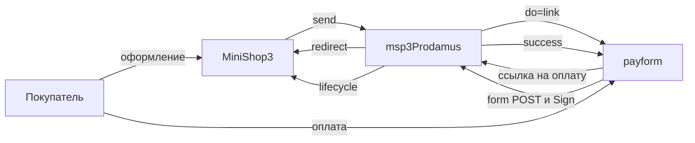

# Интеграция msp3Prodamus

Нужны только шаги установки? Откройте [Быстрый старт](quick-start). Двухстадийки у Prodamus нет.

## Webhook

В кабинете один URL на страницу:

```text
https://ваш-домен.ru/assets/components/msp3prodamus/webhook.php
```

HTTPS без Basic Auth и без 301. HTTP на `*.test` часто отвечает 301.

Prodamus шлёт `multipart/form-data`. Подпись в заголовке `Sign`. Пакет считает HMAC-SHA256 по полям уведомления и секрету страницы.

| Ответ | Когда |
| --- | --- |
| HTTP 200, `success` | подпись верна, событие разобрано |
| HTTP 401, `error: signature incorrect` | неверный секрет или поля |
| HTTP 400, `error: empty` | пустое тело |

JSON-маршрут ядра MiniShop3 для form POST не подходит.

| payment_status | Попытка |
| --- | --- |
| Success / success | paid |
| Order_canceled | cancelled |
| Order_denied | failed |
| refund / refunded / order_refunded | refunded |

`order_num` в уведомлении должен совпасть с `external_id` попытки (тот `order_id`, который пакет отправил при создании ссылки). `order_id` в webhook это номер в кабинете Prodamus, пишется в payload.

Если боевой режим страницы выключен на стороне Prodamus, подпись считают другим ключом (суффикс `demo`). Такой webhook не должен проходить как боевой.

Повторную отправку можно нажать в кабинете: **Список платежей → URL-оповещения**.

## Как проходит оплата



`payment_id` и `external_id` это `{orderId}-{hex}`. Валюта в ответе ядру в верхнем регистре (`RUB`).

В запрос уходит `do=link`, корзина `products`, `urlSuccess`, `urlReturn`, `_param_msorder` (uuid заказа). Если задан `sys`, пакет добавляет `urlNotification` на свой `webhook.php`.

События: `msp3ProdamusOnPrepareReceiptItem`, `msp3ProdamusOnProviderEvent`. Секрет и `Sign` в лог не попадают. Строки лога начинаются с `[msp3Prodamus]`.

`send()` отклоняет заказ дешевле 0.01 ₽.

## Чеки 54-ФЗ

При включённом `msp3prodamus_payment_receipt` в каждую позицию `products` уходят `tax`, `paymentMethod`, `paymentObject`. Товары заказа и доставка, если `delivery_cost > 0`. Без флага чека в ссылку всё равно уходит список товаров с именем, ценой и количеством.

## Вкладка заказа

| Действие | Что происходит |
| --- | --- |
| Синхронизировать | Текст: у Prodamus нет API статуса. Актуальный статус приходит webhook |
| Возврат | Текст: оформите заявку в кабинете |
| Отменить | Текст: покупатель закрывает страницу или ждёт отказ |
