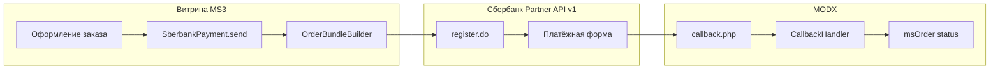

# msp3Sberbank

**msp3Sberbank** подключает [платёжный шлюз Сбербанка](https://ecomtest.sberbank.ru/doc) (Partner API v1) к [MiniShop3](/components/minishop3/) в MODX Revolution 3.x: `register.do` / `registerPreAuth.do`, redirect на formUrl, **callback** с опциональной проверкой checksum, чеки 54-ФЗ через **orderBundle** и обновление статуса заказа.

Пространство имён настроек: **`msp3sberbank`**. Точка входа уведомлений: `assets/components/msp3sberbank/callback.php`.

Пакет распространяется через [modstore.pro](https://modstore.pro). Перед установкой добавьте провайдер **modstore.pro** в менеджере пакетов MODX.

С чего начать: [Быстрый старт](quick-start).

## Возможности

- **Redirect-оплата**: `SberbankPayment::send()` вызывает `register.do` и возвращает `formUrl`.
- **Callback**: POST/GET на `callback.php`, опциональная проверка checksum (HMAC-SHA256 или RSA), перепроверка статуса через `getOrderStatusExtended.do`.
- **Одностадийная схема**: списание после успешной оплаты (`DEPOSITED`).
- **Двухстадийная схема**: способ `SberbankPreAuthPayment`, `registerPreAuth.do`, холд, затем processor **Deposit** или **Reverse**.
- **Чеки 54-ФЗ**: `orderBundle` в `register.do` и при двухстадийной схеме в `deposit.do` при включённом `msp3sberbank_send_order_bundle`.
- **Возврат**: processor `refund`; отмена холда: processor `reverse`.
- **Reuse formUrl**: пока не истёк `msp3sberbank_session_timeout_secs`, повторный `send()` отдаёт тот же URL.
- **TLS НУЦ**: в пакете `certs/russian-trusted-chain.pem` для обхода curl error 60.
- **Отладка**: `msp3sberbank_debug` пишет запросы и ответы API в лог MODX без полного пароля.

Для чеков включите `msp3sberbank_send_order_bundle`. Нужна онлайн-касса на стороне банка и email или телефон покупателя в заказе. Без контакта при включённом bundle `send()` вернёт `msp3sberbank.error_fiscal_contact`.

## Системные требования

| Требование | Версия |
| --- | --- |
| MODX Revolution | 3.0+ |
| PHP | 8.2+ (расширения `json`, `curl`, для RSA-checksum: `openssl`) |
| MiniShop3 | 1.0+ |
| pdoTools | 3.0+ (рекомендуется для Fenom) |

### Зависимости

- [MiniShop3](/components/minishop3/): заказы, способы оплаты, статусы (`ms3_status_paid`, `ms3_status_canceled` и др.).

## Регистрация в Сбербанке

Подключите интернет-эквайринг в [СберБизнес](https://www.sberbank.ru/) или через менеджера банка. После выдачи учёток скопируйте:

- **Логин `-api`** → [`msp3sberbank_api_login`](settings)
- **Пароль API** → [`msp3sberbank_api_password`](settings)

В API поле называется `userName`. Суффикс **`-api`** обязателен. Логин **`-operator`** только для входа в личный кабинет мерчанта, в настройки компонента его не вставляйте.

Публичные демо-пары с developers.sber.ru на ecomtest часто дают **errorCode 5**. Нужны учётные данные **вашего** договора.

Подробнее: [Быстрый старт, ключи](quick-start#шаг-2-ключи-api-в-modx).

## Установка

1. Установите **MiniShop3** и **pdoTools**.
2. Добавьте провайдер **modstore.pro** (**Система → Управление пакетами → Провайдеры**): URL `https://modstore.pro/extras/`, email и API-ключ из личного кабинета modstore.
3. Установите пакет **msp3Sberbank** через **Управление пакетами** (в **Show Details** выберите провайдер **modstore.pro**).
4. **Очистите кэш** MODX.
5. В **Системные настройки → `msp3sberbank`** задайте [ключи API](settings).
6. Включите способ **Оплата через Сбербанк** (или двухстадийный) в MiniShop3.

Резолвер создаёт два способа оплаты:

| Название | Класс |
| --- | --- |
| Оплата через Сбербанк | `Msp3Sberbank\Payment\SberbankPayment` |
| Оплата через Сбербанк (двухстадийная) | `Msp3Sberbank\Payment\SberbankPreAuthPayment` |

Плагин **`msp3sberbank_bootstrap`** на **`OnMODXInit`** подключает автозагрузку `Msp3Sberbank\`. Плагин должен быть включён.

## Быстрая настройка callback

В личном кабинете Сбербанка (**Настройки → Callback-уведомления**) укажите URL:

```text
https://ваш-домен.ru/assets/components/msp3sberbank/callback.php
```

Только HTTPS. Рекомендуется включить уведомления **с контрольной суммой** и задать `msp3sberbank_callback_secret` или `msp3sberbank_callback_public_key` в MODX.

Без callback заказ может остаться неоплаченным, если покупатель не вернётся на `returnUrl`.

## Архитектура



## Быстрые ссылки

| Нужно | Документ |
| --- | --- |
| Установить и принять первый платёж | [Быстрый старт](quick-start) |
| Все ключи `msp3sberbank_*` | [Системные настройки](settings) |
| Callback, чеки, двухстадийная, deposit/refund | [Интеграция](integration) |
| errorCode 5, curl 60, modstore | [FAQ](faq) |
| Оформление заказа MS3 | [MiniShop3: заказ](/components/minishop3/frontend/order) |

## Документация по разделам

- [Быстрый старт](quick-start): провайдер modstore, ключи `-api`, callback, способ оплаты, тестовая карта.
- [Системные настройки](settings): таблицы настроек, чеки 54-ФЗ, TLS НУЦ, связанные ключи MiniShop3.
- [Интеграция и сценарии](integration): API ↔ код, поток оплаты, deposit/reverse/refund, оплата из личного кабинета.
- [FAQ](faq): типовые ошибки и диагностика.

Лицензия пакета: GPLv2 и новее.
