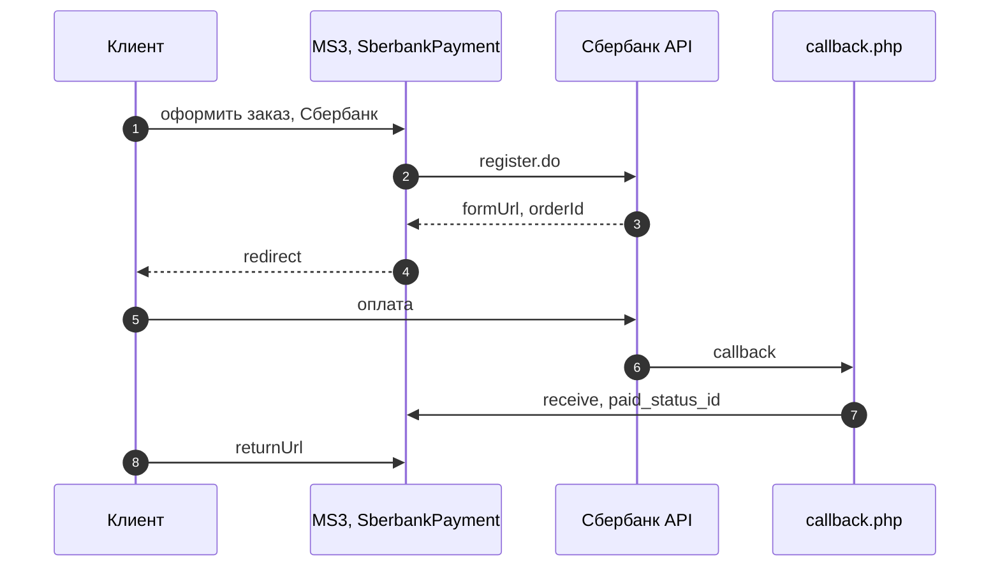
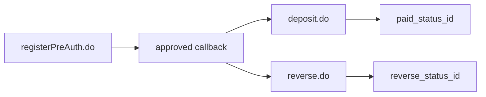
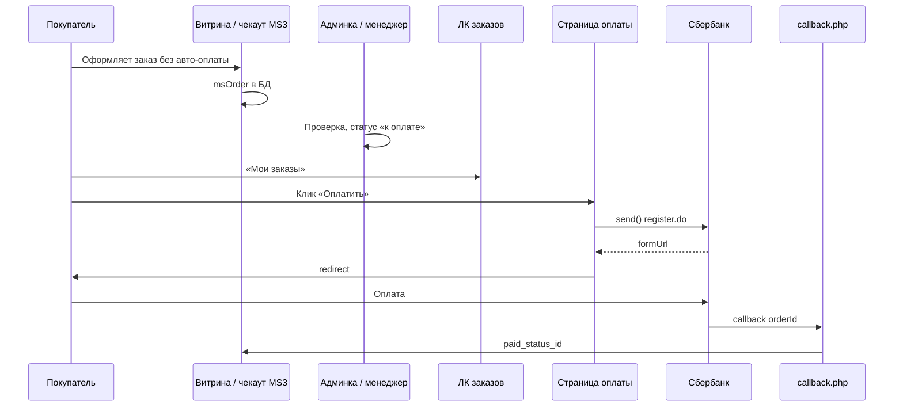

# Интеграция msp3Sberbank

Нужны только шаги установки? Откройте [Быстрый старт](quick-start). Ниже сопоставлены методы [Partner API v1](https://ecomtest.sberbank.ru/doc) и классы **msp3Sberbank** для MiniShop3.

## API ↔ код

| Метод Сбербанка | Класс / точка входа | Назначение |
| --- | --- | --- |
| **register.do** | `SberbankApi::register()`, `SberbankPayment::send()` | Одностадийная оплата, получение `formUrl` |
| **registerPreAuth.do** | `SberbankApi::registerPreAuth()`, `SberbankPreAuthPayment::send()` | Холд на карте |
| **getOrderStatusExtended.do** | `SberbankApi::getOrderStatusExtended()`, `SberbankPayment::receive()`, `CallbackHandler` | Статус и сумма платежа |
| **deposit.do** | `SberbankApi::deposit()`, `Processors\Deposit` | Списание после холда |
| **reverse.do** | `SberbankApi::reverse()`, `Processors\Reverse` | Отмена холда |
| **refund.do** | `SberbankApi::refund()`, `Processors\Refund` | Возврат после списания |
| Callback (POST/GET) | `callback.php`, `CallbackHandler::handle()` | Уведомления банка, checksum, смена статуса |
| orderBundle | `OrderBundleBuilder` | Чеки 54-ФЗ в register и deposit |

## Когда создаётся платёж {#когда-создаётся-платёж}

Отдельной настройки «сначала проверка менеджером, потом оплата» в компоненте **нет**. Платёж в Сбербанке регистрирует метод:

```php
Msp3Sberbank\Payment\SberbankPayment::send(msOrder $order)
```

MiniShop3 вызывает `send()` после оформления заказа, если выбран способ «Оплата через Сбербанк» и чекаут сразу ведёт покупателя к оплате. Компонент вызывает `register.do` или `registerPreAuth.do`, сохраняет в `payment_data` поля `sber_order_id`, `form_url`, `registered_at`, `attempt`, возвращает redirect на formUrl.

Настройки `return_url`, `send_order_bundle`, `callback_secret` / `callback_public_key` работают уже после регистрации платежа. Они не задают момент первого вызова `send()`.

Отложенную оплату собирают через статусы заказа и отдельную страницу: [оплата после проверки менеджером](#оплата-после-проверки-менеджером).

## Callback {#callback}

**URL на сайте:**

```text
https://ваш-домен.ru/assets/components/msp3sberbank/callback.php
```

Указывается в ЛК Сбербанка, не в системных настройках MODX.

**Обработка:**

1. Тело запроса: JSON POST с полями `mdOrder`, `orderNumber`, `operation`, `status` или legacy-формат с `orderId` в GET/POST.
2. При заданном `callback_secret` / `callback_public_key` проверяется **checksum**:
   - убрать `checksum` и `sign_alias`
   - отсортировать пары по имени параметра
   - собрать строку `name;value;name;value;…;`
   - симметрия: `strtoupper(hash_hmac('sha256', $string, $callback_secret))`
   - асимметрия: `openssl_verify` с `OPENSSL_ALGO_SHA512` и PEM из `callback_public_key`
3. Заказ ищется по `payment_data.sber_order_id`, затем по `orderNumber` (ID MiniShop3).
4. Статус перепроверяется через **getOrderStatusExtended.do**.
5. Сумма из шлюза сравнивается с `order.cost` (±1 коп.).

| Ситуация | HTTP | errorCode |
| --- | --- | --- |
| Успех | 200 | 0 |
| Ошибка обработки | 200 | 1 |
| Невалидный orderId / checksum | 400 | 1 |
| Заказ не найден | 404 | 1 |

| Операция в callback | Результат после `receive()` |
| --- | --- |
| Любая (deposited, approved и др.) | Обработчик запрашивает **getOrderStatusExtended.do** и действует по фактическому статусу шлюза |
| Статус «оплачен» (одностадийная) | `paid_status_id` или `ms3_status_paid` |
| Статус «холд» (двухстадийная) | `authorized_status_id`, если задан (> 0) |

Поле `operation` в теле callback **не** меняет статус напрямую. `CallbackHandler` всегда вызывает `receive()`, который сверяет ответ API.

Повторный callback идемпотентен: если заказ уже оплачен, статус не дублируется.

Факт оплаты фиксируйте по **callback**, а не только по возврату браузера на `returnUrl`.

## Поток одностадийной оплаты

1. Покупатель оформляет заказ и выбирает **Оплата через Сбербанк**.
2. `SberbankPayment::send()` вызывает **register.do**.
3. MS3 возвращает фронтенду redirect на `formUrl`.
4. Покупатель платит в форме Сбербанка.
5. Банк шлёт callback на `callback.php`.
6. `CallbackHandler` вызывает `receive()`, который по **getOrderStatusExtended.do** выставляет **`msp3sberbank_paid_status_id`** или **`ms3_status_paid`**.



## Двухстадийная схема {#двухстадийная}

Способ оплаты **`SberbankPreAuthPayment`** вызывает **registerPreAuth.do**.

1. После оплаты банк присылает callback **approved** (холд).
2. При заданном **`msp3sberbank_authorized_status_id`** заказ переходит в этот статус.
3. Списание после отгрузки: processor **Deposit** — см. [ниже](#deposit-reverse-refund-из-кода).
4. Отмена холда: processor **Reverse**.

Двухстадийность **не откладывает** показ платёжной формы. Покупатель уходит в Сбербанк сразу после `send()`. Сценарий «сначала проверка менеджером» собирается отдельно (см. [ниже](#оплата-после-проверки-менеджером)).

При **`msp3sberbank_send_order_bundle`** = «Да» в **deposit.do** передаётся orderBundle.



## Чеки 54-ФЗ {#чеки-54-фз}

Если **`msp3sberbank_send_order_bundle`** включён, `OrderBundleBuilder` добавляет **orderBundle** в register и deposit.

Состав чека:

- товары заказа из `msOrder->getMany('Products')`
- доставка отдельной позицией, если `delivery_cost > 0`
- `tax.taxType` из `msp3sberbank_tax_type` на всех позициях
- версия ФФД из `msp3sberbank_ffd_version`
- `receiptType: sell` в корне bundle
- email или телефон покупателя (обязательно)

Без контакта `send()` вернёт `msp3sberbank.error_fiscal_contact`. При расхождении сумм позиций и заказа: `msp3sberbank.error_bundle_amount_mismatch`.

## Ответ `send()` {#ответ-send}

Успешный `SberbankPayment::send()` возвращает:

| Поле | Смысл |
| --- | --- |
| `redirect` | URL платёжной формы Сбербанка |
| `payment_link` | То же значение (алиас для фронтенда) |
| `order_id` | ID заказа MiniShop3 |
| `order_num` | Номер заказа |
| `sber_order_id` | UUID платежа в шлюзе Сбербанка |

В `payment_data` заказа сохраняются `sber_order_id`, `form_url`, `registered_at`, `attempt`.

**Reuse formUrl:** если `registered_at` + `session_timeout_secs` ещё не истекли, повторный `send()` вернёт тот же URL. После истечения сессии шлюза: новый register с `orderNumber` вида `{id}-{attempt}`.

## `receive()` {#receive}

MiniShop3 вызывает `receive()` когда покупатель возвращается на сайт (`returnUrl`).

Компонент вызывает **getOrderStatusExtended.do**, сверяет сумму с заказом и при успехе обновляет статус. Callback остаётся основным источником истины.

## Списание, отмена холда и возврат из PHP {#deposit-reverse-refund-из-кода}

После одностадийной оплаты деньги уже списаны: дополнительных действий в коде не нужно.

Для **двухстадийной** схемы и возвратов в пакете есть три PHP-процессора. Они вызывают методы API Сбербанка и при успехе меняют статус заказа в MiniShop3:

| Процессор | Метод API | Когда нужен |
| --- | --- | --- |
| **Deposit** | `deposit.do` | Холд прошёл, товар отгружен: **списать** деньги с карты |
| **Reverse** | `reverse.do` | Холд ещё действует, отгрузки не будет: **отменить** блокировку (полностью или частично) |
| **Refund** | `refund.do` | Деньги уже **списаны** (одностадийная или после Deposit): вернуть покупателю полную или частичную сумму |

Готовых кнопок в карточке заказа MiniShop3 **нет**. Параметры процессору передаёте **вы**:

| Параметр | Откуда взять |
| --- | --- |
| `order_id` | ID заказа MiniShop3: колонка в **MiniShop3 → Заказы**, `$order->get('id')`, или query `?order_id=42` / поле формы. Для Refund можно вместо числа передать UUID Сбербанка из `payment_data.sber_order_id`. |
| `amount` (Refund / частичный Reverse) | Рубли. Полный возврат: `(float) $order->get('cost')`. Частичный: сумма из формы менеджера. Либо `amount_kopecks` (целое). |
| Deposit | Сумму **не** передаёте: процессор списывает `order.cost` целиком. |

Нужно право `save`. Пример сниппета менеджера `msp3SberbankOrderAction`. Вызов из чанка заказа или по URL:

```modx
[[!msp3SberbankOrderAction? &action=`refund` &order_id=`123` &amount=`500`]]
```

Тот же сценарий через query string: `?action=refund&order_id=42&amount=500`.

```php
<?php
declare(strict_types=1);

use MiniShop3\Model\msOrder;

/** @var modX $modx */

$action = strtolower(trim((string) ($scriptProperties['action'] ?? $_REQUEST['action'] ?? '')));
$orderId = (int) ($scriptProperties['order_id'] ?? $_REQUEST['order_id'] ?? 0);

if ($orderId < 1 || !in_array($action, ['deposit', 'reverse', 'refund'], true)) {
    return 'Укажите action=deposit|reverse|refund и order_id (ID заказа MiniShop3).';
}

if (!$modx->hasPermission('save')) {
    return 'Недостаточно прав (save).';
}

/** @var msOrder|null $order */
$order = $modx->getObject(msOrder::class, $orderId);
if (!$order) {
    return 'Заказ #' . $orderId . ' не найден.';
}

// Сумма: из запроса (частичный возврат) или полная стоимость заказа
$amountRaw = $scriptProperties['amount'] ?? $_REQUEST['amount'] ?? null;
if ($amountRaw !== null && $amountRaw !== '') {
    $amount = (float) $amountRaw;
} else {
    $amount = (float) $order->get('cost');
}

$processorsPath = $modx->getOption('core_path') . 'components/msp3sberbank/processors/';
$props = ['order_id' => $orderId];

switch ($action) {
    case 'deposit':
        // Холд → списание: сумма берётся из order.cost внутри процессора
        break;

    case 'reverse':
        // Полная отмена холда — без amount; частичная — amount в рублях
        if (isset($_REQUEST['amount']) || isset($scriptProperties['amount'])) {
            $props['amount'] = $amount;
        }
        break;

    case 'refund':
        // Возврат после deposited: amount обязателен
        $props['amount'] = $amount;
        break;
}

$response = $modx->runProcessor($action, $props, ['processors_path' => $processorsPath]);
$result = is_array($response) ? $response : (method_exists($response, 'getResponse') ? $response->getResponse() : []);

if (!empty($result['success'])) {
    return 'OK: ' . $action . ' для заказа #' . $orderId
        . ($action !== 'deposit' ? ', amount=' . $amount : '');
}

return 'Ошибка: ' . ($result['message'] ?? 'unknown');
```

Короткий вызов из своего PHP (тот же смысл, без сниппета):

```php
use MiniShop3\Model\msOrder;
use Msp3Sberbank\Processors\Deposit;
use Msp3Sberbank\Processors\Refund;
use Msp3Sberbank\Processors\Reverse;

/** @var modX $modx */
/** @var msOrder $order — уже загружен, или: */
$order = $modx->getObject(msOrder::class, (int) $_REQUEST['order_id']);
if (!$order) {
    throw new RuntimeException('Заказ не найден');
}

$orderId = (int) $order->get('id');
$amount = isset($_REQUEST['amount'])
    ? (float) $_REQUEST['amount']
    : (float) $order->get('cost');

$path = $modx->getOption('core_path') . 'components/msp3sberbank/processors/';

// Deposit — только order_id; сумму списывает процессор из order.cost
$modx->runProcessor('deposit', ['order_id' => $orderId], ['processors_path' => $path]);

// Reverse — полная отмена холда
$modx->runProcessor('reverse', ['order_id' => $orderId], ['processors_path' => $path]);

// Refund — amount из cost заказа или из ?amount=
$modx->runProcessor('refund', [
    'order_id' => $orderId,
    'amount' => $amount,
], ['processors_path' => $path]);

// Или напрямую классами:
(new Deposit($modx, ['order_id' => $orderId]))->process();
(new Reverse($modx, ['order_id' => $orderId]))->process();
(new Refund($modx, ['order_id' => $orderId, 'amount' => $amount]))->process();
```

В живом MODX у процессора также есть `run()` (проверка прав + `process()`).

| Процессор | Параметры | После успеха |
| --- | --- | --- |
| **Deposit** | `order_id` | `paid_status_id` |
| **Reverse** | `order_id`, опционально `amount` / `amount_kopecks` | `reverse_status_id` |
| **Refund** | `order_id` или UUID Сбербанка, `amount` / `amount_kopecks` | `refund_status_id` |

Статусы после **Reverse** / **Refund** задают `reverse_status_id` и `refund_status_id`. Callback с операциями `reversed` / `refunded` сам статус на сайте не меняет.

Возврат можно сделать и в личном кабинете Сбербанка. Статус заказа на сайте при этом **сам не обновится** без вызова processor **Refund** или ручной смены в MiniShop3.

## Оплата после проверки менеджером {#оплата-после-проверки-менеджером}

Целевой сценарий:

1. Заказ создаётся **без** немедленного redirect в Сбербанк.
2. Менеджер проверяет заказ и переводит в статус «к оплате».
3. В личном кабинете покупатель нажимает «Оплатить».
4. Отдельная страница один раз вызывает `send()` и делает redirect.

В пакет **сниппет не входит**. Ниже пример `msp3SberbankPayOrder` для страницы оплаты.

### 1. Страница «Оплатить заказ»

1. Создайте ресурс MODX (например «Оплата Сбербанк»), шаблон витрины, без меню.
2. В содержимое ресурса:

```modx
[[!msp3SberbankPayOrder]]
```

Запомните ID ресурса (ниже обозначен как `25`).

### 2. Ссылка в личном кабинете

В списке «Мои заказы» только ссылка (не вызывайте `send()` при рендере таблицы):

```fenom
{if $status_id in [3, 4]}
  <a class="btn btn-pay" href="[[~25]]?order_id={$id}">Оплатить</a>
{/if}
```

`[3, 4]` — ваши статусы «готов к оплате». Подставьте свои ID.

### 3. Сниппет `msp3SberbankPayOrder`

Элементы → Сниппеты → создать `msp3SberbankPayOrder`:

```php
<?php
declare(strict_types=1);

use MiniShop3\Model\msOrder;
use MiniShop3\Model\msPayment;
use Msp3Sberbank\Payment\SberbankPayment;
use Msp3Sberbank\Services\LegacyClassMap;

/** @var modX $modx */

$fail = static function (string $message) use ($modx): string {
    $modx->setPlaceholder('msp3sberbank.pay_error', $message);
    return '<p class="msp3sberbank-pay-error">' . htmlspecialchars($message, ENT_QUOTES | ENT_SUBSTITUTE, 'UTF-8') . '</p>';
};

$orderId = (int) ($scriptProperties['order_id'] ?? $_GET['order_id'] ?? 0);
if ($orderId < 1) {
    return $fail('Не указан заказ.');
}

if (!$modx->user || !(int) $modx->user->get('id')) {
    return $fail('Войдите в личный кабинет, чтобы оплатить заказ.');
}

$order = $modx->getObject(msOrder::class, $orderId);
if (!$order) {
    return $fail('Заказ не найден.');
}

$currentUserId = (int) $modx->user->get('id');
$orderUserId = (int) $order->get('user_id');
if ($orderUserId < 1 || $orderUserId !== $currentUserId) {
    return $fail('Этот заказ вам не принадлежит.');
}

// ID статусов «можно оплачивать» — подставьте свои
$payableStatusIds = [3, 4];
if (!in_array((int) $order->get('status_id'), $payableStatusIds, true)) {
    return $fail('Заказ ещё нельзя оплатить. Дождитесь проверки менеджером.');
}

$paymentId = (int) $order->get('payment_id');
if ($paymentId < 1) {
    return $fail('У заказа не выбран способ оплаты.');
}

/** @var msPayment|null $msPayment */
$msPayment = $modx->getObject(msPayment::class, $paymentId);
if (!$msPayment) {
    return $fail('Способ оплаты не найден.');
}

$class = (string) $msPayment->get('class');
if ($class === '' || !LegacyClassMap::isSberbankPaymentClass($class) || !class_exists($class)) {
    return $fail('Способ оплаты заказа не Сбербанк.');
}

/** @var SberbankPayment $handler */
$handler = new $class($modx);
$result = $handler->send($order);

if (empty($result['success'])) {
    $message = (string) ($result['message'] ?? 'Не удалось создать платёж.');
    $modx->log(modX::LOG_LEVEL_ERROR, '[msp3SberbankPayOrder] order=' . $orderId . ' ' . $message);
    return $fail($message !== '' ? $message : 'Не удалось создать платёж.');
}

$url = (string) ($result['redirect'] ?? $result['payment_link'] ?? '');
if ($url === '') {
    return $fail('Платёжный шлюз не вернул ссылку на оплату.');
}

$modx->sendRedirect($url);
return '';
```

`SberbankPreAuthPayment` входит в `LegacyClassMap::isSberbankPaymentClass()`, отдельная ветка не нужна.

Плагин **`msp3sberbank_bootstrap`** на **`OnMODXInit`** подключает автозагрузку классов. Не вызывайте сниппет в цикле списка заказов: только на отдельной странице по клику.

### Повторные клики

Если `form_url` свежий (`registered_at` в пределах `session_timeout_secs`), повторный `send()` вернёт тот же URL. После истечения сессии шлюза — новый `register.do` с `orderNumber` `{id}-{attempt}`.



## Статус заказа и уведомления

Компонент не отправляет письма сам. После callback или `receive()` меняется `status_id` заказа. Дальше работает штатная логика MiniShop3 (события, Центр уведомлений MS3).

Сверьте `msp3sberbank_paid_status_id` или `ms3_status_paid` со статусом, на который настроены правила уведомлений.

## Ограничения

- Валюта: **RUB** (код `643`). Сумма в API в копейках.
- Только **redirect** на форму Сбербанка, без встроенного виджета на сайте.
- Чеки **54-ФЗ** требуют настроенную онлайн-кассу у банка и email или телефон в заказе.
- UI deposit/refund/reverse в админке MS3 не поставляется.
- Только **MODX 3 + MiniShop3** (не miniShop2).
- Пакет зашифрован, установка через провайдер **modstore.pro**.

## Что дальше

- [Системные настройки](settings)
- [FAQ](faq): callback не доходит, errorCode 5
- [MiniShop3: оформление заказа](/components/minishop3/frontend/order)
