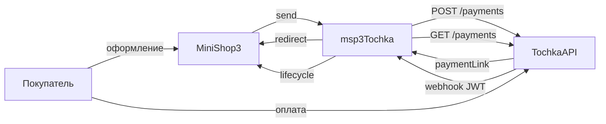

# msp3Tochka

**msp3Tochka** подключает [интернет-эквайринг Точка Банка](https://developers.tochka.com/docs/tochka-api/opisanie-metodov/platyozhnye-ssylki/) к [MiniShop3](/components/minishop3/) в MODX Revolution 3. Статус «оплачен» выставляет MiniShop3, не пакет. Письма покупателю шлёт Центр уведомлений MiniShop3.

Старый пакет `mspTochka` при установке не удаляется.

Суммы передаются в рублях с двумя знаками. Пакет ходит в банк с токеном из кабинета и сам проверяет подпись уведомления об оплате.

- [Документация API](https://developers.tochka.com/docs/tochka-api/)
- [Песочница](https://developers.tochka.com/docs/tochka-api/pesochnica)

Пространство имён настроек: **`msp3tochka`**. Точка входа уведомлений: `assets/components/msp3tochka/webhook.php`.

## Возможности

- Пакет создаёт ссылку на оплату: карта, СБП и другие способы, которые принимает банк.
- Обычная оплата, деньги списываются сразу: способ **Оплата через Точка Банк**.
- Холд, деньги сначала блокируются на карте: способ **Оплата через Точка Банк (двухстадийная)**. Списание кнопкой во вкладке заказа.
- Банк присылает уведомление на сайт. Пакет проверяет, что оно от банка, и отдельно запрашивает статус платежа. Статус из текста уведомления не берёт.
- Номер операции банка пакет сохраняет у попытки оплаты. Без него кнопки «Списать холд», «Возврат» и «Синхронизировать» в банк не ходят.
- Запросы `create`, `get`, `capture`, `refund` и загрузка JWK для webhook идут через транспорт пакета с файлом `certs/russian_trusted.pem`.

У банка нет отмены холда. Блокировка снимается, когда истекает срок ссылки. Кнопка «Отменить холд» во вкладке заказа только пишет об этом.

При создании токена банк просит права `MakeAcquiringOperation` и `ReadAcquiringData`. Пакет состав токена не проверяет. Право `ManageWebhookData` нужно, только если уведомления регистрируете вызовом API банка. Из админки MODX пакет этого не делает.

## Системные требования

| Требование | Версия |
| --- | --- |
| MODX Revolution | 3.0+ |
| MiniShop3 | 1.14.0-beta1 и новее |
| PHP | 8.2+. Нужно расширение openssl: им пакет проверяет подпись уведомления банка |
| pdoTools | 3.0+ (зависимость транспортного пакета) |
| Сайт | HTTPS на webhook. 301 с HTTP часто роняет тело POST |

### Зависимости

- [MiniShop3](/components/minishop3/): заказы и способы оплаты.
- pdoTools 3.0+: менеджер пакетов не поставит msp3Tochka без него. В штатной поставке сниппетов нет, пакет нужен только как зависимость установки.

## Установка

1. Установите **MiniShop3**.
2. Добавьте провайдер **modstore.pro** (**Система → Управление пакетами → Провайдеры**). URL: `https://modstore.pro/extras/`. Email и API-ключ из личного кабинета modstore.
3. Установите пакет **msp3Tochka** через **Управление пакетами** (в **Show Details** выберите провайдер **modstore.pro**).
4. **Очистите кеш** MODX.

Резолвер создаёт два активных способа:

| Название | Класс |
| --- | --- |
| Оплата через Точка Банк | `Msp3Tochka\Payment\TochkaPayment` |
| Оплата через Точка Банк (двухстадийная) | `Msp3Tochka\Payment\TochkaTwoStagePayment` |

Секреты сначала кладите в `msPayment.properties` (`jwt_token`, `token`, `secret` или `secret_key`, плюс `customer_code`). Если properties пусты, пакет читает системные настройки `msp3tochka_*`, затем устаревший ключ `msptochka_jwt_token`.

Ключи JWT, `customerCode` и `merchantId`: [Быстрый старт](quick-start#откуда-брать-ключи).

Заказ дешевле 1 копейки пакет на оплату не отправляет. `paymentLinkId` не длиннее 45 символов.

После смены настроек очистите кеш MODX.

## Быстрая настройка webhook

В кабинете событие `acquiringInternetPayment`:

```text
https://ваш-домен.ru/assets/components/msp3tochka/webhook.php
```

HTTPS без Basic Auth и без 301. Тело: компактный JWT, `Content-Type: text/plain`.

## Архитектура



## Быстрые ссылки

| Нужно | Документ |
| --- | --- |
| Установить и принять первый платёж | [Быстрый старт](quick-start) |
| Все ключи `msp3tochka_*` | [Системные настройки](settings) |
| Webhook, холд, переход с mspTochka | [Интеграция](integration) |
| Ошибка связи, 403, кеш | [FAQ](faq) |
| Оформление заказа MS3 | [MiniShop3: заказ](/components/minishop3/frontend/order) |
