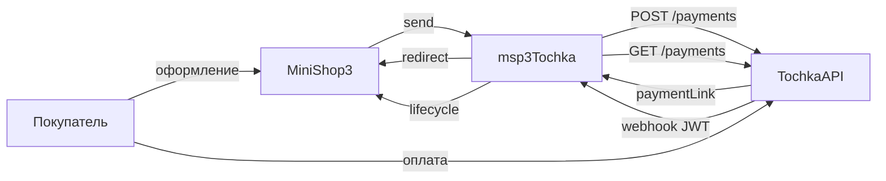

# msp3Tochka

**msp3Tochka** подключает [интернет-эквайринг Точка Банка](https://developers.tochka.com/docs/tochka-api/opisanie-metodov/platyozhnye-ssylki/) к [MiniShop3](/components/minishop3/) в MODX Revolution 3. Оплата идёт через `ms3_payment_lifecycle`. Пакет не пишет `status_id` заказа. Письма покупателю шлёт Центр уведомлений MiniShop3.

Старый пакет `mspTochka` при установке не удаляется.

Суммы передаются в рублях с двумя знаками. HTTP-запросы идут через `file_get_contents` и Bearer JWT. Подпись webhook проверяет openssl.

- [Документация API](https://developers.tochka.com/docs/tochka-api/)
- [Песочница](https://developers.tochka.com/docs/tochka-api/pesochnica)

Пространство имён настроек: **`msp3tochka`**. Точка входа уведомлений: `assets/components/msp3tochka/webhook.php`.

Версия пакета: 1.0.0-pl. Лицензия: GPL v2 и новее.

С чего начать: [Быстрый старт](quick-start).

## Возможности

- Платёжная ссылка `POST /acquiring/v1.0/payments`. Способы на ссылке задаёте JSON-массивом (`card`, `sbp` и другие, которые принимает API).
- Одностадийная оплата: `Msp3Tochka\Payment\TochkaPayment`.
- Холд: `TochkaTwoStagePayment` (`preAuthorization=true`). Списание кнопкой во вкладке заказа.
- Webhook `acquiringInternetPayment`: тело JWT `text/plain`, проверка RS256. Статус для lifecycle читается из `GET /payments/{operationId}`, не из claims.
- `operationId` пакет кладёт в payload попытки через `initiate()`.
- Корни НУЦ Минцифры лежат в `certs/russian_trusted.pem`. Без них PHP часто не доверяет `enter.tochka.com`.

У Точки нет `reverse`. Холд истекает по `ttl` (статус EXPIRED). Кнопка «Отменить холд» отвечает текстом об этом.

Права JWT: `MakeAcquiringOperation`, `ReadAcquiringData`. Чтобы регистрировать webhook через API Точки, ещё `ManageWebhookData`.

## Системные требования

| Требование | Версия |
| --- | --- |
| MODX Revolution | 3.0+ |
| MiniShop3 | beta с `ms3_payment_lifecycle` |
| PHP | 8.2+, расширение openssl |
| Сайт | HTTPS на webhook. 301 с HTTP часто роняет тело POST |

### Зависимости

- [MiniShop3](/components/minishop3/): заказы и способы оплаты.

## Установка

Пакет зашифрован. Перед установкой добавьте провайдер **modstore.pro** в менеджере пакетов MODX.

1. Установите **MiniShop3**.
2. Добавьте провайдер **modstore.pro** (**Система → Управление пакетами → Провайдеры**): URL `https://modstore.pro/extras/`, email и API-ключ из личного кабинета modstore.
3. Установите пакет **msp3Tochka** через **Управление пакетами** (в **Show Details** выберите провайдер **modstore.pro**).
4. **Очистите кэш** MODX.

Без провайдера установка завершится ошибкой `Package provider not found`.

Резолвер создаёт два активных способа:

| Название | Класс |
| --- | --- |
| Оплата через Точка Банк | `Msp3Tochka\Payment\TochkaPayment` |
| Оплата через Точка Банк (двухстадийная) | `Msp3Tochka\Payment\TochkaTwoStagePayment` |

JWT и `customerCode` положите в `msPayment.properties` (`jwt_token`, `token` или `secret`). Если properties пусты, пакет читает системные настройки.

`send()` отклоняет заказ дешевле 0.01 ₽. `paymentLinkId` не длиннее 45 символов.

После смены настроек очистите кеш MODX.

## Быстрая настройка webhook

В кабинете событие `acquiringInternetPayment`:

```text
https://ваш-домен.ru/assets/components/msp3tochka/webhook.php
```

HTTPS без Basic Auth и без 301. Тело: компактный JWT, `Content-Type: text/plain`.

## Архитектура



## Быстрые ссылки

| Нужно | Документ |
| --- | --- |
| Установить и принять первый платёж | [Быстрый старт](quick-start) |
| Все ключи `msp3tochka_*` | [Системные настройки](settings) |
| Webhook, холд, переход с mspTochka | [Интеграция](integration) |
| TLS, 403, кеш | [FAQ](faq) |
| Оформление заказа MS3 | [MiniShop3: заказ](/components/minishop3/frontend/order) |

## Документация по разделам

- [Быстрый старт](quick-start): провайдер modstore, песочница, webhook, боевой режим.
- [Системные настройки](settings): JWT, customerCode, песочница, срок ссылки, проверка подписи.
- [Интеграция и сценарии](integration): поток оплаты, вкладка заказа, переход со старого пакета, ограничения.
- [FAQ](faq): типовые сбои.

Лицензия пакета: GPL v2 и новее.
