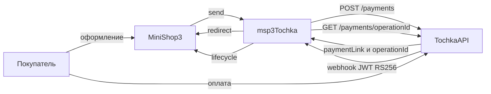

# Интеграция msp3Tochka

Шаги установки: [Быстрый старт](quick-start).

## Webhook

В кабинете событие `acquiringInternetPayment`:

```text
https://ваш-домен.ru/assets/components/msp3tochka/webhook.php
```

HTTPS без Basic Auth и без 301. Тело: компактный JWT, `Content-Type: text/plain`.

| Ответ | Когда |
| --- | --- |
| HTTP 200, JSON `{"success":…,"message":…}` | обычно |
| HTTP 500, текст `Config not found` | нет `config.core.php` |
| HTTP 500, `"Lifecycle unavailable"` | MiniShop3 не зарегистрировал `ms3_payment_lifecycle` |

Обработчик проверяет подпись, если `msp3tochka_webhook_verify_jwt` включён. Затем берёт номер операции из токена и запрашивает платёж у банка (`GET /payments/{operationId}`). Сумма сверяется с попыткой (допуск 0.02 ₽). Статус заказа пакет берёт из этого ответа, не из текста уведомления.

| status | Попытка | Заказ |
| --- | --- | --- |
| APPROVED | paid | `ms3_status_paid` |
| AUTHORIZED | authorized | |
| EXPIRED | cancelled | cancelled и ключ `ms3_payment_on_cancelled_status` |
| REFUNDED | refunded | `ms3_payment_on_refunded_status` |
| CREATED | игнор | |
| ON-REFUND | игнор, как CREATED | |

Пакет не выставляет статус failed. Ключ `ms3_payment_on_failed_status` для webhook Точки не используется.

Старый `mspTochka` при AUTHORIZED сам вызывал capture. Здесь спишите холд кнопкой во вкладке. Второй webhook APPROVED тоже ставит paid.

## Как проходит оплата



`payment_id` и `external_id` равны `paymentLinkId` вида `{orderId}-{random}`. `paymentLinkId` не длиннее 45 символов. `purpose`: `Order #<num>`, не длиннее 210 символов.

Номер операции пакет сохраняет у попытки оплаты. Без него кнопки вкладки в банк не ходят.

Двухстадийный способ просит банк заблокировать деньги, а не списать сразу (`preAuthorization=true`). Отмены холда у Точки нет. Блокировка снимается, когда истекает срок ссылки (статус EXPIRED).

Событие `msp3TochkaOnProviderEvent` получает данные уведомления или ответ банка о платеже. Если в MiniShop3 есть класс `EventGate`, пакет вызывает событие через него. Иначе вызывает напрямую.

Строки лога начинаются с `[msp3Tochka]`. Ошибки API, webhook и процессоров пишутся в `core/cache/logs/error.log` всегда.

Заказ дешевле 1 копейки пакет на оплату не отправляет.

## Вкладка заказа

Плагин `msp3tochka_bootstrap` на `OnMODXInit` подключает автозагрузку. На `msOnManagerCustomCssJs` добавляет вкладку через `MS3OrderTabsRegistry`. Запросы вкладки идут в `assets/components/msp3tochka/connector.php`.

| action | Процессор |
| --- | --- |
| `mgr/getlist` | список попыток оплаты |
| `mgr/sync` | статус в банке |
| `mgr/capture` | списание холда |
| `mgr/refund` | возврат |
| `mgr/cancel` | подсказка про EXPIRED |

| Действие | API | Нужно |
| --- | --- | --- |
| Синхронизировать | `GET /payments/{operationId}` | JWT в настройках, `operationId` у попытки |
| Списать холд | `POST …/capture` | JWT и `customerCode`, статус AUTHORIZED |
| Возврат | `POST …/refund` | JWT и `customerCode`, попытка `paid` или `partially_refunded` |
| Отменить холд | нет | Дождитесь EXPIRED или спишите capture |

**Синхронизировать** без JWT в настройках в банк не ходит. Connector вернёт список попыток и мягкую заметку «не настроено». Для оплаты (`send`) и webhook нужны и JWT, и `customerCode`.

Возврат из вкладки на попытке `pending` или `authorized` не уходит в API. Сначала нужен webhook APPROVED или capture. Повторный частичный возврат с попыткой `partially_refunded` в API разрешён.

## Переход со старого mspTochka {#переход-со-старого-msptochka}

Резолвер копирует непустые `msptochka_*` в `msp3tochka_*`, если новые пусты. Старый способ оплаты не удаляется. Выключите его вручную и смените URL webhook.

Ключи `two_stage` и `status_refunded` больше не нужны. Двухстадийная оплата идёт отдельным способом. Статус заказа задаёт MiniShop3.

`paymentLinkId` больше не равен `msOrder.uuid`. Поиск попытки идёт по `external_id`.

## Ограничения

- Песочница не проводит карту и не шлёт живой webhook оплаты.
- Возврат из вкладки на попытке `pending` или `authorized` не уходит в API. С `partially_refunded` частичный возврат можно повторить.
- Отдельный НДС на каждый товар пакет не задаёт. Зарегистрировать уведомление из админки MODX тоже нельзя.
