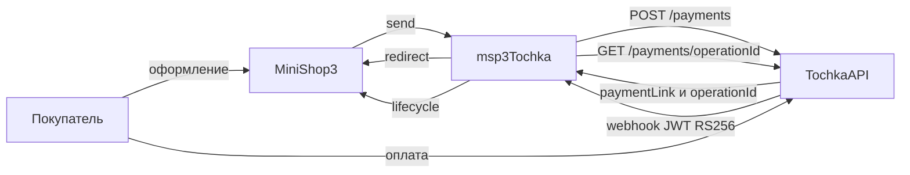

# Интеграция msp3Tochka

Нужны только шаги установки? Откройте [Быстрый старт](quick-start).

## Webhook

В кабинете событие `acquiringInternetPayment`:

```text
https://ваш-домен.ru/assets/components/msp3tochka/webhook.php
```

HTTPS без Basic Auth и без 301. Тело: компактный JWT, `Content-Type: text/plain`. Ответ всегда HTTP 200 и JSON `{"success":…,"message":…}`.

Обработчик проверяет подпись, если `msp3tochka_webhook_verify_jwt` включён, берёт номер операции из токена и запрашивает платёж у банка (`GET /payments/{operationId}`). Сумма сверяется с попыткой (допуск 0.02 ₽). Статус заказа пакет берёт из этого ответа, не из текста уведомления.

| status | Попытка |
| --- | --- |
| APPROVED | paid |
| AUTHORIZED | authorized |
| EXPIRED | cancelled |
| REFUNDED | refunded |
| CREATED | игнор |

После статуса APPROVED MiniShop3 ставит заказу `ms3_status_paid`. Неуспех и возврат: `ms3_payment_on_failed_status` и `ms3_payment_on_refunded_status`.

Старый `mspTochka` при AUTHORIZED сам вызывал capture. Здесь спишите холд кнопкой во вкладке. Второй webhook APPROVED тоже ставит paid.

## Как проходит оплата



`payment_id` и `external_id` это `paymentLinkId` вида `{orderId}-{random}`. `paymentLinkId` не длиннее 45 символов. `purpose`: `Order #<num>`, не длиннее 210 символов.

Номер операции пакет сохраняет у попытки оплаты. Без него кнопки вкладки в банк не ходят.

Двухстадийный способ просит банк заблокировать деньги, а не списать сразу (`preAuthorization=true`). Отмены холда у Точки нет. Блокировка снимается, когда истекает срок ссылки (статус EXPIRED).

Событие `msp3TochkaOnProviderEvent` получает данные уведомления или ответ банка о платеже. Если в MiniShop3 есть класс `EventGate`, пакет вызывает событие через него. Иначе вызывает напрямую.

Строки лога начинаются с `[msp3Tochka]`. Ошибки API, webhook и процессоров пишутся в `core/cache/logs/error.log` всегда.

`send()` отклоняет заказ дешевле 0.01 ₽.

## Вкладка заказа

Плагин на `msOnManagerCustomCssJs` вешает вкладку через `MS3OrderTabsRegistry`.

| Действие | API | Нужно |
| --- | --- | --- |
| Синхронизировать | `GET /payments/{operationId}` | `operationId` в payload |
| Списать холд | `POST …/capture` | `operationId`, статус AUTHORIZED |
| Возврат | `POST …/refund` | `operationId`, сумма не больше поступления |
| Отменить холд | нет | Дождитесь EXPIRED или спишите capture |

Возврат из вкладки на попытке `pending` или `authorized` не уходит в API. Сначала нужен webhook APPROVED или capture.

## Переход со старого mspTochka {#переход-со-старого-msptochka}

Резолвер копирует непустые `msptochka_*` в `msp3tochka_*`, если новые пусты. Старый способ оплаты не удаляется. Выключите его вручную и смените URL webhook.

Ключи `two_stage` и `status_refunded` больше не нужны. Двухстадийка это отдельный способ. Статус заказа задаёт ядро.

`paymentLinkId` больше не равен `msOrder.uuid`. Поиск попытки идёт по `external_id`.

## Ограничения

- Песочница не проводит карту и не шлёт живой webhook оплаты.
- Возврат из вкладки на попытке `pending` или `authorized` не уходит в API.
- Per-product НДС и регистрация webhook из админки MODX в пакете нет.
