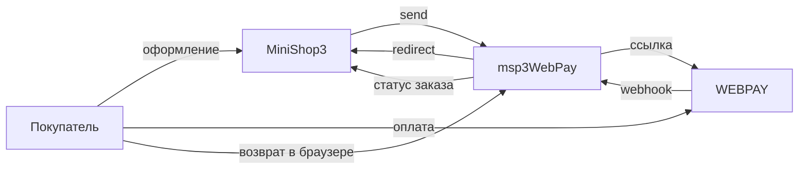

# msp3WebPay

**msp3WebPay** подключает [WEBPAY](https://docs.webpay.by/) к [MiniShop3](/components/minishop3/) в MODX Revolution 3. Покупатель уходит на страницу оплаты. Статус «оплачен» выставляет MiniShop3, когда приходит уведомление. Пакет сам статус заказа не меняет.

Возврат покупателя в браузере заказ не оплачивает. Отдельного запроса «какой сейчас статус» у WEBPAY для пакета нет. Вкладка заказа показывает попытки, которые уже сохранены на сайте.

- [Документация WEBPAY](https://docs.webpay.by/)

Пространство имён настроек: **`msp3webpay`**. Уведомления: `assets/components/msp3webpay/webhook.php`. Возврат покупателя: `assets/components/msp3webpay/return.php`.

## Возможности

- Карта, деньги списываются сразу: способ **Оплата через WebPay (карта)**.
- ERIP: способ **Оплата через WebPay (ERIP)**. Номер заказа для этого способа пакет начинает с `WP-`.
- Холд: способ **Оплата через WebPay (двухстадийная)**. Заказ станет оплаченным после списания.
- Одно уведомление в кабинете WEBPAY. По нему пакет понимает оплату, отказ, возврат и отмену.
- Списание холда, отмена холда и возврат идут отдельным входом в кабинет. Нужны логин и пароль.
- Пока холд не списан, возврат не уходит.
- Тестовый режим включает песочницу `securesandbox.webpay.by`.

## Системные требования

| Требование | Версия |
| --- | --- |
| MODX Revolution | 3.0+ |
| MiniShop3 | 1.14.0-beta1 и новее |
| PHP | 8.2+ |
| Доступ | номер магазина, секретный ключ, логин и пароль кабинета |
| Сайт | HTTPS на webhook без 301 |

### Зависимости

- [MiniShop3](/components/minishop3/): заказы и способы оплаты.

Статус заказа после уведомления задают настройки MiniShop3: `ms3_status_paid`, `ms3_payment_on_failed_status`, `ms3_payment_on_refunded_status`.

## Установка

1. Установите **MiniShop3**.
2. Добавьте провайдер **modstore.pro** (**Система → Управление пакетами → Провайдеры**): URL `https://modstore.pro/extras/`, email и API-ключ из личного кабинета modstore.
3. Установите пакет **msp3WebPay** через **Управление пакетами** (в **Show Details** выберите провайдер **modstore.pro**).
4. **Очистите кэш** MODX.

Резолвер создаёт три активных способа:

| Название | Класс |
| --- | --- |
| Оплата через WebPay (карта) | `Msp3WebPay\Payment\WebPayPayment` |
| Оплата через WebPay (ERIP) | `Msp3WebPay\Payment\WebPayEripPayment` |
| Оплата через WebPay (двухстадийная) | `Msp3WebPay\Payment\WebPayTwoStagePayment` |

Ключи удобнее хранить в `msPayment.properties`: `store_id`, `secret_key`, `api_username`, `api_password`. Если properties пусты, пакет читает системные настройки `msp3webpay_*`.

Откуда брать номер магазина и секрет: [Быстрый старт](quick-start#откуда-брать-ключи).

## Быстрая настройка уведомлений

В кабинете WEBPAY укажите один адрес:

```text
https://ваш-домен.ru/assets/components/msp3webpay/webhook.php
```

HTTPS без 301. Покупатель после оплаты попадает на `return.php`. Статус эта страница не ставит.

## Архитектура



## Быстрые ссылки

| Нужно | Документ |
| --- | --- |
| Установить и принять первый платёж | [Быстрый старт](quick-start) |
| Ключи `msp3webpay_*` | [Системные настройки](settings) |
| Уведомление, холд, ERIP | [Интеграция](integration) |
| Статус, возврат до списания, return | [FAQ](faq) |
| Оформление заказа MS3 | [MiniShop3: заказ](/components/minishop3/frontend/order) |
