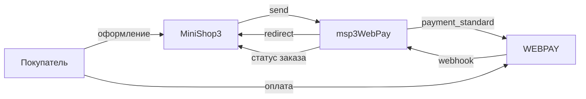

# Интеграция msp3WebPay

Нужны только шаги установки? Откройте [Быстрый старт](quick-start).

## Как проходит оплата

| Способ | Запрос | Что делает |
| --- | --- | --- |
| Оплата через WebPay (карта) | `POST /api/v1/payment_standard` | Списание сразу |
| Оплата через WebPay (ERIP) | `POST /api/v1/payment_Erip` | Номер заказа с префиксом `WP-` |
| Оплата через WebPay (двухстадийная) | тот же платёжный API | Холд. Уведомление `payment_type=4` ставит `authorized` |

`send()` отдаёт ссылку на оплату, номер платежа `wt` и номер заказа `wsb_order_num`. В попытке сохраняются `wt` и `webpay_order_num`. После webhook добавляется `transaction_id`.

Если JSON-адрес создания платежа отвечает `404`, пакет отправляет ту же заявку обычной формой на `securesandbox.webpay.by` или `payment.webpay.by`. Адрес `/api/v1/payment` пакет не использует. Туда WEBPAY ждёт зашифрованные данные карты.



## Webhook

Один адрес в кабинете:

```text
https://ваш-домен.ru/assets/components/msp3webpay/webhook.php
```

Это форма. Подпись `wsb_signature` считается по [правилам WEBPAY](https://docs.webpay.by/paymentIntegration/cardIntegration/paymentNotification/) (MD5). Пакет пробует вариант с полем карты и без него.

| `payment_type` | Обычная оплата и ERIP | Холд |
| --- | --- | --- |
| 1, Completed | paid | paid |
| 4, Authorized | paid | authorized |
| 2 и 8, отказ | failed | failed |
| 5 и 9, возврат | refunded | refunded |
| 7 и 11, отмена | cancelled | cancelled |

Статус заказа после этого ставят `ms3_status_paid`, `ms3_payment_on_failed_status` и `ms3_payment_on_refunded_status`.

Публичного запроса статуса у WEBPAY нет. Кнопка синхронизации смотрит только попытки, уже записанные на сайте.

## Возврат покупателя

`return.php` перенаправляет браузер на `success_url` или `fail_url`. Статус заказа эта страница не ставит. Оплату подтверждает только webhook.

## Списание, отмена и возврат

Пакет входит в кабинет: `POST /api/login`, в ответе токен. Тестовый хост `https://sandbox.webpay.by`. Боевой `https://billing.webpay.by`. Нужны **`msp3webpay_api_username`** и **`msp3webpay_api_password`**.

| Действие | Запрос | Что дальше |
| --- | --- | --- |
| Списать холд | `POST /api/v1/transactions/complete` | Заказ отмечается оплаченным |
| Отменить холд | `POST /api/v1/transactions/cancel` | Попытка отменяется |
| Вернуть после оплаты | `POST /api/v1/transactions/cancel` | Попытка помечается возвратом |

Пока попытка в `authorized`, возврат не уходит. Сначала спишите холд.
