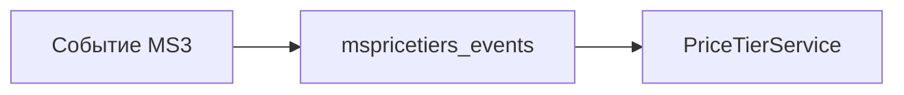

# События MODX

## События компонента

Вызываются из `PriceTierService` и процессоров CRUD.

### mspricetiersOnBeforeResolvePrice

Перед выбором порога и расчётом цены.

```php
$modx->invokeEvent('mspricetiersOnBeforeResolvePrice', [
    'product_id' => $productId,
    'quantity' => $quantity,
    'base_price' => $basePrice,
    'options' => $options,
    'tiers' => $tiers,
]);
```

Можно изменить массив `tiers` или отменить применение порога через логику плагина.

### mspricetiersOnResolvePrice

После расчёта.

```php
$modx->invokeEvent('mspricetiersOnResolvePrice', [
    'product_id' => $productId,
    'quantity' => $quantity,
    'resolved_price' => $resolvedPrice, // Value object ResolvedPrice
]);
```

### CRUD порогов (manager)

| Событие | Когда |
|---------|-------|
| `mspricetiersOnBeforeSaveTier` | Перед созданием/обновлением порога |
| `mspricetiersOnSaveTier` | После сохранения |
| `mspricetiersOnBeforeRemoveTier` | Перед удалением |
| `mspricetiersOnRemoveTier` | После удаления |

Подключите плагин на нужные события в **Элементы → Плагины**.

## События MiniShop3

Обрабатываются плагином **`mspricetiers_events`** (не переименовывайте без необходимости).



Основное для витрины — **`msOnGetProductPrice`**: MS3 запрашивает цену → сервис подставляет tier.

## События в браузере

| Событие | Источник | Назначение |
|---------|----------|------------|
| `ms3variants:selected` | [ms3Variants](/components/ms3variants/) | Пересчёт цены при смене варианта |

Слушатель встроен в `mspricetiers.js` при `mspricetiers_integrate_ms3variants` = Да.

## Пример плагина (логирование)

```php
<?php
switch ($modx->event->name) {
    case 'mspricetiersOnResolvePrice':
        $rp = $scriptProperties['resolved_price'] ?? null;
        if ($rp) {
            $modx->log(modX::LOG_LEVEL_INFO, '[msPT] product ' . $scriptProperties['product_id']
                . ' qty ' . $scriptProperties['quantity']
                . ' price ' . $rp->getPrice());
        }
        break;
}
```

## См. также

- [AJAX API и PHP](api)
- [Подключение на сайте](frontend#событие-ms3variantsselected)
