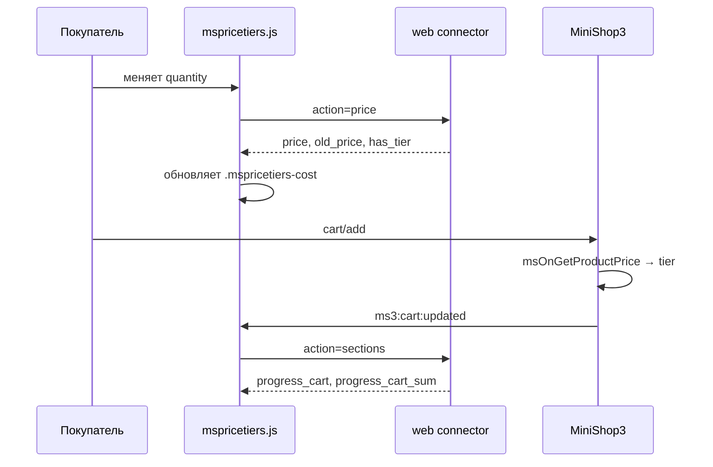

# Подключение на сайте

После [msPriceTiers.initialize](snippets/msPriceTiersInitialize) на странице доступны стили, скрипт и объект **`window.msPriceTiers`**.

## Обязательная разметка

| Элемент | Класс / атрибут | Назначение |
|---------|-----------------|------------|
| Форма товара | `mspricetiers-form` | Контейнер для пересчёта цены |
| Поле количества | `mspricetiers-quantity` | Слушатель `input` / `change` |
| Таблица | `mspricetiers-table-wrapper` | Обёртка из чанка |
| Строка порога | `mspricetiers-row` | `data-count-from`, `data-price` |
| Текущая цена | `mspricetiers-cost` | Обновляется из JS |
| Старая цена | `mspricetiers-old-cost` | Зачёркнутая цена из MS3 |

Пример формы — [Быстрый старт](quick-start#шаг-5-разметка-количества).

## Жизненный цикл на карточке



## JavaScript API

### fetchPrice(productId, quantity, variantId)

```javascript
const result = await msPriceTiers.fetchPrice(123, 10, 5);
// result.price, result.old_price, result.has_tier, result.tier_id
```

| Параметр | Тип | Описание |
|----------|-----|----------|
| `productId` | number | ID товара |
| `quantity` | number | Количество |
| `variantId` | number \| null | ID варианта ms3Variants |

Запрос: `POST` на `assets/components/mspricetiers/js/web/connector.php`, `action=price`. Подробнее: [AJAX API](api).

### fetchSections(productId, quantity, options)

Возвращает HTML-секции для обновления без перезагрузки. Параметры `options`: `cartItems`, `cartSubtotal`.

```javascript
const sections = await msPriceTiers.fetchSections(123, 10, {
  cartSubtotal: 15000,
});
// sections.table, sections.progress_cart, sections.progress_cart_sum, …
```

## Live-секции (`data-mspt-live`)

Обёрните сниппет в контейнер с атрибутом:

| Значение | Секция |
|----------|--------|
| `progress-cart` | Прогресс по количеству в корзине |
| `progress-cart-sum` | Прогресс до следующего порога по сумме корзины |

После **`ms3:cart:updated`** (MiniShop3 после добавления, изменения или удаления позиции) `mspricetiers.js` вызывает `action=sections` и подменяет `innerHTML` найденных блоков.

На карточке товара при смене количества JS обновляет **цену** (`.mspricetiers-cost`) и подсказку у поля количества. Таблицу или бейдж без перезагрузки перерисуйте через `fetchSections` в своём коде или на QA-странице пакета.

## События в браузере

| Событие | Источник | Назначение |
|---------|----------|------------|
| `ms3variants:selected` | [ms3Variants](/components/ms3variants/) | Пересчёт цены при смене варианта |
| `ms3:cart:updated` | MiniShop3 CartUI | Обновление блоков `data-mspt-live` |
| `mspricetiers:cart:updated` | mspricetiers.js | После обновления прогресса корзины (кастомные слушатели) |

При **`mspricetiers_integrate_ms3variants`** = Да слушатель `ms3variants:selected` встроен в `mspricetiers.js`.

Ручной вызов после смены варианта:

```javascript
document.addEventListener('ms3variants:selected', (event) => {
  const { productId, id } = event.detail;
  msPriceTiers.fetchPrice(productId, msPriceTiers.getQuantity(), id);
});
```

## CSS-переменные

Компонент стилизуется через переменные **`--mspt-*`** на обёртке `.mspricetiers-table-wrapper` (или `:root`).

| Группа | Примеры |
|--------|---------|
| Цвета | `--mspt-primary-color`, `--mspt-success-color`, `--mspt-border-color` |
| Типографика | `--mspt-font-size-price`, `--mspt-font-weight-bold` |
| Таблица | `--mspt-table-row-active-bg`, `--mspt-table-row-active-border` |
| Прогресс | `--mspt-progress-fill`, `--mspt-progress-height` |

### Пример тёмной темы

```css
[data-theme="dark"] .mspricetiers-table-wrapper {
  --mspt-primary-color: #64b5f6;
  --mspt-bg-header: #303030;
  --mspt-text-primary: #ffffff;
  --mspt-border-color: #424242;
}
```

Поддерживается `prefers-color-scheme: dark` в базовом CSS.

## Конфигурация в браузере

`window.msPriceTiersConfig` (из сниппета initialize):

| Поле | Описание |
|------|----------|
| `assetsUrl` | URL assets компонента |
| `connectorUrl` | `…/js/web/connector.php` |
| `enabled` | `mspricetiers_enabled` |
| `applyOnProductPage` | `mspricetiers_apply_on_product_page` |
| `quantityHintEnabled` | `mspricetiers_progress_bar_enabled` |
| `numberLocale` | `ru-RU` / `en-US` из `cultureKey` |
| `messages.*` | Шаблоны подсказок прогресс-бара (`untilNext`, `savings`, `currency`, …) |

## См. также

- [Интеграция](integration)
- [Сниппеты](snippets/index)
- [FAQ](faq)
