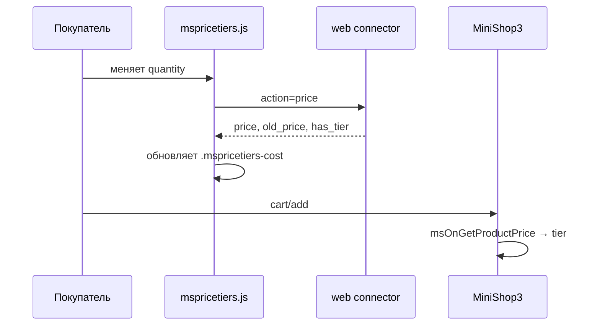

# Подключение на сайте

После [msPriceTiers.initialize](snippets/msPriceTiersInitialize) на странице доступны стили, скрипт и объект **`window.msPriceTiers`**.

## Обязательная разметка

| Элемент | Класс / атрибут | Назначение |
|---------|-----------------|------------|
| Форма товара | `mspricetiers-form` | Контейнер для пересчёта цены |
| Поле количества | `mspricetiers-quantity` | Слушатель `input` / `change` |
| Таблица | `mspricetiers-table-wrapper` | Обёртка из чанка |
| Строка порога | `mspricetiers-row` | `data-count-from`, `data-price` |
| Текущая цена | `mspricetiers-cost` | Обновляется из JS (опционально в теме) |
| Старая цена | `mspricetiers-old-cost` | Зачёркнутая цена |

Пример формы — [Быстрый старт](quick-start#шаг-5-разметка-количества).

## Жизненный цикл на карточке



## JavaScript API

### fetchPrice(productId, quantity, variantId)

```javascript
const result = await msPriceTiers.fetchPrice(123, 10, 5);
// result.price, result.old_price, result.has_tier, result.tier_id
```

| Параметр | Тип | Описание |
|----------|-----|----------|
| `productId` | number | ID товара |
| `quantity` | number | Количество |
| `variantId` | number \| null | ID варианта ms3Variants |

Запрос: `POST` на `assets/components/mspricetiers/js/web/connector.php`, `action=price`. Подробнее: [AJAX API](api).

### Событие ms3variants:selected

При включённой [интеграции с ms3Variants](integration#ms3variants) скрипт сам пересчитывает цену после выбора варианта. Вручную:

```javascript
document.addEventListener('ms3variants:selected', (event) => {
  const { productId, id, price } = event.detail;
  msPriceTiers.fetchPrice(productId, msPriceTiers.getQuantity(), id);
});
```

## CSS-переменные

Компонент стилизуется через переменные **`--mspt-*`** на обёртке `.mspricetiers-table-wrapper` (или `:root`).

| Группа | Примеры |
|--------|---------|
| Цвета | `--mspt-primary-color`, `--mspt-success-color`, `--mspt-border-color` |
| Типографика | `--mspt-font-size-price`, `--mspt-font-weight-bold` |
| Таблица | `--mspt-table-row-active-bg`, `--mspt-table-row-active-border` |
| Прогресс | `--mspt-progress-fill`, `--mspt-progress-height` |

### Пример тёмной темы

```css
[data-theme="dark"] .mspricetiers-table-wrapper {
  --mspt-primary-color: #64b5f6;
  --mspt-bg-header: #303030;
  --mspt-text-primary: #ffffff;
  --mspt-border-color: #424242;
}
```

Поддерживается `prefers-color-scheme: dark` в базовом CSS.

## Конфигурация в браузере

`window.msPriceTiersConfig` (из сниппета initialize) содержит URL connector, флаги `applyOnProductPage`, `integrateMs3variants`, строки лексикона для JS.

## См. также

- [Интеграция](integration)
- [Сниппеты](snippets/index)
- [FAQ](faq)
