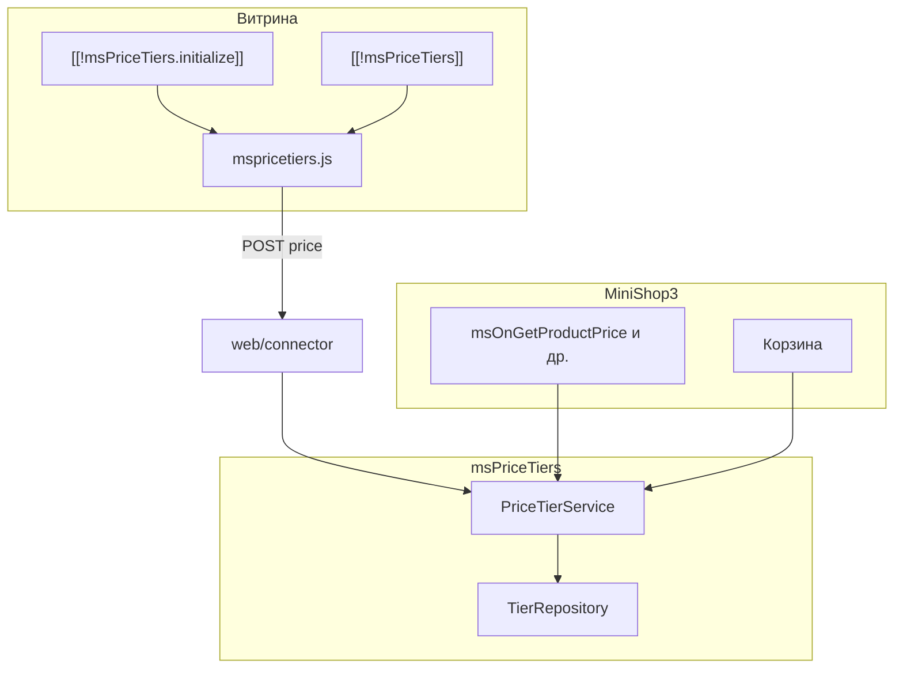

# msPriceTiers

**msPriceTiers** — дополнение для [MODX Revolution 3](https://modx.com/) и [MiniShop3](/components/minishop3/): разные цены в зависимости от количества (оптовые пороги), с учётом корзины, вариантов [ms3Variants](/components/ms3variants/) и наследования от категории.

С чего начать: [Быстрый старт](quick-start).

## Минимальный путь на витрине

1. Установить пакет через **ModStore** и убедиться, что работают **MiniShop3** и **VueTools** (вкладка в админке).
2. В **Системные настройки** (область `mspricetiers`) включить компонент и при необходимости интеграцию с ms3Variants.
3. На карточке товара создать пороги во вкладке **«Оптовые цены»** (Мини-магазин → Товары).
4. На шаблоне `msProduct` вывести `[[!msPriceTiers.initialize]]` и `[[!msPriceTiers]]`.
5. **Очистить кэш** и проверить: смена количества → пересчёт цены, в корзине — tier-цена.

## Быстрые ссылки

| Нужно | Документ |
| --- | --- |
| Установить и вывести таблицу порогов | [Быстрый старт](quick-start) |
| Все ключи `mspricetiers_*` | [Системные настройки](settings) |
| Сниппеты и параметры | [Сниппеты](snippets/index) |
| CSS-классы, JS API, темы | [Подключение на сайте](frontend) |
| Шаблон товара, корзина, категории | [Интеграция](integration) |
| Вкладка в MS3, шаблоны порогов | [Управление порогами](manager) |
| connector, сервис PHP | [AJAX API и PHP](api) |
| `mspricetiersOn*` | [События MODX](events) |
| Диагностика | [FAQ](faq) |

## Возможности

- **Пороги по количеству** — цена и зачёркнутая «старая» цена от `count_from`
- **Корзина MS3** — пересчёт при добавлении и изменении количества
- **Категорийные пороги** — наследование товарами без своих активных порогов
- **Шаблоны порогов** — сохранение сетки и применение к товару/категории (`merge` / `replace`)
- **Группы пользователей** — ограничение порогов по группам MODX
- **Временные акции** — `valid_from` / `valid_until` на пороге
- **Прогресс-бар** — «до следующей скидки» на товаре и в корзине
- **ms3Variants** — базовая цена от выбранного варианта
- **Админка** — вкладка «Оптовые цены» на товаре и категории (Vue + PrimeVue, как в MS3)

## Системные требования

| Требование | Версия |
|------------|--------|
| MODX Revolution | 3.0+ |
| PHP | 8.2+ |
| MiniShop3 | 1.0+ |
| pdoTools | 3.0+ (рекомендуется для Fenom) |
| VueTools | для вкладки в админке MiniShop3 |

### Зависимости

- **[MiniShop3](/components/minishop3/)** — товары, корзина, цены

### Опционально

- **[ms3Variants](/components/ms3variants/)** — варианты товара и цена варианта как база для порогов
- **[VueTools](https://modstore.pro/)** — без него Vue-вкладки MS3 не загрузятся

## Установка

1. [Подключите репозиторий ModStore](https://modstore.pro/info/connection).
2. **Extras → Installer** → **Download Extras** — найдите **msPriceTiers**, **Download**, **Install**.
3. Установите **MiniShop3** и **VueTools**, если ещё не установлены.
4. Настройте область **`mspricetiers`** в системных настройках.
5. **Настройки → Очистить кэш**.

Каталог: [modstore.pro/packages/ecommerce/mspricetiers](https://modstore.pro/packages/ecommerce/mspricetiers).

После установки: namespace `mspricetiers`, сниппеты `msPriceTiers`, `msPriceTiers.initialize`, `msPriceTiersProgress`, чанки `mspricetiers_*`, плагин `mspricetiers_events`, таблицы порогов и шаблонов.

## Термины

| Термин | Описание |
|--------|----------|
| **Порог (tier)** | Правило: от N штук — цена X |
| **Каскад** | Сначала пороги товара → пороги категории → базовая цена MS3 / варианта |
| **Шаблон** | Сохранённая сетка порогов; при применении копируется в товар/категорию |
| **merge / replace** | Добавить пороги из шаблона или полностью заменить текущие |

## Архитектура (кратко)

Подробнее: [Подключение на сайте](frontend), [AJAX API](api), [Управление порогами](manager).
